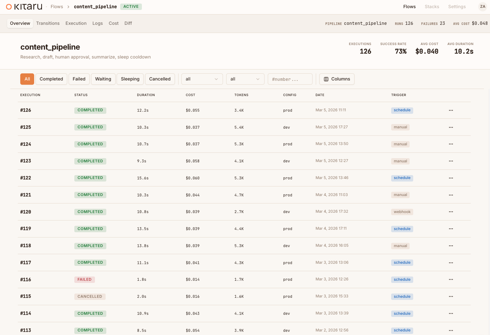

<p align="center">
  <a href="https://kitaru.ai">
    
  </a>
</p>

<h3 align="center">You build your agents. We make them durable.</h3>

<p align="center">
  Open-source durable execution for AI agents, built on <a href="https://zenml.io">ZenML</a>.
</p>

<p align="center">
  <a href="https://pypi.org/project/kitaru/"></a>
  <a href="https://pypi.org/project/kitaru/"></a>
  <a href="https://github.com/zenml-io/kitaru/blob/main/LICENSE"></a>
  <a href="https://zenml.io/slack"></a>
</p>

<p align="center">
  <a href="https://kitaru.ai/docs">Docs</a> &middot;
  <a href="#quick-start">Quick Start</a> &middot;
  <a href="https://kitaru.ai/docs/getting-started/examples">Examples</a> &middot;
  <a href="GETTING_STARTED.md">Getting Started Guide</a>
</p>

---

<p align="center">
  
</p>

Kitaru makes your AI agent workflows **persistent, replayable, and observable**.
Add a few Python decorators to your existing code — no graph DSL, no framework
lock-in — and get durable execution with a built-in dashboard out of the box.

## Why Kitaru?

### Python-first, no graph DSL

Write normal Python. Use `if`, `for`, `try/except` — whatever your agent needs.
Kitaru gives you two decorators (`@flow` and `@checkpoint`) and a handful of
utility functions. That's it.

```python
from kitaru import checkpoint, flow

@checkpoint
def research(topic: str) -> str:
    return do_research(topic)

@checkpoint
def write_draft(research: str) -> str:
    return generate_draft(research)

@flow
def writing_agent(topic: str) -> str:
    data = research(topic)
    return write_draft(data)

result = writing_agent.run("quantum computing").wait()
```

### Deployment simplicity

No workers, no message queues, no distributed systems PhD required. Kitaru runs
locally with zero config, and scales to production with a single server backed by
a SQL database. Deploy your agents anywhere — Kubernetes, Vertex AI, SageMaker,
or AzureML — using Kitaru's **stack** abstraction.

### Built-in dashboard

Every execution is observable from day one. See your agent runs, inspect
checkpoint outputs, track LLM costs, and approve human-in-the-loop wait steps —
all from a visual dashboard that ships with the Kitaru server.

## Quick Start

### Install

```bash
pip install kitaru
```

Or with [uv](https://docs.astral.sh/uv/) (recommended):

```bash
uv pip install kitaru
```

### Optional: connect to an existing Kitaru server

Flows run locally by default. If you already have a deployed Kitaru server and
want this quick start to use it, connect first:

```bash
kitaru login https://my-server.example.com
# add --project <PROJECT> or other login flags if your setup requires them
kitaru status
```

If you're just trying Kitaru locally, skip this step.

### Initialize your project

```bash
kitaru init
```

### Write your first flow

```python
# agent.py
from kitaru import checkpoint, flow

@checkpoint
def fetch_data(url: str) -> str:
    return "some data"

@checkpoint
def process_data(data: str) -> str:
    return data.upper()

@flow
def my_agent(url: str) -> str:
    data = fetch_data(url)
    return process_data(data)

result = my_agent.run("https://example.com").wait()
print(result)  # SOME DATA
```

### Run it

```bash
python agent.py
```

Every checkpoint's output is persisted automatically. You can inspect what
happened, replay from any checkpoint, or resume a waiting flow:

```bash
kitaru executions list
kitaru executions get <EXECUTION_ID>
kitaru executions logs <EXECUTION_ID>
kitaru executions replay <EXECUTION_ID> --from process_data
```

## Learn more

| Resource | Description |
|---|---|
| [Getting Started Guide](GETTING_STARTED.md) | Full setup walkthrough with all examples |
| [Documentation](https://kitaru.ai/docs) | Complete reference and guides |
| [Examples](https://kitaru.ai/docs/getting-started/examples) | Runnable workflows for every feature |
| [Stack Selection Guide](https://kitaru.ai/docs/getting-started/stack-selection) | Deploy to Kubernetes, Vertex AI, SageMaker, or AzureML |

## Contributing

We welcome contributions! See [CONTRIBUTING.md](CONTRIBUTING.md) for development
setup, code style, and how to submit changes. The default branch is `develop` —
all PRs should target it.

## Community and support

- [Slack](https://zenml.io/slack) — chat with the team and other users
- [GitHub Issues](https://github.com/zenml-io/kitaru/issues) — bug reports and feature requests
- [kitaru.ai](https://kitaru.ai) — landing page and docs

## License

[Apache 2.0](LICENSE)
