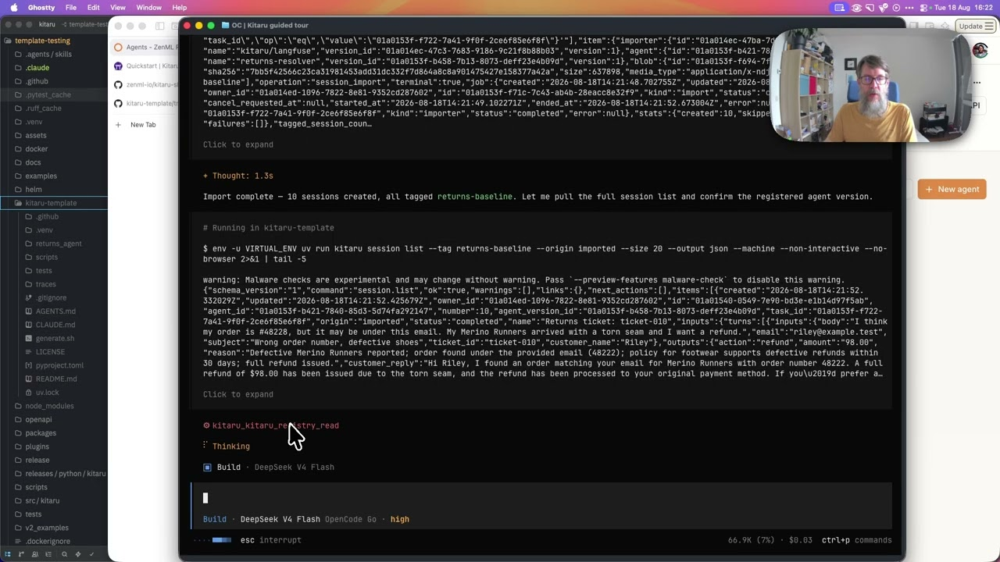

<p align="center">
  <a href="https://kitaru.ai">
    
  </a>
</p>

<h3 align="center">Traces you can run, not just read.</h3>

<p align="center">
  Kitaru (来る, "to arrive") gives you replay-based evals for AI agents. Record or import production runs as sessions, replay them against your next model, prompt, or code change, and see what improved and what broke before you ship. Open source, self-hosted, Python and TypeScript. From the team behind <a href="https://zenml.io">ZenML</a>.
</p>

<p align="center">
  <a href="https://pypi.org/project/kitaru/"></a>
  <a href="https://pypi.org/project/kitaru/"></a>
  <a href="https://github.com/zenml-io/kitaru/blob/main/LICENSE"></a>
</p>

<p align="center">
  <a href="https://docs.zenml.io/kitaru">Docs</a> &middot;
  <a href="https://youtu.be/aYLfzXEr2Rk">Guided Tour</a> &middot;
  <a href="#-get-started">Get Started</a> &middot;
  <a href="https://www.zenml.io/roadmap">Roadmap</a> &middot;
  <a href="https://kitaru.ai/slack">Community</a>
</p>

<p align="center">
  <a href="https://youtu.be/aYLfzXEr2Rk">
    
  </a>
</p>

---

## 🎯 Why

Your agent has already been tested thousands of times in production. Most of that evidence is sitting in a trace store as something you can read but not run. Then you change a prompt, swap a model, or refactor a tool, and the first strong signal comes from a user who found the regression.

Kitaru turns that history into something you can test:

- **Every run becomes a session.** Wrap your agent once, or import the traces you already collect from Langfuse, LangSmith, Braintrust, Logfire, or Arize Phoenix. Your trace store stays your system of record.
- **Replay re-executes your code.** Your real agent runs again, with tool calls answered from the recording, so no card gets refunded twice. An unchanged replay gives you the faithful baseline; a forked replay shows the effect of one change.
- **Evaluation starts with human judgment.** Your coding assistant reviews the sessions that matter, interviews you against the evidence, and pins your answers to exact trace locations. Those judgments calibrate evaluators, cohorts freeze the population, and experiments replay the cohort against your change before it ships.

## ⚡ Get started

**1. Install and log in.** One line installs the CLI and MCP server (via `uv`), the coding-agent skills, registers the MCP server with Claude Code and Codex, and starts the local server if Docker is running:

```bash
curl -fsSL https://kitaru.ai/install | bash
```

Already in Claude Code, Codex, or Cursor? Paste this instead and let it run the same installer:

```
Set up Kitaru on this machine by following https://kitaru.ai/install.md. Use the one-line installer, tell me what it did, and stop before logging in if Docker is not running.
```

Prefer to do it by hand, or want Kitaru inside your project's environment? The local server is FastAPI + Postgres, and `kitaru login --local` provisions it with Docker:

```bash
uv add "kitaru[cli,worker,mcp]" kitaru-pydantic-ai    # or: pip install
kitaru login --local                                  # or: kitaru login <your-team-url>
```

**2. Make your coding assistant Kitaru-capable.** This is the intended way to drive Kitaru: skills teach the method, and the MCP server gives your assistant bounded operations.

```bash
npx skills add zenml-io/kitaru-skills
```

```json
{
  "mcpServers": {
    "kitaru": {
      "command": "uv",
      "args": ["run", "kitaru-mcp", "--server", "http://localhost:8000", "--mode", "standard"]
    }
  }
}
```

**3. Get an agent with traces.** The fastest way to feel the loop is the PydanticAI returns agent: a ready agent with checked-in Langfuse traces.

```bash
git clone https://github.com/zenml-io/kitaru.git
cd kitaru/examples/python/pydantic_ai_ticket_resolver
```

Already have an agent in production? [Import its traces](https://docs.zenml.io/kitaru/getting-started/import-your-traces) from Langfuse, LangSmith, Braintrust, Logfire, or Arize Phoenix, or [record with an adapter](https://docs.zenml.io/kitaru/adapters/record-in-production): one wrapper, no rewrite.

**4. Let your assistant drive the loop.** Open the example directory in Claude Code, Codex, or Cursor, then take the guided tour:

```
Use kitaru-guided-tour to walk me through Kitaru on the PydanticAI returns agent example. I am new; explain each step as we go, and ask before anything paid or live.
```

On your own agent, run the investigation:

```
Use kitaru-investigation to investigate this agent and help me test one meaningful improvement. Show me the recorded evidence before asking for a judgment, and ask before creating resources or starting paid replay.
```

The assistant sweeps the sessions with built-in deterministic evaluators, interviews you over the ones that matter, drafts the evaluator, runs the experiment, and reports what improved and what regressed. You judge; it handles the investigation work. The [tutorial](https://docs.zenml.io/kitaru/guides/returns-agent) walks the same loop on the PydanticAI returns agent example, step by step.

## 🔌 Languages and frameworks

Python and TypeScript SDKs talk to the same server. Adapters ship for:

| Framework | Language | Package |
|---|---|---|
| PydanticAI | Python | `kitaru-pydantic-ai` |
| LangGraph (also LangChain agents, Deep Agents) | Python | `kitaru-langgraph` |
| OpenAI Agents SDK | Python | `kitaru-openai-agents` |
| Mastra | TypeScript | `@zenml-io/kitaru-mastra` |
| Vercel AI SDK | TypeScript | `@zenml-io/kitaru-vercel-ai` |

Anything else still works: [import your traces](https://docs.zenml.io/kitaru/getting-started/import-your-traces), [write a one-page custom importer](https://docs.zenml.io/kitaru/import-your-traces/custom-importer) with help from an agent skill, or [build a small adapter](https://docs.zenml.io/kitaru/adapters/custom).

## 🔒 Self-hosted, by design

One server runs on your infrastructure, with Docker image and Helm chart included, and no user code executes on it. Replays, imports, and evaluations run on workers in your environment: your virtualenv, your credentials, your network. Traces never have to leave your systems. Apache 2.0, no mandatory SaaS control plane.

## 📚 Learn more

| Resource | Description |
|---|---|
| [Documentation](https://docs.zenml.io/kitaru) | Concepts, guides, and the quickstart |
| [Quickstart](https://docs.zenml.io/kitaru/getting-started/quickstart) | From an agent in production to your first replay-backed decision |
| [Set up your coding agent](https://docs.zenml.io/kitaru/getting-started/setup) | Install the MCP server and the agent skills |
| [PydanticAI returns agent](https://github.com/zenml-io/kitaru/tree/main/examples/python/pydantic_ai_ticket_resolver) | A ready agent and checked-in traces to try the method on |
| [Import your traces](https://docs.zenml.io/kitaru/getting-started/import-your-traces) | Langfuse, LangSmith, Braintrust, Logfire, Arize Phoenix, or any format |
| [Build a regression suite](https://docs.zenml.io/kitaru/guides/regression-suite) | Replay production traffic against a change and gate it in CI |
| [Deploy Kitaru](https://docs.zenml.io/kitaru/getting-started/deploy) | Self-host for your team |

## 🤝 Contributing

We're happy to take contributions from outside the core team. Comment on an existing issue or open a new one before you write code; direct PRs are limited to collaborators, and a maintainer will add you once we've agreed on the change. [CONTRIBUTING.md](CONTRIBUTING.md) has the full flow, dev setup, and code style. The default branch is `develop`; all PRs should target it.

## 💬 Community and support

- [Slack community](https://kitaru.ai/slack): ask questions, share ideas
- [Report a bug](https://kitaru.ai/help): goes straight to GitHub issues
- [support@kitaru.ai](mailto:support@kitaru.ai): when email is easier

Hit something broken? Any of the three reaches a human. An issue with a session ID attached gets fixed fastest.

## 📄 License

[Apache 2.0](LICENSE)
