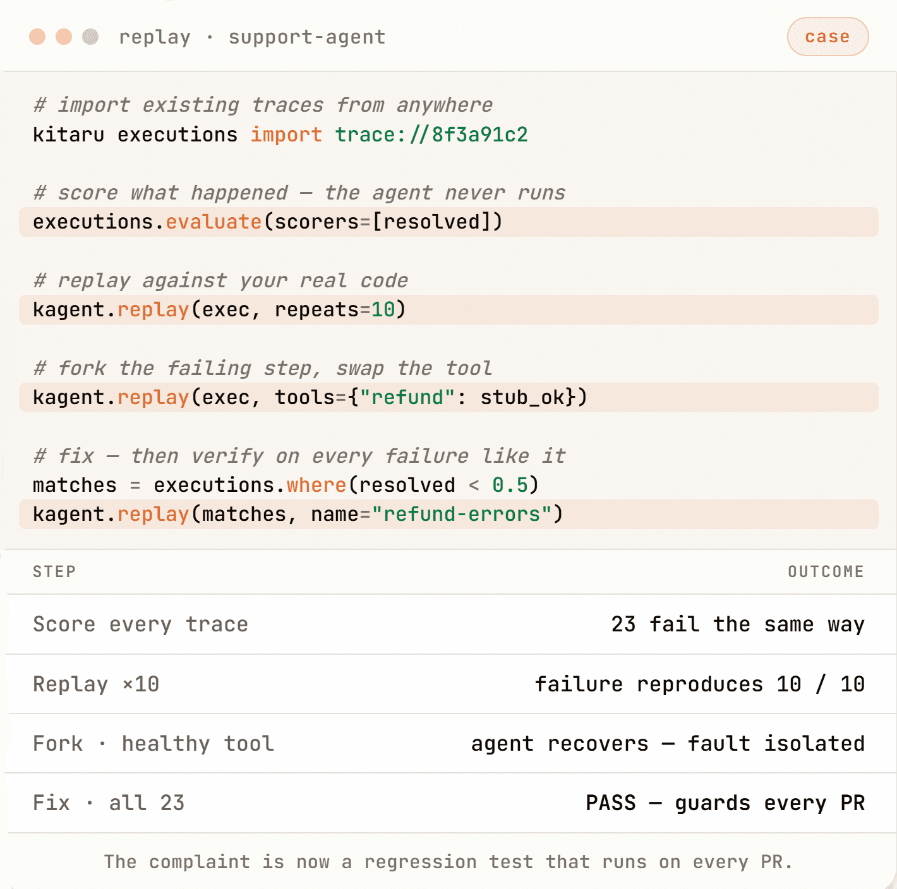

<p align="center">
  <a href="https://kitaru.ai">
    
  </a>
</p>

<h3 align="center">Every agent run, recorded and replayable.</h3>

<p align="center">
  Kitaru (来る, "to arrive") is a self-hosted, framework-agnostic runtime for autonomous agents — underneath the harness your team already picked. You keep your agent SDK, your prompts, your tools, your model. Kitaru records every step of every run — each model call, tool call, and decision — as a replayable checkpoint, so you can diagnose failures, replay runs with a different model or input, and ship agent updates with confidence. All on your own infrastructure.
</p>

<p align="center">
  <a href="https://pypi.org/project/kitaru/"></a>
  <a href="https://pypi.org/project/kitaru/"></a>
  <a href="https://github.com/zenml-io/kitaru/blob/main/LICENSE"></a>
</p>

<p align="center">
  <a href="https://docs.zenml.io/kitaru">Docs</a> &middot;
  <a href="#quick-start">Quick Start</a> &middot;
  <a href="https://docs.zenml.io/kitaru/getting-started/examples">Examples</a> &middot;
  <a href="GETTING_STARTED.md">Getting Started Guide</a> &middot;
  <a href="https://www.zenml.io/roadmap">Roadmap</a> &middot;
  <a href="https://www.zenml.io/slack">Community</a>
</p>

---

<p align="center">
  
</p>

## 🧩 Where Kitaru fits

Agent stacks break cleanly into four layers. Kitaru is exactly one of them.

| Layer | What it does | Examples |
|---|---|---|
| **Model** | The LLM itself — a compute unit over a context window | OpenAI, Anthropic, Google, open-weights, fine-tuned in-house |
| **Harness** | The *loop around the model* — prompts, tools, model loop, framework choice | Pydantic AI / Pydantic AI Harness, LangGraph, Claude Agent SDK, OpenAI Agents SDK, raw Python |
| **Runtime (Kitaru)** | How the agent's runs are *recorded, replayed, and improved over time* — checkpoints, replay, resume, `wait()`, versioned deployments, isolated runtimes | `@flow`, `@checkpoint`, `flow.deploy()`, `kitaru.wait()` |
| **Platform** | How your org *governs* — auth, entitlements, interceptors, observability, product UI, policy | Your existing stack |

Kitaru lives in the middle row. Harnesses define behavior, your stack defines
policy, and Kitaru gives you the execution record — and the replay loop — in
between.

If you're *buying* an agent platform, Kitaru may feel low-level. If you're
*building* one, that's the point.

Platform teams get the execution layer they'd otherwise build themselves —
run lifecycle, checkpoint recording, replay, invocation routing, and
self-hosted execution — without mandating which harness application teams
use on top.

## 🎯 Why Kitaru?

### Record, replay, improve

- **Every step recorded.** Each checkpoint output — model call, tool call,
  decision — is written to your object store as a typed, versioned artifact.
  Step through any run, diff artifacts across runs, and trace a bad output
  back to the exact step that produced it.
- **Replay with overrides.** Re-run any execution from any checkpoint, and
  override what you want to test: swap the model, change a parameter, inject
  a different tool output — and see what would have happened before you ship
  the change.
- **Compare and decide.** `kitaru.llm()` tracks prompt, response, tokens, and
  latency per call, so comparing runs answers questions like "would a smaller
  model have done this cheaper?" with evidence instead of vibes.

### Production mechanics

- **Crash recovery.** A crash, pod eviction, or timeout doesn't send the run
  back to zero. Fix the bug, replay, and the completed checkpoints return cached
  output instead of re-burning tokens.
- **Pause and resume.** `kitaru.wait()` suspends a flow, releases compute, and
  resumes minutes, hours, or days later when input lands from a human, another
  agent, a webhook, or a CLI call.
- **Versioned deployments.** `flow.deploy()` freezes a flow as an immutable
  snapshot consumers invoke by name. Tag to roll out, re-tag to roll back.
  Nothing that *calls* the agent redeploys when a new version ships.
- **Isolated execution.** `@checkpoint(runtime="isolated")` runs a specific
  step in its own pod or job on Kubernetes, AWS, GCP, or Azure. Heavy or risky
  steps stay isolated; orchestration stays inline.

### Python-first, no graph DSL

Write normal Python. Use `if`, `for`, `try/except` — whatever your agent needs.
Kitaru gives you two decorators (`@flow` and `@checkpoint`) and a handful of
utility functions. That's all you need.

```python
from kitaru import checkpoint, flow

@checkpoint
def research(topic: str) -> str:
    return do_research(topic)

@checkpoint
def write_draft(research: str) -> str:
    return generate_draft(research)

@flow
def writing_agent(topic: str) -> str:
    data = research(topic)
    return write_draft(data)

result = writing_agent.run("quantum computing").wait()
```

### Deploy on your cloud

A single self-hosted server, your own infra. Flows run on whichever **stack**
you pick — local, Kubernetes, GCP, AWS, or Azure — with artifacts in your own
S3/GCS/Azure Blob bucket. No mandatory SaaS control plane.

### Built-in UI

Every execution is observable from day one. See your agent runs, inspect
checkpoint outputs, and approve human-in-the-loop wait steps, all from a UI
that ships with the Kitaru server.

To start the server locally, run `kitaru login` after installing `kitaru[local]`.
To connect to an existing remote server, run `kitaru login <server>`.

### Works with your agent SDK

Wrap an existing PydanticAI agent with `KitaruAgent` — no rewrite. For agents
built on the OpenAI Agents SDK, Anthropic Agent SDK, or raw Python, use `@flow`
and `@checkpoint` around your calls. Your model, your tools, your framework —
Kitaru wraps them, not the other way around.

```python
from kitaru.adapters.pydantic_ai import KitaruAgent
from pydantic_ai import Agent

researcher = KitaruAgent(
    Agent(
        "openai:gpt-5.4",
        name="researcher",
        system_prompt="You summarize research topics.",
    )
)
researcher.register(label="stable")
result = researcher.run_sync("Summarize durable AI agents.")
```

<a id="quick-start"></a>

## 🚀 Quick Start

### Install

```bash
pip install kitaru
```

Or with [uv](https://docs.astral.sh/uv/) (recommended):

```bash
uv pip install kitaru
```

To wrap a PydanticAI agent, install the adapter extra:

```bash
uv pip install "kitaru[pydantic-ai]"
```

### Optional: start a local Kitaru server

Flows run locally by default with the base install. If you also want the local
dashboard and REST API, install the local extra and then run bare `kitaru login`:

```bash
uv pip install "kitaru[local]"
kitaru login
kitaru status
```

### Optional: connect to an existing remote Kitaru server

If you already have a deployed Kitaru server, connect to it explicitly and choose
the project you want later commands to use:

```bash
kitaru login https://my-server.example.com --project production
kitaru status
kitaru agents list
```

The `--project production` option selects that Project during login. Agents are
the canonical public lifecycle resource. After registering a `KitaruAgent`,
inspect or switch initialized Agents with `kitaru agents current` and
`kitaru agents use`.

An existing Project without Agent metadata is a compatibility state. Until its
first Agent registration, select it with `KITARU_PROJECT=production` or the
hidden compatibility command `kitaru project use production`. Do not use the
deprecated `project` commands for normal Agent lifecycle work.

For CI, Docker, and other headless environments, set `KITARU_PROJECT` alongside
`KITARU_SERVER_URL` and `KITARU_AUTH_TOKEN` instead of relying on persisted local
state.

### Initialize your project

```bash
kitaru init
```

### Write your first flow

```python
# agent.py
from kitaru import checkpoint, flow

@checkpoint
def fetch_data(url: str) -> str:
    return "some data"

@checkpoint
def process_data(data: str) -> str:
    return data.upper()

@flow
def my_agent(url: str) -> str:
    data = fetch_data(url)
    return process_data(data)

result = my_agent.run("https://example.com").wait()
print(result)  # SOME DATA
```

### Run it

```bash
python agent.py
```

Every step is recorded automatically. Inspect any run, then replay it from a
checkpoint — a faithful rerun, or a fork with one input changed (a different
model or parameter) so you can see what *would* have happened before you ship
the change:

```bash
kitaru executions list
kitaru executions get <EXECUTION_ID>
kitaru executions logs <EXECUTION_ID>

# Reproduce a run faithfully from a checkpoint
kitaru executions replay <EXECUTION_ID> --at process_data

# Fork the same run with one input changed
kitaru executions replay <EXECUTION_ID> --at fetch_data \
  --flow-overrides '{"url": "https://other.example.com"}'
```

See [Replay and overrides](https://docs.zenml.io/kitaru/guides/replay-and-overrides)
for the full reproduce → fork → diff loop.

### Deploy it

When the flow is ready, deploy it as a versioned snapshot and invoke it by
name — no redeploy of whatever *calls* the agent.

```python
# Freeze the current code + dependencies as a versioned snapshot.
# Parameterized flows take representative deployment-time inputs;
# consumers can override them at invocation time.
my_agent.deploy(url="https://example.com")

# Consumers invoke by name — from Python, CLI, MCP, or HTTP.
from kitaru import KitaruClient
KitaruClient().deployments.invoke(
    flow="my_agent",
    inputs={"url": "https://example.com"},
)
```

```bash
# Tag a version into a stage; re-tag to roll back.
kitaru flow tag my_agent latest --stage=prod
kitaru flow tag my_agent v2     --stage=prod   # rollback
```

## 📚 Learn more

| Resource | Description |
|---|---|
| [Getting Started Guide](GETTING_STARTED.md) | Full setup walkthrough with all examples |
| [Documentation](https://docs.zenml.io/kitaru) | Complete reference and guides |
| [Agents guide](https://docs.zenml.io/user-guides/agents-guide) | Run, replay, and improve production agents end to end |
| [Examples](https://docs.zenml.io/kitaru/getting-started/examples) | Runnable workflows for every feature |
| [Stacks](https://docs.zenml.io/kitaru/stacks) | Deploy to Kubernetes, AWS, GCP, or Azure |

## 🌱 Origins

Kitaru is built by the team behind [ZenML](https://zenml.io), drawing on five
years of production orchestration experience (JetBrains, Adeo, Brevo). The
orchestration primitives (stacks, artifacts, lineage) are purpose-rebuilt here
for autonomous agents.

## 🤝 Contributing

We welcome contributions! See [CONTRIBUTING.md](CONTRIBUTING.md) for development
setup, code style, and how to submit changes. The default branch is `develop` —
all PRs should target it.

## 💬 Community and support

- [Discussions](https://www.zenml.io/slack) — ask questions, share ideas
- [Issues](https://github.com/zenml-io/kitaru/issues) — report bugs, request features
- [Roadmap](https://www.zenml.io/roadmap) — see what's coming next
- [Docs](https://docs.zenml.io/kitaru) — guides and reference

## 📄 License

[Apache 2.0](LICENSE)


