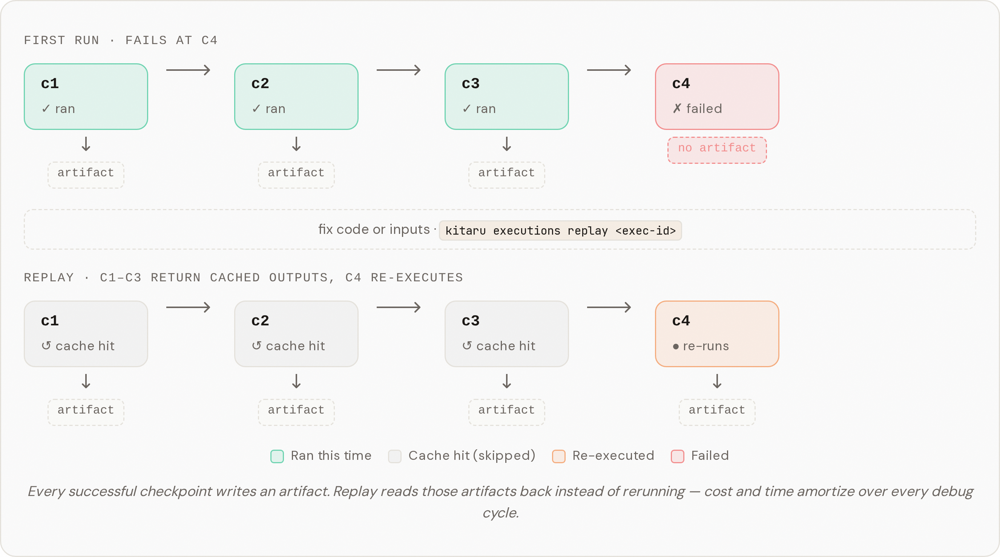

# Checkpoints

A **checkpoint** is a unit of work inside a flow whose output is automatically
persisted. It's also the **contract between the runner and the
[execution target](how-it-works.md)**: the runner owns durable control flow
(order, retry, replay, resume, wait), the execution target (inline, isolated
container, sandbox, external tool) does the work, and the checkpoint is what they
agree on.

That separation is why a checkpoint failure is never just a crash — it's
persisted context the runner, agent loop, or a human can retry, replay, or feed
back into the flow. See [How It Works](how-it-works.md) for the full model.

## Checkpoints are replay boundaries

Every checkpoint is a boundary the runner remembers. On the first run, checkpoint
outputs are computed and stored. On replay, completed checkpoints return their
persisted outputs — execution only re-enters the first incomplete one.

<figure><figcaption></figcaption></figure>

You can also **override** a cached checkpoint's output during replay — useful
when you want to correct a single step's result and let the rest of the flow
continue. See [Replay and overrides](../guides/replay-and-overrides.md).

## Defining a checkpoint

Decorate work functions with `@checkpoint`:

```python
from kitaru import checkpoint

@checkpoint
def fetch_data(url: str) -> str:
    return requests.get(url).text

@checkpoint
def process_data(data: str) -> str:
    return data.upper()
```

Checkpoints are reusable — define them once and call them from any flow.

## Composing checkpoints in a flow

Call checkpoints from inside a `@flow` to build your workflow:

```python
from kitaru import flow

@flow
def my_agent(url: str) -> str:
    data = fetch_data(url)
    result = process_data(data)
    return result
```

Checkpoints execute sequentially by default. The return value of one checkpoint
can be passed directly as input to the next — standard Python data flow.

## Concurrent execution

For independent work that can run in parallel, use `.submit()`:

```python
from kitaru import flow

@flow
def parallel_agent(urls: list[str]) -> list[str]:
    futures = [fetch_data.submit(url) for url in urls]
    return [f.result() for f in futures]
```

`.submit()` returns a future-like object. Call `.result()` on it to get the
checkpoint's return value. This is the primary fan-out pattern in Kitaru.


The object returned by `.submit()` is a runtime future — use `.result()` to
collect the value. You can submit multiple checkpoints and collect their results
later for fan-out / fan-in patterns.


### Additional concurrent helpers

Kitaru also provides `.map()` and `.product()` for batch concurrent execution:

```python
# .map() — apply checkpoint to each element of an iterable
results = fetch_data.map(["url1", "url2", "url3"])

# .product() — apply checkpoint to the cartesian product of inputs
results = my_checkpoint.product(["a", "b"], [1, 2])
```

These are convenience wrappers over concurrent submission. See the
[API reference](../reference/python/checkpoint.md) for detailed signatures.

## Decorator options

```python
from kitaru import checkpoint

@checkpoint(retries=3, type="llm_call")
def call_model(prompt: str) -> str:
    ...
```

| Option | Default | What it controls |
|---|---|---|
| `retries` | `0` | Automatic retries on checkpoint failure |
| `cache` | `True` | Reuse the persisted output from a previous run when inputs and code match. Set `False` to disable on this checkpoint (overrides the flow-level default). |
| `type` | `None` | A label for UI visualization (e.g. `"llm_call"`, `"tool_call"`) |
| `runtime` | `None` | Execution runtime: `"inline"` or `"isolated"` (see below) |

Like flow options, `retries` must be non-negative.

### Isolated runtime

By default, checkpoints run **inline** — in the same process/pod as the runner.
This is the right default for most orchestration. For checkpoints that run
untrusted code, need a different image or resources, or must be strongly isolated
from the rest of the run, set `runtime="isolated"` and the runner will place the
checkpoint on a separate container/job on the configured stack (Kubernetes,
Vertex AI, SageMaker, AzureML). Locally it falls back to inline so dev loops stay
fast.

```python
@checkpoint(runtime="isolated")
def heavy_computation(data: str) -> str:
    ...
```

This applies to every execution of the checkpoint, whether called directly or
submitted concurrently with `.submit()`:

```python
@flow
def parallel_agent(items: list[str]) -> list[str]:
    # Each submission runs in its own container when runtime="isolated"
    futures = [heavy_computation.submit(item) for item in items]
    return [f.result() for f in futures]
```


`runtime` controls **where** a checkpoint runs (same process vs. separate
container). `.submit()` controls **when** — it enables concurrency. The two are
independent: you can use `.submit()` without isolation, or isolation without
`.submit()`.



If the active orchestrator does not support isolated steps, the runtime is
silently downgraded to inline with a warning. Local stacks always run inline.


When retries are enabled, Kitaru records each failed attempt before the final
checkpoint outcome. You can inspect this history through
`KitaruClient().executions.get(exec_id).checkpoints[*].attempts`.

## Error handling and retries

When a checkpoint raises an unhandled exception, the flow stops immediately and
the execution is marked as **failed**. No subsequent checkpoints run.

### Automatic retries

The `retries` parameter on `@checkpoint` tells Kitaru to re-run the checkpoint
automatically before giving up:

```python
@checkpoint(retries=3)
def call_model(prompt: str) -> str:
    return client.chat(prompt)  # retried up to 3 times on failure
```

Each failed attempt is recorded, so you can inspect the full retry history
through the execution's checkpoint attempts. If the checkpoint still fails after
all retries, the flow fails.

For retrying the **entire flow** (not just a single checkpoint), see the
[`retries` option on flows](flows.md#runtime-options).

### Resuming after failure

When a flow fails, you don't need to re-run everything from scratch. Use
[replay](../guides/replay-and-overrides.md) to re-execute from the point of
failure — checkpoints that already succeeded return their recorded results, and
execution picks up at the first incomplete checkpoint.

## Return values

Checkpoint return values must be serializable — Kitaru persists them so they can
be reused in future executions. Prefer:

* Built-in Python types (`str`, `int`, `float`, `bool`, `list`, `dict`)
* Pydantic models
* JSON-compatible data structures

## Rules to know

Kitaru enforces several guardrails in the current release:

* **Checkpoints only work inside a flow.** Calling a checkpoint outside a
  `@flow` raises `KitaruContextError`.
* **No nested checkpoints.** Calling one checkpoint from inside another is not
  supported and raises `KitaruContextError`.
* **`.submit()` requires a running flow.** Concurrent submission is only
  available during flow execution, not during flow compilation.
* **`.map()` and `.product()` follow the same rules as `.submit()`** — they
  require a running flow context.

```python
from kitaru import checkpoint

# This raises KitaruContextError — checkpoint called outside a flow
fetch_data("https://example.com")

# This also raises KitaruContextError — nested checkpoint
@checkpoint
def outer():
    return inner()  # inner is also a checkpoint — not allowed
```

## Next steps

* Add structured metadata to your checkpoints with
  [Logging and Metadata](logging.md)
* Understand how results and errors surface in [Flows](flows.md#how-errors-surface)
* See the full API in the [Checkpoint Reference](../reference/python/checkpoint.md)

## Related blog posts

* [Why agents need durable execution](https://kitaru.ai/blog/why-agents-need-durable-execution)
* [No journal replay](https://kitaru.ai/blog/no-journal-replay)
