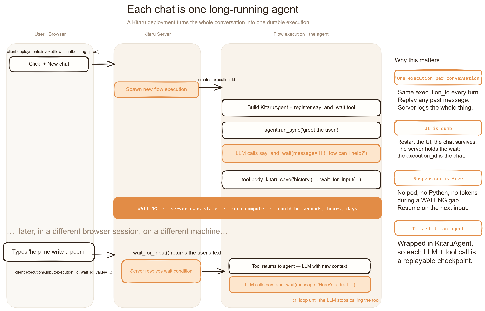

# Durable chatbot



> **Are modern chatbots just long-horizon async agents?**
> If you squint, yes — a chat session is an agent that thinks for a few seconds, hands the turn over to a human, and waits. Sometimes for minutes. Sometimes for days.

This example takes that idea literally. We model the entire conversation as **one PydanticAI agent** with one human-in-the-loop tool. When the agent wants to talk to the user, it calls the tool. The tool calls `kitaru.wait(...)` under the hood, the underlying compute is freed, and the run sleeps. When the user replies, Kitaru spins the pod back up and the agent picks up exactly where it left off.

```python
@agent.tool
def say_and_wait(ctx: RunContext[Conversation], message: str) -> str:
    """Send MESSAGE to the user and return whatever they reply.

    Internally: kitaru.save("history", …) → kitaru.wait(...) → save → return.
    """
```

That's the whole loop. Greeting, every assistant turn, and "goodbye" are all the LLM choosing to call `say_and_wait`. When it stops calling it, the conversation ends.

In this paradigm — where the runtime is smart enough to release compute during the human's turn — every chatbot is a long-horizon agent. A session can last months until the user is satisfied, and you only pay for the seconds the model is actually thinking.

## Quick start

```bash
cd examples/chatbot
uv sync --extra pydantic-ai

# Deploy the flow once to a stack the server can execute remotely
kitaru deploy chatbot.py:chatbot --tag prod --stack <remote-stack> --exclusive

# Run the Gradio UI
uv add --dev gradio
export OPENAI_API_KEY=sk-...
uv run python ui.py
```

Open `http://127.0.0.1:7860`, click **Start a new chat**, and start talking. Close the browser, restart the UI, click your session in the sidebar — the conversation is right where you left it.

## What's in the box

| File | What it does |
| --- | --- |
| [`chatbot.py`](chatbot.py) | One `@flow` containing one `KitaruAgent` with one `say_and_wait` tool. ~120 lines. |
| [`ui.py`](ui.py) | Gradio UI: invokes the deployment, polls for waits, pipes the user's text back via `executions.input(...)`. |

The flow stores the full message list as a single `history` artifact, updated on every turn. The UI rehydrates a session by loading the latest one — no exec-ID pasting, no clever bookkeeping.

## What to look for

After a few turns, open the Kitaru dashboard for the execution:

- **The agent's synthetic checkpoint per LLM call** — `KitaruAgent` wraps every model request, tool call, and wait under its own replay boundary.
- **The `history` artifact, versioned per turn** — every `say_and_wait` body call appends and saves; replay reuses the latest one.
- **Multiple completed `wait`s** — one per user turn, each with the question the LLM asked and the user's reply.

If you kill the pod between turns, the execution stays `WAITING` indefinitely. When the user finally sends another message, the server schedules a fresh pod and the run resumes from the wait — same checkpoints, same artifacts, no replay of completed turns.

## Adapt this to your own chatbot

The agent loop is generic. To make this a real product:

1. **Swap the system prompt** for your product's persona and rules.
2. **Add more tools** alongside `say_and_wait`. The agent can browse, query a DB, or call other Kitaru flows in between user turns — each tool call is its own checkpoint and is replay-safe.
3. **Plug in a real frontend.** The UI here is Gradio for demo speed; in production the contract is just `client.deployments.invoke(...)` to start a session and `client.executions.input(...)` to feed each user message.

That's the whole pattern. One agent, one HITL tool, durable runtime — chat sessions that live as long as your users care to keep them.
