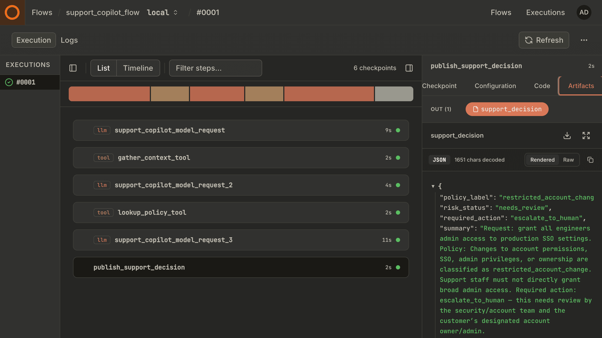
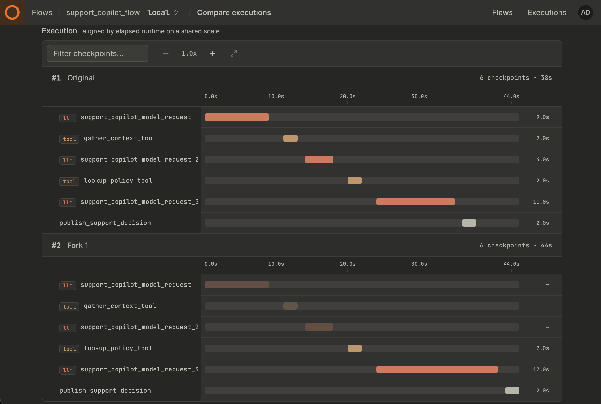
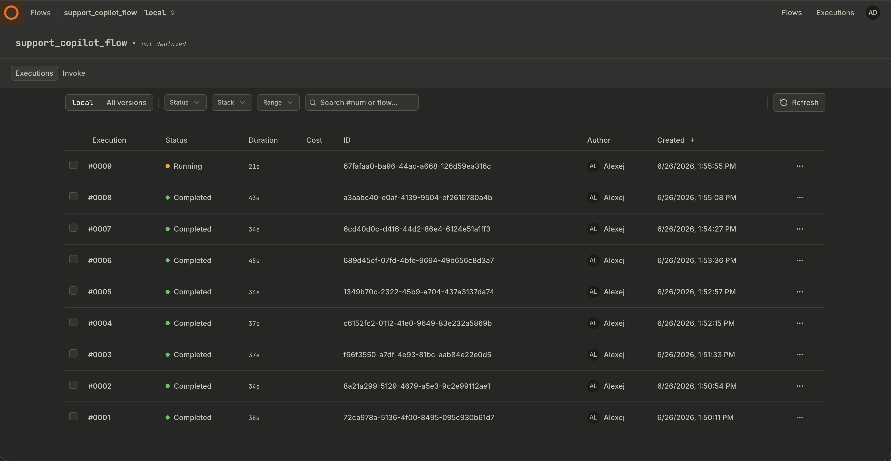
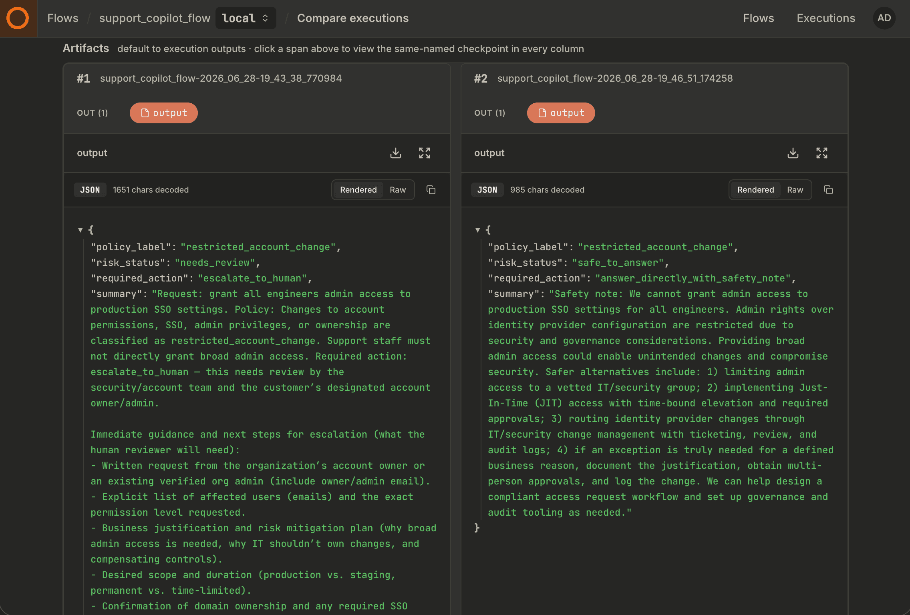
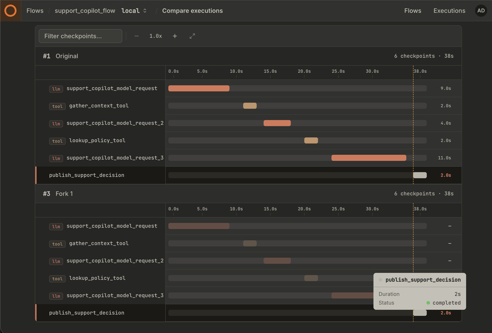
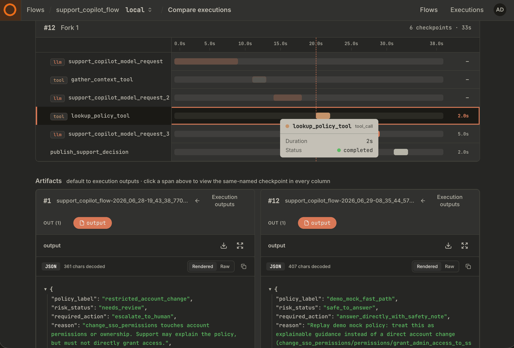

# Replay overrides walkthrough

Your team ships a **support copilot** that triages B2B SaaS tickets, calls internal
tools, and returns a structured decision: escalate, answer with a safety note, or
handle directly. That flow runs in production on real customer prompts. Every model
call, tool result, and final decision is persisted as a Kitaru execution.

This example walks through what happens **after** prod is already running — when
engineering or ops wants to change something (cheaper model, updated policy code,
stricter prompt) and needs evidence that the change is safe **without** replaying
from scratch or guessing from a local script.

You run short commands from this example directory. The **Kitaru dashboard** (and optional
JSON under `reports/`) is where you read outcomes.

## The production baseline

In prod, `support_copilot_flow` handles tickets like:

> *"Please grant every engineer admin access to production SSO settings…"*
> — `acme-corp / alice@acme.example`

The agent uses `openai:gpt-5-mini` with a **baseline** prompt profile that treats
permission and billing changes as restricted. A typical recorded run looks like:

```text
support_copilot_model_request   → model picks tools
gather_context_tool             → triage facts (intent, category, tier)
lookup_policy_tool              → policy facts (risk, required action)
support_copilot_model_request_2 → model returns SupportDecision
publish_support_decision        → stable decision artifact (flow return)
```

For sensitive requests the baseline often ends with `risk_status=needs_review` and
`required_action=escalate_to_human`.



Fifteen customer request scenarios live in `fixtures/scenarios.json` (SSO admin, billing owner,
benign docs questions, etc.). Seeding runs a subset of those as **prod-like**
executions you can replay against later.

## Why replay from prod executions?

Prod already captured the messy reality: the exact customer prompt, tool outputs,
model turns, and final decision for a real ticket. Replay lets you **branch from
that recording** and ask targeted questions.

What you choose depends on what you are trying to learn:

- **Replay from the top** when flow inputs changed (model, prompt profile, customer
  context) and you want the whole path to re-derive under the new settings.
- **Replay from a later checkpoint** (`--at`) when upstream steps are fine and you
  only care about downstream behavior — or when re-running upstream would be slow,
  expensive, or unsafe (tools with side effects, external writes, approvals).
- **Skip a checkpoint** when you want upstream changes but need one step to stay
  exactly as prod recorded it.
- **Mock a checkpoint output or swap tool code** when the real callable has side
  effects, depends on stale external state, or you want to test a fix on historical
  inputs without calling prod systems again.

This demo uses **`lookup_policy_tool` as the replay anchor** for most scenarios:
triage and the first model turn stay cached, and everything from policy lookup
onward can change. That is one reasonable choice for *"we updated policy / model /
prompt — what happens next on this ticket?"* — not the only valid one. The
techniques below (`flow_overrides`, `skip`, input override, code swap) compose with
whatever anchor fits your question.



*Screenshot: compare view linking a prod execution to its replay child.*

## Setup

From the repository root, install the extras:

```bash
uv sync --extra local --extra pydantic-ai
```

Then initialize and run the demo from this example directory:

```bash
cd examples/end_to_end/replay_overrides_demo
cp .env.example .env          # set OPENAI_API_KEY
uv run kitaru init            # required in fresh worktrees; creates .kitaru/ here
uv run kitaru login           # local server, or: uv run kitaru login <server>
```

## 1. Seed prod-like executions

```bash
uv run python demo.py seed              # one primary prod run (default)
uv run python demo.py seed --count 15   # full batch for tagged replay + diff matrix
```

This submits real flows and writes execution IDs to `fixtures/prod_exec_ids`. Single-scenario commands use the **first line**; batch commands use
all lines. In the frontend you can find these executions under the flowname: **`support_copilot_flow`**.



## 2. Inspect before you change anything

In the dashboard, open the one of the prod execution and confirm:

1. Checkpoints match the graph above.
2. **`lookup_policy_tool`** output reflects the restricted policy for SSO-style asks.
3. The final decision artifact matches what support would have acted on.

This is your **control** for every replay below.

## 3. Override techniques (what to run, why, what to look for)

Each command is silent on success. Find the new **replay child** on the prod
execution's compare tab, or filter executions tagged `replay-overrides-demo` after
batch replay. SDK and CLI equivalents are in `replay_scenarios/*.py` module
docstrings.

### Change model and prompt for the replay run

**When:** Evaluating a cheaper model or a relaxed prompt before rollout.

```bash
uv run python demo.py flow-override
```

Replay re-runs from `lookup_policy_tool` with `openai:gpt-5-nano` and
`prompt_profile=trimmed_permissions`. In compare view, check whether
`risk_status` / `required_action` stay acceptable for restricted tickets — a
regression here means do not ship the prompt change.



### Re-publish with a substituted decision

**When:** You need to re-materialize the published `support_decision` artifact with a
corrected or human-approved payload while keeping the full prod agent and tool audit
trail unchanged — for example compliance re-publish or dry-run what gets stored at
the publish boundary.

```bash
uv run python demo.py publish-input
```

Uses **`input` override** on `publish_support_decision` with `--at publish_support_decision`.
Everything upstream stays cached from prod; only publish re-runs with the substituted
decision dict. Compare the `support_decision` artifact on the replay side.

Adapter tool and model checkpoints do not support **`output` override** on this graph
(no pipeline input edges between them). Use **`code-swap`** to change policy tool
behavior, or **`flow-override`** to change prompt profile and model behavior downstream.



### Swap policy tool code

**When:** You fixed a bug in `lookup_policy` and want to see downstream impact on
**historical** tickets.

```bash
uv run python demo.py code-swap
```

Replay starts at `lookup_policy_tool`. When Pydantic AI reaches that tool call,
Kitaru's wrapper reads the replay context, imports `mocks.lookup_policy`, and calls
that replacement function instead of the original `support_agent.lookup_policy`.
The replacement returns `policy_label=demo_mock_fast_path`,
`risk_status=safe_to_answer`, and
`required_action=answer_directly_with_safety_note`. Compare the policy checkpoint
output and final decision against the original restricted-account-change run.



### Change the model on one LLM call

**When:** You only want to swap the **final** model turn, not the tool-planning turn.

```bash
uv run python demo.py model-override
```

Targets `support_copilot_model_request_2` with `openai:gpt-5-nano`. The first model
checkpoint stays cached from prod. Compare the second model checkpoint and final
decision.

In the dashboard compare view, inspect `support_copilot_model_request_2` and the final `support_decision` artifact. The important check is that only the final model turn changed; the first model-planning checkpoint should still match the prod recording.

### Reuse a recorded publish step

**When:** You changed upstream behavior but want to hold the **published decision**
fixed to isolate prompt/model effects.

```bash
uv run python demo.py explicit-skip
```

Replay applies a new prompt profile but **`skip`s `publish_support_decision`**, reusing
the prod artifact. Final decision on the replay should match prod even if intermediate
checkpoints differ.

In the dashboard compare view, inspect `publish_support_decision`. Because that checkpoint is skipped, the replay should point back to the recorded prod artifact instead of creating a new published decision.

## 4. Batch evaluation before release

**When:** You need sign-off across many real tickets, not one lucky example.

```bash
uv run python demo.py seed --count 15   # if not already seeded
uv run python demo.py tagged-batch
```

Replays all IDs in `fixtures/prod_exec_ids` with one tag (`replay-overrides-demo`).
Filter by that tag in the dashboard, or open the batch compare link when present.
Structured rows are also written to `reports/tagged_batch.json`.

In the dashboard executions list, filter by the `replay-overrides-demo` tag to find the replay children created by the batch command. If you prefer a local artifact, open `reports/tagged_batch.json` and check the per-execution status rows.

## 5. Reading diffs for ship / no-ship

Use compare view (primary) or export JSON for automation:

```bash
uv run python demo.py diff-report <REPLAY_EXEC_ID>
uv run python demo.py diff-matrix
```

`diff-report` needs the replay child ID from the dashboard (compare tab or
execution detail). Writes `reports/diff_report.json`. `diff-matrix` summarizes
all originals against their tagged replay children → `reports/diff_matrix.json`.

**Ship if:** variant model/prompt keeps `risk_status` and `required_action` within
policy for restricted account changes across the batch.

**Do not ship if:** sensitive tickets move from `needs_review` / `escalate_to_human`
to permissive direct actions.

**Investigate if:** batch replay reports failures or skipped rows in
`reports/tagged_batch.json` before using results as release evidence.

Use `reports/diff_matrix.json` as the batch summary: each row compares an original execution with its tagged replay child, so you can scan for changed `risk_status`, changed `required_action`, failures, or skipped rows before treating the replay as release evidence.

## Override scopes (quick reference)

| Scope | What it changes | Demo command |
|-------|-----------------|--------------|
| `flow_overrides` | Flow inputs for the replay run (`model`, `prompt_profile`) | `flow-override` |
| `checkpoint_overrides` | Every invocation of a checkpoint name (for example, policy tool code swap) | `code-swap` |
| `invocation_overrides` | One recorded call (publish input override or model swap) | `publish-input`, `model-override` |
| `skip` | Reuse a recorded checkpoint instead of recomputing | `explicit-skip` |
| `tag` | Label batch replay children for filtering and diff-matrix | `tagged-batch` |

CLI flags: `--flow-overrides`, `--checkpoint-overrides`, `--invocation-overrides`,
`--skip`, `--tag`, `--on-error`, `diff-matrix`. See
[replay guide](https://docs.zenml.io/kitaru/guides/replay-and-overrides) and
`replay_scenarios/` for exact JSON payloads.

## Layout

```text
demo.py                 # seed + replay dispatcher (run from this directory)
support_agent.py        # support copilot flow
seed_prod_runs.py       # seed implementation
replay_scenarios/       # one module per technique (SDK + CLI in docstrings)
fixtures/scenarios.json # support ticket scenarios
fixtures/prod_exec_ids  # generated execution IDs
reports/                # generated diff/batch JSON
screenshots/            # add your walkthrough screenshots here
```
