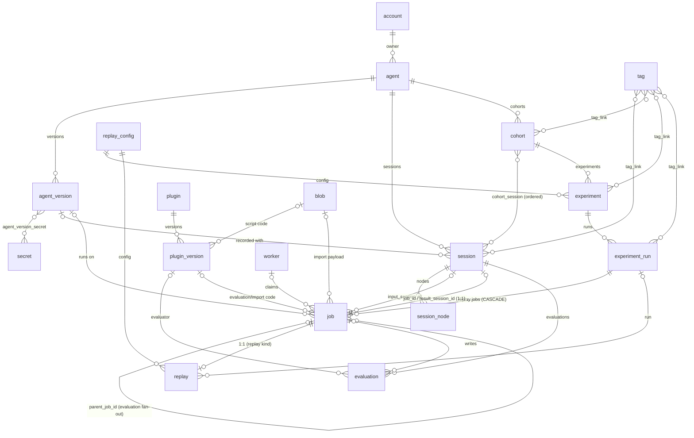

# Server

The server design: every endpoint, API model, domain model, and ORM model, with their connections.

## Layer map

A request flows through four layers:

```
routers (adapters/rest/routers)          FastAPI handlers, api_models in and out
  └─ mapping (adapters/rest/mapping)     api_models ↔ domain models, filters, and commands
      └─ services (application/services) orchestration, invariants, transactions
          └─ repositories (adapters/db/repositories)  domain ↔ ORM models
              └─ orm (adapters/db/orm)                SQLAlchemy tables
```

- `api_models/` is the wire contract shared by server and client. Neither imports the other, both import `api_models`.
- `application/models/` holds `FrozenModel` filter and command objects that services accept.
- `application/interfaces/` holds the repository protocols the services depend on.
- `domain/` holds the entities, value objects, enums, and domain errors.
- Exception mapping is global in `app.py`: `NotFoundError` 404, `ConflictError` 409, `PayloadTooLargeError` 413, `ValidationError` 422, `DomainError` 500, body always `{"detail": str}`.
- Auth is one dependency, `authorize`, yielding `AuthContext(account, csrf_token)`. Credentials are an API key (`KITKEY_` prefix) or a JWT, from bearer header or cookie. Health and login/logout routes skip it. There is no separate worker auth.
- Ownership is provenance, not authorization: the server is a trusted-team deployment, `owner_id` records who created a resource, and no service filters or rejects by owner. Every authenticated account reads and writes every resource.
- Pagination is uniform: `cursor` (opaque, from the previous response), `size` (ge=1, le=1000, default 20), and `sort` (`created:asc` or `created:desc`, default `created:desc`) on the `ListParams` base model, response `Page[T]` with `items` and `next_cursor` (null on the last page). The keyset rides the UUIDv7 id. Cursors embed the sort and a hash of the filter fields, changing either mid-pagination is a 422, changing `size` is allowed. Sortable fields are an allowlist per filter model (`sortable_fields` ClassVar, default `created`), a field beyond that needs a `(field, id)` composite index.
- Commits happen before the response leaves: routers register through a custom `APIRoute` subclass that commits the request session after the handler returns and before the response is sent, so a 2xx means the write is committed and an immediate follow-up read sees it. An exception skips the commit and the session rolls back on close.
- PATCH semantics are uniform: an omitted field is unchanged, an explicitly null field clears, a 422 where clearing is invalid (e.g. `status`). Mapping functions build update commands from the request's `model_fields_set` only, and commands preserve their own `model_fields_set`, so services distinguish omitted from null without per-resource conventions. A dict-valued field (`metadata`, `values`, `env`) is replaced whole, never merged key by key, so a PATCH carrying a dict always states the final map. Key-level merging is a dedicated endpoint where it is wanted, `POST /v1/sessions/{id}/evaluations` being the one case.
- Paginated list endpoints take an `XListParams(ListParams)` query model from `api_models`, bound in routers via `Annotated[XListParams, Query()]` and converted to the application filter by `<x>_list_params_to_filter` in the mapping module. Lists without resource-specific params take `ListParams` directly.
- Client list methods take the same params model, defaulting to a fresh instance, and send `model_dump(mode="json", exclude_unset=True)`. No hand-rolled `if x is not None` param dicts in resources. Each resource also exposes `iter()` next to `list()`, an async generator following `next_cursor` to exhaustion. Endpoints nested under a resource path live on the parent resource with the path parameter as the first argument (`/v1/sessions/{id}/nodes` → `client.sessions.list_nodes`, `iter_nodes`, `ingest_nodes`), there is no separate client resource for them.
- The client is constructed directly or via `KitaruAPIClient.from_env()` (`KITARU_API_URL`, `KITARU_API_KEY`, a missing URL is a `RuntimeError`). Requests go through a retrying transport: transport errors and 408/429/502/503/504 retry with backoff, a request with a streaming body is sent exactly once, and every request carries an `Idempotency-Key` header held stable across attempts. The server does not dedup on it yet, see future_improvements.md.

## Endpoints

`/v1/imports` and `/v1/session-runs` are POST-only command endpoints creating jobs, they have no GET. `POST /v1/evaluations` creates jobs too, while its GETs read stored evaluation rows.

### health (`/health`, unauthenticated)

| Method | Path | Request | Response | Service |
|---|---|---|---|---|
| GET | /health | - | `dict[str, str]`, 503 on DB probe failure | raw `SELECT 1` |
| GET | /health/live | - | `dict[str, str]` | - |

### auth (`/v1`, unauthenticated)

| Method | Path | Request | Response | Service |
|---|---|---|---|---|
| POST | /v1/login | form `username`, `password` | `TokenResponse`, sets auth cookie | `AuthService.login_with_password` |
| POST | /v1/logout | - | 204, deletes cookie | - |

### accounts (`/v1/accounts`)

| Method | Path | Request | Response | Service |
|---|---|---|---|---|
| POST | /v1/accounts | `AccountCreateRequest` | `AccountResponse` 201 | `AccountService.create_account` |
| GET | /v1/accounts | query name, active | `Page[AccountResponse]` | `AccountService.list_accounts` |
| GET | /v1/accounts/{id} | - | `AccountResponse` | `AccountService.get_account` |
| PATCH | /v1/accounts/{id} | `AccountUpdateRequest` | `AccountResponse` | `AccountService.update_account` |

No DELETE for accounts.

### agents (`/v1/agents`)

| Method | Path | Request | Response | Service |
|---|---|---|---|---|
| POST | /v1/agents | `AgentCreateRequest` | `AgentResponse` 201 | `AgentService.create_agent` |
| GET | /v1/agents | query name | `Page[AgentResponse]` | `AgentService.list_agents` |
| GET | /v1/agents/{id} | - | `AgentResponse` | `AgentService.get_agent` |
| PATCH | /v1/agents/{id} | `AgentUpdateRequest` | `AgentResponse` | `AgentService.update_agent` |
| DELETE | /v1/agents/{id} | - | 204 | `AgentService.delete_agent` |
| POST | /v1/agents/{id}/versions | `AgentVersionCreateRequest` | `AgentVersionResponse` 201 | `AgentVersionService.create_version` |
| GET | /v1/agents/{id}/versions | - | `Page[AgentVersionResponse]` | `AgentVersionService.list_versions` |

### agent-versions (`/v1/agent-versions`)

| Method | Path | Request | Response | Service |
|---|---|---|---|---|
| GET | /v1/agent-versions/{id} | - | `AgentVersionResponse` | `AgentVersionService.get_version` |
| PATCH | /v1/agent-versions/{id} | `AgentVersionUpdateRequest` | `AgentVersionResponse` | `AgentVersionService.update_version` |
| DELETE | /v1/agent-versions/{id} | - | 204 | `AgentVersionService.delete_version` |

### api-keys (`/v1/api-keys`)

| Method | Path | Request | Response | Service |
|---|---|---|---|---|
| POST | /v1/api-keys | `ApiKeyCreateRequest` | `ApiKeyIssuedResponse` 201 | `ApiKeyService.create_api_key` |
| GET | /v1/api-keys | query name | `Page[ApiKeyResponse]` | `ApiKeyService.list_api_keys` |
| GET | /v1/api-keys/{id} | - | `ApiKeyResponse` | `ApiKeyService.get_api_key` |
| PATCH | /v1/api-keys/{id} | `ApiKeyUpdateRequest` | `ApiKeyResponse` | `ApiKeyService.update_api_key` |
| DELETE | /v1/api-keys/{id} | - | 204 | `ApiKeyService.delete_api_key` |

### blobs (`/v1/blobs`)

| Method | Path | Request | Response | Service |
|---|---|---|---|---|
| POST | /v1/blobs | multipart file | `BlobResponse`, 201 or 200 on dedup hit | `BlobService.upload_blob` |
| GET | /v1/blobs/{id} | - | `BlobResponse` | `BlobService.get_blob` |
| GET | /v1/blobs/{id}/content | - | raw bytes with the blob media type | `BlobService.download_blob` |
| DELETE | /v1/blobs/{id} | - | 204 | `BlobService.delete_blob` |

Uploads are capped by a server setting (max blob size, default 100 MiB), a larger file is a 413. The cap must stay at or below the worker's payload cache budget (`PAYLOAD_CACHE_MAX_BYTES`, see worker.md), otherwise a payload exists that no worker can ever cache. Deleting a blob restricts on the plugin versions and jobs referencing it, surfacing as a `BlobInUse` conflict, so only unreferenced blobs delete. The size check and the sha256 run streaming from the spooled upload before any materialization: an oversized upload is rejected at the cap holding one chunk, a dedup hit returns the stored row without loading the content, and only a new blob is materialized in memory, once, for the insert (bytea parameters cannot be streamed). Memory per upload is bounded by the cap. Dedup is race-safe: the create catches the sha256 unique violation from a concurrent identical upload and returns the stored row with a 200. Content downloads carry `Content-Disposition: attachment` and `X-Content-Type-Options: nosniff`, so the client-supplied media type is never rendered inline.

### cohorts (`/v1/cohorts`)

| Method | Path | Request | Response | Service |
|---|---|---|---|---|
| POST | /v1/cohorts | `CohortCreateRequest` | `CohortResponse` 201 | `CohortService.create_cohort` |
| GET | /v1/cohorts | query name, tag | `Page[CohortResponse]` | `CohortService.list_cohorts` |
| GET | /v1/cohorts/{id} | - | `CohortResponse` | `CohortService.get_cohort` |
| GET | /v1/cohorts/{id}/sessions | - | `Page[SessionResponse]` | `CohortService.list_cohort_sessions` |
| PATCH | /v1/cohorts/{id} | `CohortUpdateRequest` | `CohortResponse` | `CohortService.update_cohort` |
| DELETE | /v1/cohorts/{id} | - | 204 | `CohortService.delete_cohort` |

Cohort membership is fixed at creation, a cohort is an immutable snapshot. There are no membership endpoints.

### evaluations (`/v1/evaluations`)

| Method | Path | Request | Response | Service |
|---|---|---|---|---|
| POST | /v1/evaluations | `EvaluationBatchCreateRequest` | `list[JobResponse]` 201 | `JobService.create_evaluations` |
| GET | /v1/evaluations | query session_id, job_id, evaluator_version_id, name, data_type | `Page[EvaluationResponse]` | `EvaluationService.list_evaluations` |
| GET | /v1/evaluations/{id} | - | `EvaluationResponse` | `EvaluationService.get_evaluation` |

The POST is the evaluation command: it creates one evaluation job per (input session, evaluator) pair and returns the jobs ordered by input session then evaluator, both in request order. Creation is atomic, an unknown session id fails the whole request. The pair count per request is capped by a server setting (default 100), a larger request is a 422. The GETs read stored evaluation rows. Rows are written by the server when an evaluation job completes and by `POST /v1/sessions/{id}/evaluations`, never created directly here.

### evaluators (`/v1/evaluators`, `PluginService` bound to `PluginKind.EVALUATOR`)

| Method | Path | Request | Response | Service |
|---|---|---|---|---|
| POST | /v1/evaluators | `EvaluatorCreateRequest` | `EvaluatorResponse` 201 | `PluginService.create_plugin` |
| GET | /v1/evaluators | query name | `Page[EvaluatorResponse]` | `PluginService.list_plugins` |
| GET | /v1/evaluators/{id} | - | `EvaluatorResponse` | `PluginService.get_plugin` |
| PATCH | /v1/evaluators/{id} | `EvaluatorUpdateRequest` | `EvaluatorResponse` | `PluginService.update_plugin` |
| DELETE | /v1/evaluators/{id} | - | 204 | `PluginService.delete_plugin` |
| POST | /v1/evaluators/{id}/versions | `EvaluatorVersionCreateRequest` | `EvaluatorVersionResponse` 201 | `PluginService.create_version` |
| GET | /v1/evaluators/{id}/versions | - | `Page[EvaluatorVersionResponse]` | `PluginService.list_versions` |
| GET | /v1/evaluators/{id}/versions/{version} | - | `EvaluatorVersionResponse` | `PluginService.get_version` |
| PATCH | /v1/evaluators/{id}/versions/{version} | `EvaluatorVersionUpdateRequest` | `EvaluatorVersionResponse` | `PluginService.update_version` |

The importer and evaluator routers stay two thin declarative files (paths, tags, response models, status-code docstrings), but every handler body is a one-liner into shared kind-parametrized functions. The two mapping modules are one `mapping/plugins.py` whose functions take the target response class as a parameter, since the field-for-field mapping is identical modulo that class. The one semantic difference, importers carrying `provider` while evaluators have none, lives in that shared mapping keyed off the request type, not in branches. No router factory: FastAPI reads static type annotations for request bodies and response models, so the declarations stay per-resource and only the orchestration is shared.

### experiments (`/v1/experiments`)

| Method | Path | Request | Response | Service |
|---|---|---|---|---|
| POST | /v1/experiments | `ExperimentCreateRequest` | `ExperimentResponse` 201 | `ExperimentService.create_experiment` |
| GET | /v1/experiments | query name, tag | `Page[ExperimentResponse]` | `ExperimentService.list_experiments` |
| GET | /v1/experiments/{id} | - | `ExperimentResponse` | `ExperimentService.get_experiment` |
| PATCH | /v1/experiments/{id} | `ExperimentUpdateRequest` | `ExperimentResponse` | `ExperimentService.update_experiment` |
| DELETE | /v1/experiments/{id} | - | 204 | `ExperimentService.delete_experiment` |
| POST | /v1/experiments/{id}/runs | `ExperimentRunCreateRequest` | `ExperimentRunResponse` 201 | `ExperimentService.start_run` |

### experiment-runs (`/v1/experiment-runs`)

| Method | Path | Request | Response | Service |
|---|---|---|---|---|
| GET | /v1/experiment-runs | query experiment_id, status, tag | `Page[ExperimentRunResponse]` | `ExperimentRunService.list_runs` |
| GET | /v1/experiment-runs/{id} | - | `ExperimentRunResponse` | `ExperimentRunService.get_run` |
| DELETE | /v1/experiment-runs/{id} | - | 204 | `ExperimentRunService.delete_run` |
| GET | /v1/experiment-runs/{id}/jobs | query status | `Page[JobResponse]` | `ExperimentRunService.list_run_jobs` |
| POST | /v1/experiment-runs/{id}/cancel | - | `ExperimentRunResponse` | `ExperimentRunService.cancel_run` |

### importers (`/v1/importers`, `PluginService` bound to `PluginKind.IMPORTER`)

| Method | Path | Request | Response | Service |
|---|---|---|---|---|
| POST | /v1/importers | `ImporterCreateRequest` | `ImporterResponse` 201 | `PluginService.create_plugin` |
| GET | /v1/importers | query name, provider | `Page[ImporterResponse]` | `PluginService.list_plugins` |
| GET | /v1/importers/{id} | - | `ImporterResponse` | `PluginService.get_plugin` |
| PATCH | /v1/importers/{id} | `ImporterUpdateRequest` | `ImporterResponse` | `PluginService.update_plugin` |
| DELETE | /v1/importers/{id} | - | 204 | `PluginService.delete_plugin` |
| POST | /v1/importers/{id}/versions | `ImporterVersionCreateRequest` | `ImporterVersionResponse` 201 | `PluginService.create_version` |
| GET | /v1/importers/{id}/versions | - | `Page[ImporterVersionResponse]` | `PluginService.list_versions` |
| GET | /v1/importers/{id}/versions/{version} | - | `ImporterVersionResponse` | `PluginService.get_version` |
| PATCH | /v1/importers/{id}/versions/{version} | `ImporterVersionUpdateRequest` | `ImporterVersionResponse` | `PluginService.update_version` |

### imports (`/v1/imports`)

| Method | Path | Request | Response | Service |
|---|---|---|---|---|
| POST | /v1/imports | `ImportCreateRequest` | `JobResponse` 201 | `JobService.create_import` |

### jobs (`/v1/jobs`)

| Method | Path | Request | Response | Service |
|---|---|---|---|---|
| GET | /v1/jobs | query experiment_run_id, parent_job_id, kind, status, standalone, worker_id | `Page[JobResponse]` | `JobService.list_jobs` |
| POST | /v1/jobs/claim | `JobClaimRequest` | `JobClaimResponse` | `JobService.claim_jobs` |
| GET | /v1/jobs/{id} | - | `JobResponse` | `JobService.get_job` |
| GET | /v1/jobs/{id}/spec | - | `JobSpecResponse` | `JobService.get_spec` |
| PATCH | /v1/jobs/{id} | `JobUpdateRequest` | `JobResponse` | `JobService.update_job` |
| POST | /v1/jobs/{id}/cancel | - | `JobResponse` | `JobService.cancel_job` |
| DELETE | /v1/jobs/{id} | - | 204 | `JobService.delete_job` |

`PATCH /v1/jobs/{id}` is the executor surface and every transition on it is fenced by the claim's attempt. `POST /v1/jobs/{id}/cancel` is the user surface and carries no attempt: it cancels a pending job outright and sets `cancel_requested_at` on a claimed or running one, leaving the terminal write to the worker or the sweep. Splitting the two keeps the fenced and unfenced writers on separate endpoints instead of overloading one status value.

### replays (`/v1/replays`)

| Method | Path | Request | Response | Service |
|---|---|---|---|---|
| POST | /v1/replays | `ReplayCreateRequest` | `ReplayResponse` 201 | `ReplayService.create_replay` |
| GET | /v1/replays | query experiment_run_id, baseline_session_id, status | `Page[ReplayResponse]` | `ReplayService.list_replays` |
| GET | /v1/replays/{id} | - | `ReplayResponse` | `ReplayService.get_replay` |
| POST | /v1/replays/{id}/tool-lookup | `ToolLookupRequest` | `ToolLookupResponse` | `ReplayService.tool_lookup` |

### secrets (`/v1/secrets`)

| Method | Path | Request | Response | Service |
|---|---|---|---|---|
| POST | /v1/secrets | `SecretCreateRequest` | `SecretResponse` 201 | `SecretService.create_secret` |
| GET | /v1/secrets | query name | `Page[SecretResponse]` | `SecretService.list_secrets` |
| GET | /v1/secrets/{id} | query include_values | `SecretResponse` or `SecretWithValuesResponse` | `SecretService.get_secret` |
| PATCH | /v1/secrets/{id} | `SecretUpdateRequest` | `SecretResponse` | `SecretService.update_secret` |
| DELETE | /v1/secrets/{id} | - | 204 | `SecretService.delete_secret` |

### session-runs (`/v1/session-runs`)

| Method | Path | Request | Response | Service |
|---|---|---|---|---|
| POST | /v1/session-runs | `SessionRunCreateRequest` | `JobResponse` 201 | `JobService.create_session_run` |

### sessions (`/v1/sessions`)

| Method | Path | Request | Response | Service |
|---|---|---|---|---|
| POST | /v1/sessions | `SessionCreateRequest` | `SessionResponse` 201 | `SessionService.create_session` |
| GET | /v1/sessions | query agent_id, agent_version_id, job_id, origin, status, provider, external_id, name, tag, started_after/before, ended_after/before, has_evaluation, min/max_cost | `Page[SessionResponse]` | `SessionService.list_sessions` |
| GET | /v1/sessions/{id} | - | `SessionResponse` | `SessionService.get_session` |
| PATCH | /v1/sessions/{id} | `SessionUpdateRequest` | `SessionResponse` | `SessionService.update_session` |
| DELETE | /v1/sessions/{id} | - | 204 | `SessionService.delete_session` |
| POST | /v1/sessions/{id}/nodes | `SessionNodeBatchRequest` | `list[SessionNodeResponse]` | `SessionNodeService.ingest_nodes` |
| GET | /v1/sessions/{id}/nodes | query include_payloads, cursor, size | `Page[SessionNodeResponse]`, ordered by index | `SessionNodeService.list_nodes` |
| POST | /v1/sessions/{id}/evaluations | `SessionEvaluationsRequest` | `list[EvaluationResponse]` | `EvaluationService.merge_evaluations` |

### tags (`/v1/tags`)

| Method | Path | Request | Response | Service |
|---|---|---|---|---|
| POST | /v1/tags | `TagCreateRequest` | `TagResponse` 201 | `TagService.create_tag` |
| GET | /v1/tags | query name | `Page[TagResponse]` | `TagService.list_tags` |
| PATCH | /v1/tags/{id} | `TagUpdateRequest` | `TagResponse` | `TagService.update_tag` |
| DELETE | /v1/tags/{id} | - | 204 | `TagService.delete_tag` |
| POST | /v1/tags/{id}/links | `TagLinkCreateRequest` | `TagLinkResponse` 201 | `TagService.create_tag_link` |
| DELETE | /v1/tags/{id}/links/{resource_type}/{resource_id} | - | 204 | `TagService.delete_tag_link` |

### workers (`/v1/workers`)

| Method | Path | Request | Response | Service |
|---|---|---|---|---|
| POST | /v1/workers | `WorkerCreateRequest` | `WorkerResponse` 200, upsert by name (atomic `INSERT ... ON CONFLICT (name) DO UPDATE`, a concurrent delete cannot race a fallback lookup) | `WorkerService.register_worker` |
| GET | /v1/workers | query name | `Page[WorkerResponse]` | `WorkerService.list_workers` |
| GET | /v1/workers/{id} | - | `WorkerResponse` | `WorkerService.get_worker` |
| POST | /v1/workers/{id}/heartbeat | `WorkerHeartbeatRequest` | `WorkerHeartbeatResponse` | `JobService.heartbeat_worker` |
| DELETE | /v1/workers/{id} | - | 204 | `WorkerService.delete_worker` |

## API models (`api_models/v1/`)

Conventions: requests extend `RequestModel` (`extra="forbid"`), responses extend `ResponseModel`, list responses use `Page[XResponse]`, paginated list query params extend `ListParams`, request datetimes are `AwareDatetime`. The bases set `protected_namespaces=()` so fields like `model_params` pass pydantic's `model_` namespace check.

Modules are named after the entity in the singular (`account.py`, `job.py`), matching `domain/`, `orm/`, and `application/models/`. Routers and client resources are instead named after the URL segment they serve (`/v1/accounts` → `accounts.py`), and mapping modules follow their router. `imports.py` keeps the plural since `import` is a reserved word.

### base.py

- `RequestModel(BaseModel)`, `ResponseModel(BaseModel)`, `ErrorBody(detail: str)`
- `ListParams(RequestModel)`: `cursor`, `size` (ge=1, le=1000, default 20), `sort` (`field:asc` or `field:desc`, default `created:desc`), the base for `XListParams` query models
- `DiscriminatedRequestModel(RequestModel)`: base for discriminated union members, its `model_post_init` marks the `type` discriminator as set so `exclude_unset` dumps keep it
- `TimestampedResponseModel(ResponseModel)`: `created`, `updated`. `OwnedResponseModel(TimestampedResponseModel)`: adds `owner_id`. Response models carrying these fields extend the mixins instead of redeclaring the fields.
- `Page(ResponseModel, Generic[ItemT])`: `items: list[ItemT]`, `next_cursor: str | None` (null on the last page)
- Aliases: `FiniteFloat` (float, no inf/nan), `JsonValue` (Any, recursively finite), `PlainSerializedSecretStr` (SecretStr dumped as plaintext in JSON mode)

### Enums

Enum member names are uppercase, the table lists the wire values. The convention keeps `import`, a reserved word, usable as the `JobKind` member `IMPORT`.

| Enum | Values | Defined in |
|---|---|---|
| `EvaluationDataType` | float, bool, str, categorical | evaluation.py |
| `ExperimentRunStatus` | running, canceling, completed, failed, canceled | experiment_run.py |
| `JobKind` | replay, session_run, evaluation, import | job.py |
| `JobStatus` | pending, claimed, running, completed, failed, timed_out, canceled, abandoned | job.py |
| `HistoryScope` | baseline, cohort, agent | replay_config.py |
| `ReplayStatus` | pending, evaluating, completed, failed, canceled | replay.py |
| `ToolPolicyOnMiss` | fail, passthrough, error_result | replay_config.py |
| `StaticMatchMode` | exact, subset | replay_config.py |
| `SessionOrigin` | imported, recorded, replay | session.py |
| `SessionStatus` | in_progress, completed, failed | session.py |
| `NodeType` | llm_call, tool_call, subagent_call, span | session_node.py |
| `NodeStatus` | in_progress, completed, failed | session_node.py |
| `TagResourceType` | session, cohort, experiment, experiment_run | tag.py |

Terminal values: `JobStatus` completed, failed, timed_out, canceled, abandoned. `ExperimentRunStatus` completed, failed, canceled. `ReplayStatus` completed, failed, canceled. Every other value is non-terminal, `ExperimentRunStatus.canceling` included.

A job carries no canceling status. Cancellation is a request flag, `cancel_requested_at`, orthogonal to the status: the job keeps running until the worker or the sweep writes a terminal value. This keeps every job status a fact about the process and leaves exactly one writer per terminal transition. The full transition table is at the end of this document. `ExperimentRunStatus` keeps `canceling` because a run has no executor, so the request and the settled outcome need distinct values there.

### account.py

- `AccountCreateRequest`: name, email?, password?
- `AccountUpdateRequest`: active?, password?
- `AccountListParams`: name?, active?
- `AccountResponse`: id, name, email?, is_service_account, active, created, updated

### agent.py

- `AgentCreateRequest`: name, description?
- `AgentUpdateRequest`: name?, description?
- `AgentListParams`: name?
- `AgentResponse`: id, owner_id, name, description?, latest_version, created, updated

### agent_version.py

- `RunSpec` (RequestModel): command, working_dir?, env: dict[str, str], secret_ids: list[UUID], timeout_seconds: PositiveInt = 3600
- `AgentCapabilities` (RequestModel): tools, mcp_servers, skills: list[str]
- `AgentVersionCreateRequest`: display_version?, description?, run_spec: RunSpec?, capabilities: AgentCapabilities?
- `AgentVersionUpdateRequest`: display_version?, description?, run_spec?, capabilities?
- `AgentVersionResponse`: id, owner_id, agent_id, version: int, display_version?, description?, run_spec?, capabilities, created, updated

The version number is server-assigned, so the create request carries no version. `display_version` is the human-readable designator, a semver string, a git sha, or a branch name. Its shared rules live with the domain models.

### api_key.py

- `ApiKeyCreateRequest`: name
- `ApiKeyUpdateRequest`: active
- `ApiKeyListParams`: name?
- `ApiKeyResponse`: id, owner_id, name, active, last_used?, created, updated
- `ApiKeyIssuedResponse(ApiKeyResponse)`: + key (plaintext, shown once)

### auth.py

- `TokenResponse`: access_token, token_type, expires_in, csrf_token?

### blob.py

- `BlobResponse`: id, sha256, size, media_type, created

### cohort.py

- `CohortCreateRequest`: name, description?, agent_id, session_ids (ordered)
- `CohortUpdateRequest`: name?, description?
- `CohortListParams`: name?, tag?
- `CohortResponse`: id, owner_id, name, description?, agent_id, session_count, created, updated

### evaluation.py

- `EvaluationResult` (RequestModel): name, score: FiniteFloat | bool?, value: str?, explanation?. The name follows the `Name` rules. At least one of score and value must be set. The data type is derived, never supplied: float or bool from a lone score (bool checked before float), str from a lone value, categorical when both are set. A single positional constructor argument routes by type, bool and float to score, str to value. One result maps to one evaluation row.
- `EvaluationBatchCreateRequest`: input_session_ids (min 1, unique), evaluators: list[EvaluatorConfig] (min 1). Creation returns `list[JobResponse]`.
- `EvaluationListParams`: session_id?, job_id?, evaluator_version_id?, name?, data_type?
- `EvaluationResponse`: id, owner_id, evaluator_version_id?, evaluator_name?, evaluator_version?, session_id, job_id?, name, data_type, score?, value?, explanation?, created, updated. evaluator_name and evaluator_version are denormalized from the referenced evaluator version by the mapping, null on manual evaluations along with evaluator_version_id and job_id. score and value mirror the request channels: score carries the stored number, returned as a bool for bool rows, value carries the label or string.

### evaluator.py

- `EvaluatorCreateRequest`: name, description?, metadata: dict[str, JsonValue]
- `EvaluatorUpdateRequest`: description?, metadata?
- `EvaluatorListParams`: name?
- `EvaluatorResponse`: id, owner_id, name, description?, metadata, latest_version, created, updated
- `EvaluatorVersionCreateRequest`: source: PluginSource, display_version?
- `EvaluatorVersionUpdateRequest`: display_version?
- `EvaluatorVersionResponse`: id, evaluator_id, version: int, display_version?, source, created, updated

### experiment.py

- `ExperimentCreateRequest`: name, description?, cohort_id, override: ReplayOverride?, tool_policy: ToolPolicy?, evaluators: list[EvaluatorConfig] (min 1)
- `ExperimentUpdateRequest`: all of the above optional
- `ExperimentListParams`: name?, tag?
- `ExperimentResponse`: id, owner_id, name, description?, cohort_id, override?, tool_policy, evaluators, created, updated

### experiment_run.py

- `ExperimentRunProgress` (ResponseModel): pending, claimed, running, completed, failed, timed_out, canceled, abandoned, total. Counts the run's replay jobs only, read through `replay.job_id`, so the numbers track replays rather than the evaluation children they fan out.
- `ExperimentRunCreateRequest`: agent_version_id, evaluate_baselines: bool
- `ExperimentRunListParams`: experiment_id?, status?, tag?
- `ExperimentRunJobsListParams`: status?
- `ExperimentRunResponse`: id, owner_id, experiment_id, number, status: ExperimentRunStatus, agent_version_id, evaluate_baselines, started_at?, ended_at?, error?, progress: ExperimentRunProgress, created, updated

There is no run summary. The run's output is its replays, and per-run statistics are computed by the reader from the replay listing and `GET /v1/evaluations`.

### importer.py

- `ImporterCreateRequest`: name, description?, provider?, metadata: dict[str, JsonValue]
- `ImporterUpdateRequest`: description?, metadata?
- `ImporterListParams`: name?, provider?
- `ImporterResponse`: id, owner_id, name, description?, provider?, metadata, latest_version, created, updated
- `ImporterVersionCreateRequest`: source: PluginSource, display_version?
- `ImporterVersionUpdateRequest`: display_version?
- `ImporterVersionResponse`: id, importer_id, version: int, display_version?, source, created, updated

### imports.py

- `ImportCreateRequest`: importer (name), agent_id, version?, payload_blob_id, params: dict[str, JsonValue]. Importer and version resolve at creation to the plugin version id stored on the job, an omitted version resolves to latest. Creation returns `JobResponse`, there is no ImportResponse.
- `ImportFailure`: line, external_id?, error
- `ImportStats`: created, skipped, failed, failures: list[ImportFailure] (max 20)

### job.py

Job lifecycle, claim, and spec models. The spec details import `ReplayOverride` and `ToolPolicy` from replay_config.py.

- `JobResponse`: id, kind, status, attempt, experiment_run_id?, parent_job_id?, agent_version_id?, worker_id?, result_session_id?, claimed_at?, heartbeat_at?, cancel_requested_at?, started_at?, ended_at?, error?, result, created, updated. Lifecycle and reference fields only, kind-specific data lives in the spec and the kind-owning resources. result is validated only at completion (evaluation and import kinds require one), on a non-completed job it is diagnostic output (partial import stats, for example), and readers gate on status: settlement reads results from completed children only. A result larger than a server setting (default 1 MiB, matching the worker's `MAX_RESULT_BYTES`) is a 413, so the cap holds for every writer and not only for workers.
- `JobUpdateRequest`: status?, attempt?, error?, result?. The executor surface, and every transition on it (running, completed, failed, timed_out, canceled) requires attempt to match the job's current attempt, a mismatch is a 409. There is no unfenced status write: the user-facing cancel is `POST /v1/jobs/{id}/cancel`, which sets `cancel_requested_at` and never writes a terminal status on a claimed or running job.
- `cancel_requested_at` is set by the cancel endpoint and by run cancellation, never cleared. It is what the heartbeat reads to build `cancel_job_ids`, and what the sweep reads to decide whether a stale job settles to canceled instead of requeueing.
- `JobListParams`: experiment_run_id?, parent_job_id?, kind?, status?, standalone?, worker_id?
- `WorkerScope` (frozen): agent_version_ids?, kinds?, experiment_run_id?, job_id?. Validator: run and job pins mutually exclusive, lists non-empty when set.
- `JobClaimRequest`: worker_id, max_jobs (1..100). The scope comes from the worker row, not the request.
- `JobRunSpec`: command, working_dir?, env (copied from the version's run spec)
- `ScriptPluginSpec`: type="script", entrypoint, blob_id, sha256
- `PackagePluginSpec`: type="package", entrypoint, requirement
- `PluginSpec` = discriminated union of the two on `type`
- `PayloadSpec`: blob_id, sha256
- Spec details, discriminated on `kind`:
  - `ReplaySpecDetails`: kind="replay", replay_id, inputs, override: ReplayOverride?, tool_policy: ToolPolicy?, baseline_session_id
  - `SessionRunSpecDetails`: kind="session_run", inputs, name?
  - `EvaluationSpecDetails`: kind="evaluation", evaluator_name, params, plugin: PluginSpec, input_session_id
  - `ImportSpecDetails`: kind="import", plugin: PluginSpec, payload: PayloadSpec, provider, agent_id, params
- `JobSpecResponse`: job_id, kind, timeout_seconds, run: JobRunSpec?, secret_env, details (the union above, kind mirrors the top-level field). secret_env merges the run spec's secrets in secret_ids order, a later secret overrides an earlier one on key collision.

`timeout_seconds` sits on the spec rather than inside `run` because it is the one run field every kind has. The server populates it for all four kinds: from the agent version's run spec for replay and session run jobs, and from a server setting for evaluation and import jobs (defaults 300 and 600). Evaluation and import jobs carry no `run` at all, since the worker builds their command from `kitaru.job`. One field, always set, so the worker reads a single source and keeps no per-kind timeout constants of its own.
- `JobWithSpec`: job: JobResponse, spec: JobSpecResponse
- `JobClaimResponse`: jobs: list[JobWithSpec]

### plugin.py

Shared by the evaluator and importer resources:

- `ScriptPluginSource`: type="script", blob_id, entrypoint (attribute in the file)
- `PackagePluginSource`: type="package", requirement (pinned PEP 508), entrypoint (`module:attribute`)
- `PluginSource` = discriminated union of the two on `type`, members extend `DiscriminatedRequestModel`

### replay.py

- `ReplayCreateRequest`: baseline_session_id, agent_version_id?, override?, tool_policy?, evaluators (min 1). An omitted agent_version_id resolves to the baseline session's recorded agent version, rejected when the session has none. The resolved version must have a run spec.
- `ReplayListParams`: experiment_run_id?, baseline_session_id?, status?
- `ReplayResponse`: id, job_id, experiment_run_id?, baseline_session_id, result_session_id?, override?, tool_policy, evaluators, status: ReplayStatus, error?, created, updated
- `ToolLookupRequest`: tool_name, cache_key (64 chars)
- `ToolLookupResponse`: found, result

There is no verdict and no summary on a replay: its output is the result session plus that session's evaluation rows, compared by the reader via `GET /v1/evaluations` on the baseline and result sessions.

### replay_config.py

The replay configuration value objects, mirroring `domain/replay_config.py`. Imported by experiment.py, replay.py, evaluation.py, and job.py:

- `ReplayOverride`: model (str or old-to-new map)?, system_prompt?, prompt?, model_params?
- `EvaluatorConfig`: evaluator (name), version?, params. Resolved at creation to an evaluator version id, the stored form carries it, an omitted version resolves to latest. There is no per-config name, an evaluation's identity is the evaluator name and version plus the names the evaluator emits.
- `StaticCase`: match?, match_mode: StaticMatchMode, result
- `PassthroughConfig` | `HistoryConfig(scope, on_miss)` | `StaticConfig(cases, on_miss)` | `LLMConfig(model, instructions?)`
- `ToolConfig` = discriminated union of the four on `type` (values passthrough, history, static, llm)
- `ToolPolicy`: default: ToolConfig, tools: dict[str, ToolConfig]
- The `ToolConfig` union members extend `DiscriminatedRequestModel` (base.py) so their `type` discriminator survives `exclude_unset` dumps

### secret.py

- `SecretCreateRequest`: name, type?, values: dict[str, SecretStr]
- `SecretUpdateRequest`: type?, values?
- `SecretListParams`: name?
- `SecretResponse`: id, owner_id, name, type?, created, updated
- `SecretWithValuesResponse(SecretResponse)`: + values

### session.py

- `TokenUsage` (RequestModel): input_tokens?, output_tokens?, cached_input_tokens?, reasoning_tokens?
- `SessionCreateRequest`: agent_id, agent_version_id?, origin, status?, name?, inputs, outputs, expected, error?, started_at?, ended_at?, external_id?, metadata, provider?, framework?, adapter_version?, job_id?
- `SessionUpdateRequest`: status?, outputs, error?, ended_at?, name?, expected, metadata?
- `SessionEvaluationsRequest`: evaluations: list[EvaluationResult] (min 1)
- `SessionListParams`: agent_id?, agent_version_id?, job_id?, origin?, status?, provider?, external_id?, name?, tag?, started_after?, started_before?, ended_after?, ended_before?, has_evaluation?, min_cost?, max_cost?
- `SessionResponse`: id, owner_id, agent_id, agent_version_id?, job_id?, origin, status, name?, inputs, outputs, expected, error?, started_at?, ended_at?, external_id?, metadata, provider?, framework?, adapter_version?, cost: Decimal?, tokens: TokenUsage?, llm_call_count, tool_call_count, created, updated. The session carries no evaluations inline, they are read via `GET /v1/evaluations?session_id=...`.
- `provider` is a free-form string naming the source system

### session_node.py

- `SessionNodeCreateRequest`: index, parent_index?, secondary_parent_indexes, external_id?, trace_id?, node_type, name, status, error?, started_at?, ended_at?, inputs, outputs, requested_model?, model?, provider?, tokens: TokenUsage?, cost?, model_params?, tool_name?, subagent_id?, attributes, metadata. No client-generated ids: `(session, index)` is the wire identity, batches upsert on it, and the server mints the row id.
- `SessionNodeBatchRequest`: nodes (parent before child, `parent_index < index`). An index already stored is replaced whole, not merged, so a batch always states the node's full content.
- `SessionNodeResponse`: the request fields plus id, session_id, parent_id?, secondary_parent_ids, cache_key?. inputs/outputs/attributes only populated with `include_payloads`.

### session_run.py

- `SessionRunCreateRequest`: agent_version_id, inputs, name?. Creation returns `JobResponse`.

### tag.py

- `TagCreateRequest`: name
- `TagUpdateRequest`: name
- `TagListParams`: name?
- `TagResponse`: id, owner_id, name, created, updated
- `TagLinkCreateRequest`: resource_type: TagResourceType, resource_id
- `TagLinkResponse`: id, tag_id, resource_type, resource_id, created, updated

### worker.py

- `WorkerRuntime`: platform: str (kubernetes, docker, bare, ...), hostname?, os?, arch?, python_version?, kitaru_version?, namespace?, pod?. Detected by the worker at registration, see worker.md.
- `WorkerCreateRequest`: name, scope: WorkerScope, runtime: WorkerRuntime, metadata
- `WorkerListParams`: name?
- `WorkerHeartbeatRequest`: job_ids
- `WorkerHeartbeatResponse`: cancel_job_ids: list[UUID]
- `WorkerResponse`: id, owner_id, name, scope: WorkerScope, runtime: WorkerRuntime, last_seen_at, live, metadata, created, updated

### Cross-file imports

replay_config.py is the shared hub for replay configuration: experiment.py and replay.py import `ReplayOverride`, `EvaluatorConfig`, `ToolPolicy` from it, evaluation.py imports `EvaluatorConfig`, and job.py imports `ReplayOverride`, `ToolPolicy` for its spec details. worker.py imports `WorkerScope` from job.py. importer.py and evaluator.py import `PluginSource` from plugin.py. session.py imports `EvaluationResult` from evaluation.py. session_node.py imports `TokenUsage` from session.py.

## Application layer

### Services

| Service | Responsibility |
|---|---|
| `AccountService` | Account CRUD, credentials |
| `AgentService` | Agent CRUD |
| `AgentVersionService` | Version CRUD with server-assigned version numbers, run spec and capability updates with freeze checks |
| `ApiKeyService` | Key issue, list, deactivate |
| `BlobService` | Content-addressed upload, metadata reads, download |
| `CohortService` | Cohort CRUD, membership validation |
| `EvaluationService` | Evaluation reads, manual evaluation upserts |
| `ExperimentService` | Experiment CRUD, run launch with replay job fan-out |
| `ExperimentRunService` | Run reads, cancel, progress aggregation |
| `PluginService` | Plugin and version registry with server-assigned version numbers, one instance per `PluginKind` |
| `ReplayService` | `create_replay`, `get_replay`, `list_replays`, `tool_lookup` |
| `SecretService` | Secret CRUD |
| `SessionService` | Session lifecycle, job link check on create |
| `SessionNodeService` | Node batch upsert on (session, index) with parent_index resolution, cache_key derivation, rollups via atomic SQL increments. An upsert replaces the whole row, so a resent node with fewer fields clears the omitted ones, which is what the delta-based rollups already assume. The batch's existing rows load in one bulk fetch, not per-row gets. Ingest requires an in-progress session, except origin=imported sessions, created terminal with nodes ingested afterward |
| `TagService` | Tag CRUD, resource links |
| `JobService` | Job creation, spec building, claim, heartbeat, transitions, terminal-transition dispatch into `replay_settlement` and `run_finalization` |
| `WorkerService` | `register_worker` (upsert by name), reads, delete |

Shared helper modules: `agent_version_resolution.resolve_agent_version`, `plugin_resolution.resolve_plugin/resolve_plugin_version`, `evaluator_resolution.resolve_evaluator_config/validate_evaluators`, `run_finalization.finalize_run_if_drained`, `replay_settlement.fan_out_evaluations/settle_replay/settle_evaluation/baseline_evaluations`.

`resolve_agent_version` rejects versions without a run spec for job-creating callers (replays, session runs, run fan-out) with a validation error, so the failure surfaces as a 422 at the POST instead of at claim time. `validate_evaluators` resolves every config of an evaluator list and rejects duplicate resolved version ids, so one evaluator version appears at most once per list.

Full-collection reads (`ExperimentService._resolve_members`, `JobService._resolve_cohort_session_ids`) page through `paginate_all` (`server/utils.py`), which drives a page-by-page query callable until exhaustion. No hand-rolled while-loops with per-module page-size constants.

`finalize_run_if_drained` decides drained with a count of the run's non-settled replay rows on the (experiment_run_id, status) index, plus a count of the run's non-terminal baseline evaluation jobs (`experiment_run_id = :run AND parent_job_id IS NULL AND kind = 'evaluation'`). Both must be zero. Baselines are counted so a terminal run never has live jobs, cancellation propagation assumes the run owns its jobs to the end.

The terminal status of a drained run:

| Condition | Status |
|---|---|
| the run was `canceling` when it drained | canceled |
| any replay ended failed or canceled | failed |
| otherwise, every replay completed | completed |

Cancellation wins over everything. A failed replay is always a pipeline failure, there is no verdict that could count as a result, so it fails the run.

`JobService` methods: `create_session_run`, `create_import`, `create_evaluations`, `get_job`, `list_jobs`, `get_spec`, `update_job`, `cancel_job`, `heartbeat_worker`, `claim_jobs`, `delete_job`, plus private spec builders (`_build_spec` dispatching to `_replay_spec`, `_session_run_spec`, `_evaluation_spec`, `_import_spec`), `_cancel_children`, `_check_result_session`, `_record_evaluations`, `_apply_status`, `_finalize_run`. The replay pipeline (evaluation fan-out, settlement, baseline evaluations) lives in `replay_settlement`, following the `run_finalization` shape. Every status transition, no matter the writer, goes through `_apply_status`: `update_job`, `cancel_job`, run cancellation, and the staleness sweep all call it, and no status is written outside it. `_apply_status` is the only caller of settlement and finalization, and the only caller of `_record_evaluations`, which turns a completed evaluation job's result into evaluation rows, so the pipeline reacts identically no matter who writes the status.

### Application models (`application/models/`, all FrozenModel)

Filters: `AccountFilter`, `AgentFilter`, `AgentVersionFilter`, `ApiKeyFilter`, `CohortFilter`, `CohortSessionsFilter`, `EvaluationFilter` (session_id, job_id, evaluator_version_id, name, data_type), `ExperimentFilter`, `ExperimentRunFilter`, `ExperimentRunJobsFilter`, `JobFilter` (experiment_run_id, parent_job_id, kind, status, standalone, worker_id, stale_before), `PluginFilter` (kind required), `PluginVersionFilter`, `ReplayFilter`, `SecretFilter`, `SessionFilter`, `TagFilter`, `WorkerFilter` (name, agent_version_id, seen_after). Filters extend `ListFilter` (`server/base.py`), which carries `cursor`, `size`, `sort`, the `sortable_fields` allowlist, and the filter hash the cursors embed.

Filters are built from the `XListParams` wire models in the mapping layer. Filter fields without a params counterpart (`SecretFilter.internal`, `ApiKeyFilter.owner_id`, `JobFilter.stale_before`, `WorkerFilter.agent_version_id`, `WorkerFilter.seen_after`) are internal, set by services.

Commands: `AccountUpdate`, `AgentUpdate`, `AgentVersionUpdate`, `CohortCreate`, `CohortUpdate`, `ExperimentCreate`, `ExperimentUpdate`, `SessionRunCreate`, `ImportCreate`, `EvaluationBatchCreate`, `JobUpdate`, `PluginUpdate`, `ReplayCreate`, `SecretUpdate`, `SessionCreate`, `SessionUpdate`, `TagUpdate`, `SessionNodeUpsert` (index-referenced like the wire model, no id or cache_key, both server-derived).

`AuthContext`: account: Account, csrf_token?.

## Domain models (`server/domain/`)

Bases: `DomainModel` (`extra="forbid"`, `validate_assignment=True`) for mutable entities, `FrozenModel` (frozen) for value objects. `FrozenModel` lives in the top-level `src/kitaru/base.py` so `api_models` value objects (`WorkerScope`) use the same base. Errors derive from `DomainError` with `NotFoundError`, `ConflictError`, `PayloadTooLargeError`, `ValidationError` branches, mapped globally to 404/409/413/422. Ids are `uuid7()` defaults. `Name` is a validated str alias (max 255, charset `[A-Za-z0-9_.-]`, no leading or trailing separator). It constrains resource names and evaluation names alike, so a qualified display form like `accuracy@3:relevance` stays parseable even though nothing server-side depends on one.

Every versioned resource numbers its versions the same way: `version` is a server-assigned positive int, counted per parent, and `display_version` is an optional free-form str (max 255) carrying whatever the user calls that version. Nothing resolves a version by `display_version`, so it stays unconstrained and non-unique. It is set at creation and editable afterward on both `AgentVersion` and `PluginVersion`, which is what makes a plugin version a mutable entity rather than a write-once row. The code a version points at stays immutable either way, only the label moves.

### Entities

| Entity | Fields beyond id/owner_id/created/updated | Methods |
|---|---|---|
| `Account` | is_service_account, name, email?, password_hash?, active | update_active, update_password_hash |
| `Agent` | name, description?, latest_version | update_name, update_description |
| `AgentVersion` | agent_id, version: int, display_version?, description?, run_spec: RunSpec?, capabilities: AgentCapabilities | update_display_version, update_description, update_run_spec(frozen), update_capabilities(frozen) |
| `ApiKey` | name, key_hash, active, last_used? | update_active, mark_used |
| `Blob` | sha256, size, media_type, data, no updated | - |
| `Cohort` | name, description?, agent_id, session_count | check_members, update_name, update_description |
| `Evaluation` | evaluator_version_id?, session_id, job_id?, name, data_type, score?, value?, explanation? | - |
| `Experiment` | name, description?, cohort_id, replay_config_id | update_name, update_description, update_cohort_id(frozen), update_replay_config_id(frozen) |
| `ExperimentRun` | experiment_id, number, status, agent_version_id, evaluate_baselines, started_at?, ended_at?, error? | start, cancel, finalize |
| `Plugin` | kind: PluginKind, name, description?, provider?, metadata: dict, latest_version | update_description, update_metadata, validator: evaluators carry no provider |
| `PluginVersion` | plugin_id, version: int, display_version?, source: PluginSource | update_display_version |
| `ReplayConfig` | override?, tool_policy, evaluators | check_standalone (rejects cohort history scope) |
| `Replay` | job_id, experiment_run_id?, replay_config_id, baseline_session_id, status: ReplayStatus, error? | settled property, complete, fail(error) |
| `Secret` | name, internal, type?, values: dict[str, SecretStr] | update_type, update_values |
| `Session` | agent_id, agent_version_id?, job_id?, origin, status, name?, inputs, outputs, expected, error?, started_at?, ended_at?, external_id?, metadata, provider?, framework?, adapter_version?, cost?, tokens?, llm_call_count, tool_call_count | update_name, update_expected, update_metadata, check_node_ingest, finish |
| `SessionNode` | session_id, parent_id?, secondary_parent_ids, index, external_id?, trace_id?, node_type, name, status, error?, started_at?, ended_at?, inputs, outputs, requested_model?, model?, provider?, tokens?, cost?, model_params?, tool_name?, cache_key?, subagent_id?, attributes, metadata | - |
| `Tag` | name | update_name |
| `TagLink` | tag_id, resource_type, resource_id, no owner_id | - |
| `Worker` | name, scope: WorkerScope, runtime: WorkerRuntime, last_seen_at, metadata | refresh, is_live |

### Job hierarchy (`domain/job.py`)

`Job(DomainModel)` base fields: id, experiment_run_id?, parent_job_id?, agent_version_id?, result_session_id?, status, attempt, worker_id?, claimed_at?, heartbeat_at?, cancel_requested_at?, started_at?, ended_at?, error?, result, created?, updated?. `experiment_run_id` and `parent_job_id` are generic: fan-out children carry the run id of their parent's run. Methods: claim, start, requeue, check_result, complete, fail, time_out, cancel, request_cancel, abandon, link_result_session, is_stale, with_staleness. Abstract `kind` property, `standalone` property (`experiment_run_id is None`, defined once on the base for every kind). `claim` increments `attempt`, making it the fencing token for status updates.

`request_cancel` is the user path: it moves a pending job straight to canceled, and on a claimed or running job it only stamps `cancel_requested_at`, leaving the status alone. `cancel` is the executor path, writing the terminal `canceled` once the process is actually gone. The two are separate methods because they have different writers and different fencing, and collapsing them is what previously required a canceling status.

| Subclass | Kind | Extra fields | Rules |
|---|---|---|---|
| `ReplayJob` | replay | baseline_session_id | requires an agent version with a run spec, result session required for completion |
| `SessionRunJob` | session_run | inputs, name? | requires an agent version with a run spec, result session required |
| `EvaluationJob` | evaluation | input_session_id, plugin_version_id, params | no agent version, result must be a non-empty list of `EvaluationResult` with unique names |
| `ImportJob` | import | plugin_version_id, payload_blob_id, agent_id, inputs | no agent version, result must be non-null |

Spec value objects (FrozenModel): `ScriptPluginSpec(entrypoint, blob_id, sha256)` and `PackagePluginSpec(entrypoint, requirement)` with `PluginSpec` as their union, `PayloadSpec(blob_id, sha256)`, per-kind details mirroring the wire details (`ReplaySpecDetails`, `SessionRunSpecDetails`, `EvaluationSpecDetails`, `ImportSpecDetails`), `JobSpec(job_id, kind, run_spec: JobRunSpec?, secret_env, details)`, `WorkerScope` (the `api_models` model reused directly, with the `pinned` property defined on it). The spec value objects share their names with the wire models.

### Replay config module (`domain/replay_config.py`)

`ReplayOverride`, `EvaluatorConfig` (with the resolved evaluator_version_id), `StaticCase`, the four tool configs and `ToolConfig` union, `ToolPolicy`, `ReplayConfig` entity, `effective_inputs(inputs, override)`.

### Plugin source module (`domain/plugin.py`)

`ScriptPluginSource(blob_id, entrypoint)` and `PackagePluginSource(requirement, entrypoint)` are the two plugin code sources, `PluginSource` their union. A script source is one uploaded file with the entrypoint naming an attribute in it. A package source is an installable distribution with the entrypoint as a `module:attribute` reference, validated through `parse_source_ref(ref) -> tuple[str, str]` in the top-level `src/kitaru/source_refs.py` (pure, stdlib-only, raises `ValueError`, exactly one colon so `mod:attr:extra` is rejected), wrapped into the domain validation error. The format definition exists once, the job-side entrypoint loader parses it through the same helper (see job.md). The spec builders copy the source into the matching `PluginSpec` variant, joining the blob to fill the script sha256.

Requirement validation, via `packaging.requirements.Requirement` (a direct server dependency): parses as PEP 508, max 255 characters, no URL, no marker, exactly one `==` specifier without `*` in the version. Extras pass, `===` does not. The exact pin makes a registry version an immutable code reference, matching the sha256 immutability of script sources. The server never checks the package index at registration, a bad requirement fails at job time with the uv error in the stderr tail.

### Value objects elsewhere

`RunSpec`, `AgentCapabilities` (agent_version.py), `TokenUsage`, `SessionRollups` (session.py), `ExperimentRunProgress` (experiment_run.py), `WorkerRuntime` (worker.py).

## ORM models (`adapters/db/orm/`)

22 tables. Tables use `UUIDPrimaryKeyMixin` (uuid7 pk `id`) and `TimestampMixin` (`created`, `updated`), except the `agent_version_secret` and `cohort_session` link tables, which use composite primary keys and keep the timestamps. `tag_link` keeps its uuid pk since the id is exposed through `TagLinkResponse`. No SQLAlchemy relationships, joins are explicit in repositories. Enums are stored as short varchar values, JSON is always JSONB. Nullable JSONB columns set `none_as_null`, so Python `None` stores as SQL NULL and `IS NULL` matches, never the JSON null literal. `metadata` columns map from a `metadata_` attribute, the bare name collides with the declarative base.

Repository `get_many` methods load id lists through `_load_by_ids` on the base SQL repository, which returns rows keyed by id with missing ids omitted. Repository-specific conversion (`to_domain`, decryption, hydration) wraps around it at the call site.

| Table | ORM class | Domain model | Columns beyond id/created/updated |
|---|---|---|---|
| account | `AccountORM` | `Account` | is_service_account, name, email?, password_hash?, active. Unique (name, is_service_account). |
| agent | `AgentORM` | `Agent` | owner_id FK account, name unique, description?, latest_version |
| agent_version | `AgentVersionORM` | `AgentVersion` | owner_id, agent_id FK, version, display_version?, description?, run_command?, run_working_dir?, run_env JSONB?, run_timeout_seconds?, capabilities JSONB. Unique (agent_id, version). The version number comes from an `UPDATE ... RETURNING` bump of agent.latest_version in the same transaction as the insert, matching plugin_version. RunSpec is flattened into run_* columns, secret_ids live in the link table. |
| agent_version_secret | `AgentVersionSecretORM` | none (repository-managed) | Composite pk (agent_version_id FK CASCADE, secret_id FK), index with unique (agent_version_id, index) preserving secret order. |
| api_key | `ApiKeyORM` | `ApiKey` | owner_id, name unique, key_hash, active, last_used? |
| blob | `BlobORM` | `Blob` | owner_id, sha256 unique, size, media_type, data (bytea) |
| cohort | `CohortORM` | `Cohort` | owner_id, name unique, description?, agent_id FK, session_count (denormalized) |
| cohort_session | `CohortSessionORM` | none (repository-managed) | Composite pk (cohort_id FK CASCADE, session_id FK), index with unique (cohort_id, index). |
| evaluation | `EvaluationORM` | `Evaluation` | owner_id, evaluator_version_id FK plugin_version? (null for manual evaluations), session_id FK CASCADE, job_id FK CASCADE?, name, data_type, numerical_value double precision?, string_value?, explanation?. A CHECK ties data_type to the populated value columns: float and bool in numerical_value (bool as 0/1), str in string_value, categorical in both, the value in string_value and the score in numerical_value (bool scores as 0/1). Unique (job_id, name), partial unique (session_id, name) where job_id is null (the manual upsert key). Indexes session_id and evaluator_version_id. |
| experiment | `ExperimentORM` | `Experiment` | owner_id, name unique, description?, cohort_id FK, replay_config_id FK |
| experiment_run | `ExperimentRunORM` | `ExperimentRun` | owner_id, experiment_id FK, number, status, agent_version_id FK, evaluate_baselines, started_at?, ended_at?, error?. Unique (experiment_id, number). |
| job | `JobORM` | `Job` subclasses | see below |
| plugin | `PluginORM` | `Plugin` | owner_id, kind, name, description?, provider?, metadata JSONB, latest_version. Unique (kind, name), index (kind, provider). |
| plugin_version | `PluginVersionORM` | `PluginVersion` | plugin_id FK CASCADE, version, display_version?, type, blob_id FK? (script), requirement? (package), entrypoint. Unique (plugin_id, version). The source union is flattened, exactly one of blob_id and requirement is set, enforced in the domain. The version number comes from an `UPDATE ... RETURNING` bump of plugin.latest_version in the same transaction as the insert, so a rejected insert leaves no gap and the unique constraint is the backstop. |
| replay | `ReplayORM` | `Replay` | owner_id, job_id FK CASCADE unique, experiment_run_id FK CASCADE?, replay_config_id FK, baseline_session_id FK, status, error?. Unique (experiment_run_id, baseline_session_id), one replay per baseline per run. Indexes on (experiment_run_id, status) and baseline_session_id. |
| replay_config | `ReplayConfigORM` | `ReplayConfig` | owner_id, override JSONB?, tool_policy JSONB, evaluators JSONB |
| secret | `SecretORM` | `Secret` | owner_id, name unique, internal, type?, values_encrypted (text, AES-GCM over JSON) |
| session | `SessionORM` | `Session` | owner_id, agent_id FK, agent_version_id FK?, job_id FK SET NULL indexed, origin, status, name?, inputs/outputs/expected JSONB?, error?, started_at?, ended_at?, external_id?, metadata JSONB, provider?, framework?, adapter_version?, cost numeric?, input/output/cached_input/reasoning_tokens bigint?, llm_call_count, tool_call_count. Unique (provider, external_id). Indexes (agent_id, started_at) and (status). The has_evaluation filter is an EXISTS probe against the evaluation session_id index. One session per job is enforced in the service for replay and session run jobs, import jobs link many. |
| session_node | `SessionNodeORM` | `SessionNode` | session_id FK CASCADE, parent_id self-FK CASCADE?, secondary_parent_ids JSONB, index, external_id?, trace_id?, node_type, name, status, error?, started_at?, ended_at?, inputs/outputs JSONB?, requested_model?, model?, provider?, token columns, cost?, model_params JSONB?, tool_name?, cache_key char(64)?, attributes JSONB, metadata JSONB, subagent_id?. Unique (session_id, index), (session_id, external_id). Partial index on cache_key where cache_key is not null (tool_lookup across cohort and agent history scopes). Row ids are server-minted uuid7, ingest resolves parent_index against stored and in-batch rows. |
| tag | `TagORM` | `Tag` | owner_id, name unique |
| tag_link | `TagLinkORM` | `TagLink` | tag_id FK CASCADE, resource_type, resource_id (no FK, polymorphic). Own uuid pk, unique (tag_id, resource_type, resource_id), index (resource_type, resource_id). |
| worker | `WorkerORM` | `Worker` | owner_id, name unique, scope JSONB, runtime JSONB, last_seen_at, metadata JSONB |

### job table

Single-table polymorphism over the four `Job` subclasses, discriminated by `kind`. Columns: kind, experiment_run_id FK CASCADE? (generic, fan-out children inherit the run id of their parent's run), agent_version_id FK?, agent_id FK? (ImportJob), parent_job_id self-FK CASCADE? (generic), plugin_version_id FK? (EvaluationJob, ImportJob), payload_blob_id FK? (ImportJob), input_session_id FK? (ReplayJob, EvaluationJob), result_session_id FK?, status, attempt, worker_id FK SET NULL?, inputs JSONB? (SessionRunJob inputs, EvaluationJob and ImportJob params), name? (SessionRunJob), claimed_at?, heartbeat_at?, cancel_requested_at?, started_at?, ended_at?, error?, result JSONB?.

`input_session_id` is one column serving two fields: `ReplayJob.baseline_session_id` and `EvaluationJob.input_session_id` both map onto it, and the ORM mapping is where the two names meet. The column keeps the wider name because an evaluation job's session is not a baseline, it is the replay result for a fan-out child and the baseline only for a parent-less baseline job.

Constraints and indexes:

- unique (parent_job_id, input_session_id, plugin_version_id): one evaluation job per evaluator version per parent
- one replay per baseline per run lives on the replay table, unique (experiment_run_id, baseline_session_id) there
- index (experiment_run_id, status), index input_session_id, index parent_job_id
- partial index on id where status = 'pending' (claim query)
- partial index (kind, agent_version_id) where status = 'pending' (scoped claims)
- partial expression index on coalesce(heartbeat_at, claimed_at) where status in ('claimed', 'running') (staleness query, which now covers cancel-requested jobs too since they keep their claimed or running status)

Claim query (`claim_pending`): scope conditions + status = pending, ordered by id, `FOR UPDATE SKIP LOCKED`. Every scope field maps to one indexed column: job pin is `id = X OR parent_job_id = X`, run pin is `experiment_run_id = X` (children carry the run id, no parent subquery), an unpinned scope adds no condition and claims any pending job. Version filter is `agent_version_id IS NULL OR agent_version_id IN (...)`, kind filter is `kind IN (...)`. Staleness (`requeue_stale` and effective-status reads) uses the coalesce expression against the heartbeat timeout.

### JSON columns and what is stored in them

| Column | Content |
|---|---|
| agent_version.run_env | plain `dict[str, str]` |
| agent_version.capabilities | `AgentCapabilities` dump |
| job.inputs | untyped (session run inputs, evaluation and import params) |
| job.result | list of `EvaluationResult` dumps (evaluation), `ImportStats` dump (import) |
| plugin.metadata | plain dict |
| replay_config.override | `ReplayOverride` dump |
| replay_config.tool_policy | `ToolPolicy` dump |
| replay_config.evaluators | list of `EvaluatorConfig` dumps |
| session.inputs/outputs/expected | untyped payloads |
| session.metadata | plain dict |
| session_node.secondary_parent_ids | list of stringified UUIDs |
| session_node.inputs/outputs | untyped payloads |
| session_node.model_params | plain dict |
| session_node.attributes/metadata | plain dicts |
| worker.scope | `WorkerScope` dump |
| worker.runtime | `WorkerRuntime` dump |

Only seven JSON columns round-trip through a model: capabilities, job.result, the three replay_config columns, worker.scope, and worker.runtime.

Flattened value objects (queryable scalar columns instead of JSON): `TokenUsage` on session and session_node, `RunSpec` on agent_version.

### Cascades

CASCADE: agent_version_secret.agent_version_id, cohort_session.cohort_id, evaluation.session_id, evaluation.job_id, job.experiment_run_id, job.parent_job_id, plugin_version.plugin_id, replay.job_id, replay.experiment_run_id, session_node.session_id, session_node.parent_id, tag_link.tag_id. SET NULL: job.worker_id, session.job_id. Everything else restricts and surfaces as `*InUse` conflict errors, evaluation.evaluator_version_id included, so an evaluator with stored evaluations does not delete.

## Connections

### Per resource, wire to table

| Wire model | Mapping module | Domain model | Repository | Table |
|---|---|---|---|---|
| `AccountResponse` | mapping/accounts.py | `Account` | `SQLAccountRepository` | account |
| `AgentResponse` | mapping/agents.py | `Agent` | `SQLAgentRepository` | agent |
| `AgentVersionResponse` | mapping/agent_versions.py | `AgentVersion` | `SQLAgentVersionRepository` | agent_version (+ agent_version_secret) |
| `ApiKeyResponse` | mapping/api_keys.py | `ApiKey` | `SQLApiKeyRepository` | api_key |
| `BlobResponse` | mapping/blobs.py | `Blob` | `SQLBlobRepository` | blob |
| `CohortResponse` | mapping/cohorts.py | `Cohort` | `SQLCohortRepository` | cohort (+ cohort_session) |
| `EvaluationResponse` | mapping/evaluations.py | `Evaluation` | `SQLEvaluationRepository` | evaluation |
| `EvaluatorResponse`, `EvaluatorVersionResponse` | mapping/plugins.py (parametrized by response class) | `Plugin`, `PluginVersion` | `SQLPluginRepository` | plugin, plugin_version |
| `ExperimentResponse` | mapping/experiments.py | `Experiment` + `ReplayConfig` | `SQLExperimentRepository` | experiment (+ replay_config) |
| `ExperimentRunResponse` | mapping/experiment_runs.py | `ExperimentRun` + `ExperimentRunProgress` | `SQLExperimentRunRepository` | experiment_run |
| `ImporterResponse`, `ImporterVersionResponse` | mapping/plugins.py (parametrized by response class) | `Plugin`, `PluginVersion` | `SQLPluginRepository` | plugin, plugin_version |
| `JobResponse`, `JobSpecResponse` | mapping/jobs.py | `Job` subclasses, `JobSpec` | `SQLJobRepository` | job |
| `ReplayResponse` | mapping/replays.py | `Replay` | `SQLReplayRepository` | replay |
| `SecretResponse` | mapping/secrets.py | `Secret` | `SQLSecretRepository` | secret |
| `SessionResponse` | mapping/sessions.py | `Session` | `SQLSessionRepository` | session |
| `SessionNodeResponse` | mapping/session_nodes.py | `SessionNode` | `SQLSessionNodeRepository` | session_node |
| `TagResponse`, `TagLinkResponse` | mapping/tags.py | `Tag`, `TagLink` | `SQLTagRepository` | tag, tag_link |
| `WorkerResponse` | mapping/workers.py | `Worker` | `SQLWorkerRepository` | worker |

The experiment response inlines the replay config: `Experiment` stores `replay_config_id`, the service loads the `ReplayConfig` and the mapping merges override, tool_policy, and evaluators into `ExperimentResponse`. `ReplayResponse` does the same, and additionally serves `result_session_id` from the job row. `EvaluationResponse` denormalizes evaluator_name and evaluator_version from the joined plugin and plugin_version rows.

### Entity reference graph



### Job and replay flow connections

- `POST /v1/replays` creates a `ReplayConfig` row, a `Replay` row, and a `ReplayJob` in one transaction. Run fan-out (`ExperimentService.start_run`) creates one `ReplayJob` plus `Replay` per cohort session, rejecting an empty cohort with a validation error so every run starts with at least one job.
- Completing a `ReplayJob` fans out one `EvaluationJob` child per evaluator in the config's evaluator list (inside the completion request), each child carrying the parent's run id and `input_session_id = replay.result_session_id`, since the children evaluate what the replay produced rather than its baseline. The terminal transition, the fan-out, settlement, and run finalization commit in one transaction: a failure in any step rolls back the whole transition and the worker's PATCH fails, nothing is half-applied.
- Completing an `EvaluationJob` writes one evaluation row per `EvaluationResult` in its result list, in the completion transaction: evaluator_version_id from the job's plugin_version_id, session_id from input_session_id, job_id from the job. This holds uniformly for standalone, fan-out, and baseline jobs, `_record_evaluations` is the single writer.
- Baseline evaluation jobs (`evaluate_baselines`) fan out for evaluator versions with no completed evaluation job on the baseline session, checked on the job table by (input_session_id, plugin_version_id). They are parent-less, carry the run id, and carry `input_session_id = replay.baseline_session_id`, so they evaluate the baseline rather than the replayed session. Parent-less is what keeps them out of settlement: the children of a replay job are exactly the evaluators of that replay, and `settle_evaluation` needs no exclusion rule. Finalization waits for them separately (see `finalize_run_if_drained`). The existence check is unlocked, so two concurrent runs sharing a session can both fan out the same baseline, accepted as waste, the duplicate rows stay distinguishable by job_id. Postgres treats the NULL `parent_job_id` as non-conflicting, so the unique (parent_job_id, input_session_id, plugin_version_id) constraint permits those duplicates by construction.
- `EvaluationJob` outcomes settle on the `Replay` row via `replay_settlement.settle_evaluation`, which fires on every child terminal transition and branches on the statuses of the whole child set:

| Child set | Replay outcome |
|---|---|
| all completed | complete the replay |
| any failed, timed_out, or abandoned | fail the replay with that child's error, cancel non-terminal siblings |
| any canceled and none hard-failed | cancel the replay, cancel non-terminal siblings |
| otherwise | still settling, return |

  Settlement keys off terminal status rather than off completion, so a child that times out or is abandoned by the sweep settles the replay the same way an explicit failure does. Without that, those two statuses leave the replay in `evaluating` with no exit and the run never drains. `settle_evaluation` serializes concurrent sibling completions by locking the parent job row FOR UPDATE, the second completer re-reads the children after the first commits.
- The replay status tracks the pipeline: `pending` from creation, `evaluating` when the replay job completes, `completed` at settlement, `failed` when the replay job or a child fails, times out, or is abandoned (the error lives on the job), `canceled` when the pipeline is canceled. The parent direction runs through the same terminal dispatch: a replay job going failed, timed_out, canceled, or abandoned fails or cancels the replay row and cancels non-terminal children in the same transaction, so `replay_settlement` is the single owner of the replay row for the parent-driven and the child-driven paths alike.
- `POST /v1/evaluations` creates parent-less `EvaluationJob`s, one per (input session, evaluator) pair, resolving the evaluator versions at creation. Manual evaluations through `POST /v1/sessions/{id}/evaluations` are `INSERT ... ON CONFLICT` upserts on the (session_id, name) partial unique key, so a resent name overwrites its value, data type, and explanation. The rollup updates on node ingest are atomic SQL increments. The increments are delta-based: each upserted node contributes new minus old against the stored row for cost and the token columns, and 0 or 1 for the call counts, summed per batch into one atomic UPDATE on the session row, so a replacement corrects itself and a retried identical batch has delta zero.
- Sessions link to jobs at create time (`SessionCreateRequest.job_id`, job must be running). Replay and session run jobs link exactly one session and get `result_session_id` written in the same transaction, import jobs link every session they create, listable via the `job_id` session filter.
- The claim path is `POST /v1/jobs/claim`. The scope is read from the caller's worker row, stored at registration, and interpreted by `_scope_conditions` in the job repository. A claim refreshes worker.last_seen_at, so an idle worker polling an empty queue stays live.
- `heartbeat_worker` updates worker.last_seen_at, stamps heartbeat_at only on reported jobs whose worker_id matches the caller, and returns the rest in cancel_job_ids (cancel-requested, reassigned, or no longer owned). The staleness sweep runs at claim time, before the claim query, capped to a bounded row count per claim (a server setting, default 100, overflow rolls to the next claim), selecting with `FOR UPDATE SKIP LOCKED` so concurrent claims never block on each other's sweep. It applies to jobs whose coalesce(heartbeat_at, claimed_at) is older than the heartbeat timeout (a server setting, default 60 seconds, kept a comfortable multiple of the worker heartbeat interval so one dropped heartbeat never requeues a live job): a stale job with `cancel_requested_at` set settles to canceled, otherwise it is requeued while attempt is under the retry cap (a server setting, default 3) and abandoned at the cap. A requeue unlinks the stale attempt's result session (`session.job_id` and the job's `result_session_id` to null), freeing the one-session-per-job slot so the next attempt can link its own. The sweep routes its writes through the same `_apply_status` dispatch as `update_job`, so an abandoned or canceled last job settles its replay and finalizes its run without any worker transition arriving. `abandoned` is written only by the sweep, `timed_out` only by the worker's process timeout. With no worker polling, nothing sweeps, stale rows surface through effective-status reads until the next claim.
- `ExperimentRunService.cancel_run` writes the run's `canceling` status and propagates to its jobs in the same transaction: claimed and running jobs get `cancel_requested_at` stamped in one bulk UPDATE and keep their status, pending jobs move to `canceled` through `_apply_status` one by one, so their replay rows cancel and the run can finalize. Claimed and running jobs then reach a terminal status the usual way, through their worker's next heartbeat or through the sweep, so run cancellation adds no second terminal writer. The run settles to `canceled` when it drains.
- Run progress counts, run job listing, and run finalization read the run's replay rows and their 1:1 jobs through `replay.job_id`, not a kind filter on the job table.
- `tool_lookup` resolves the replay by id, looks up the tool's config in the tool policy from the replay config (rejecting tools not under a history config), and searches recorded tool-call nodes by cache_key within the config's history scope (baseline, cohort, or agent). Config and scope resolution is server-side: the adapter sends only the tool name and cache_key, never a scope, so the policy is interpreted in one place. The cache_key is `compute_tool_cache_key(tool_name, inputs)` in the top-level `src/kitaru/cache_keys.py` (pure, stdlib-only, sha256 hex over the tool name and canonical JSON inputs): node ingest derives it for recorded tool-call nodes, the replaying adapter derives it for the lookup, so the format is defined once. The adapter receives the replay id through the spec details and `KITARU_JOB_REPLAY_ID`.

## Job status transitions

Rows are the current status, columns the target, cells the writer allowed to make the move. Empty cells are illegal and answered with a 409. Every `PATCH /v1/jobs/{id}` transition is fenced by the claim's attempt, so "worker" always means the worker holding the current attempt.

| from \ to | pending | claimed | running | completed | failed | timed_out | canceled | abandoned |
|---|---|---|---|---|---|---|---|---|
| **pending** | | server (claim) | | | | | user (cancel), server (run cancel) | |
| **claimed** | sweep (requeue) | | worker | | worker | | sweep (cancel-requested) | sweep (at retry cap) |
| **running** | sweep (requeue) | | | worker | worker | worker | worker, sweep (cancel-requested) | sweep (at retry cap) |
| **completed** | | | | | | | | |
| **failed** | | | | | | | | |
| **timed_out** | | | | | | | | |
| **canceled** | | | | | | | | |
| **abandoned** | | | | | | | | |

Reading the table:

- Terminal statuses have no outgoing transitions. Re-running a terminal job is `POST /v1/jobs/{id}/retry`, a future improvement, and it moves the job back to pending without resetting attempt.
- `claimed` reaches `completed` only through `running`, because the worker always writes `running` before spawning the process.
- A stale job reaches `pending` (requeue) or `abandoned` (retry cap) depending on attempt, and reaches `canceled` when `cancel_requested_at` is set. The sweep is the only writer of `abandoned`, the worker the only writer of `timed_out`.
- `cancel_requested_at` is orthogonal to this table. It never changes a status by itself, it only changes which branch the sweep takes and what the heartbeat returns. A cancel-requested running job whose process exits 0 first is still reported `completed` by its worker and the transition is accepted, because discarding finished work is worse than honoring a cancel late.
- `POST /v1/jobs/{id}/cancel` on a pending job is the one user-written terminal transition, and it is safe unfenced because a pending job has no worker.

## Invariants

Which invariants have a database constraint behind them and which are service-level checks. A service-level check is a read followed by a write, so it holds only under the transaction isolation and locking noted beside it.

| Invariant | Enforced by |
|---|---|
| One blob per sha256 | DB, unique (sha256), the create catches the violation and returns the stored row |
| One agent version per (agent_id, version) | DB, unique, with the version number from an `UPDATE ... RETURNING` bump in the same transaction |
| One plugin per (kind, name), one version per (plugin_id, version) | DB, unique, with the version number from an `UPDATE ... RETURNING` bump in the same transaction |
| One replay per baseline per run | DB, unique (experiment_run_id, baseline_session_id) on replay |
| One evaluation job per evaluator version per parent | DB, unique (parent_job_id, input_session_id, plugin_version_id). Does not constrain parent-less baselines, which is intended |
| One evaluation per (job, name) | DB, unique (job_id, name), with a partial unique (session_id, name) where job_id is null as the manual upsert key |
| One session per (provider, external_id) | DB, unique, and the dedup import re-runs rely on |
| One replay row per replay job | DB, unique job_id on replay |
| Attempt fencing on executor transitions | DB, the conditional UPDATE matches on attempt and the affected row count decides 409 |
| Claim hands a job to exactly one worker | DB, `FOR UPDATE SKIP LOCKED` |
| Sibling settlement runs once | Service, serialized by locking the parent job row FOR UPDATE |
| Exactly one result session per replay or session run job | Service, a check-then-act on session create. Not constrained, so a stale worker whose job was requeued can create a second session while the new attempt is running |
| A session create names a running job | Service, a status read on the job row. Not fenced by attempt, same exposure as above |
| Terminal transitions are applied once | Service, `_apply_status` is the single dispatch point. The transition itself is not idempotent, so an automatic client retry of a committed completion re-enters fan-out and hits the evaluation-job unique constraint |
| Evaluation and import jobs complete with a result | Service, validated at the transition |
| Run finalization waits for replays and baselines | Service, two counts inside the settling transaction |
| An evaluator version appears once per evaluator list | Validator at resolution, `validate_evaluators` |
| A registry plugin requirement is an exact pin | Validator via `packaging.requirements.Requirement` |

The last three service-level rows in the middle of the table are the known gaps. They are listed here rather than left implicit because each one reads as atomic at the call site and is not.
