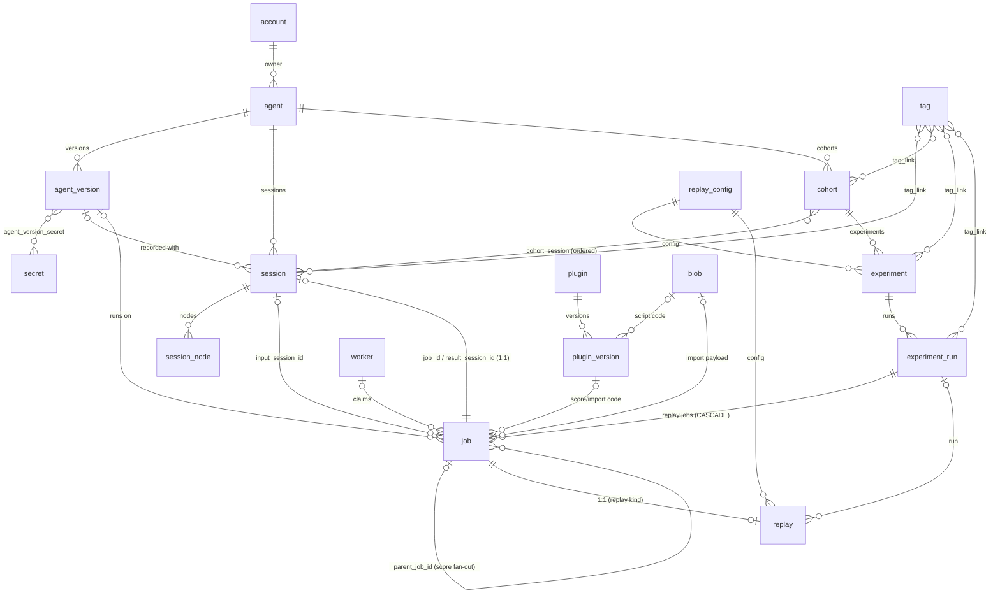

# Server

The server design: every endpoint, API model, domain model, and ORM model, with their connections.

## Layer map

A request flows through four layers:

```
routers (adapters/rest/routers)          FastAPI handlers, api_models in and out
  └─ mapping (adapters/rest/mapping)     api_models ↔ domain models, filters, and commands
      └─ services (application/services) orchestration, invariants, transactions
          └─ repositories (adapters/db/repositories)  domain ↔ ORM models
              └─ orm (adapters/db/orm)                SQLAlchemy tables
```

- `api_models/` is the wire contract shared by server and client. Neither imports the other, both import `api_models`.
- `application/models/` holds `FrozenModel` filter and command objects that services accept.
- `application/interfaces/` holds the repository protocols the services depend on.
- `domain/` holds the entities, value objects, enums, and domain errors.
- Exception mapping is global in `app.py`: `NotFoundError` 404, `ConflictError` 409, `PayloadTooLargeError` 413, `ValidationError` 422, `DomainError` 500, body always `{"detail": str}`.
- Auth is one dependency, `authorize`, yielding `AuthContext(account, csrf_token)`. Credentials are an API key (`KITKEY_` prefix) or a JWT, from bearer header or cookie. Health and login/logout routes skip it. There is no separate worker auth.
- Ownership is provenance, not authorization: the server is a trusted-team deployment, `owner_id` records who created a resource, and no service filters or rejects by owner. Every authenticated account reads and writes every resource.
- Pagination is uniform: `cursor` (opaque, from the previous response), `size` (ge=1, le=1000, default 20), and `sort` (`created:asc` or `created:desc`, default `created:desc`) on the `ListParams` base model, response `Page[T]` with `items` and `next_cursor` (null on the last page). The keyset rides the UUIDv7 id. Cursors embed the sort and a hash of the filter fields, changing either mid-pagination is a 422, changing `size` is allowed. Sortable fields are an allowlist per filter model (`sortable_fields` ClassVar, default `created`), a field beyond that needs a `(field, id)` composite index.
- Commits happen before the response leaves: routers register through a custom `APIRoute` subclass that commits the request session after the handler returns and before the response is sent, so a 2xx means the write is committed and an immediate follow-up read sees it. An exception skips the commit and the session rolls back on close.
- PATCH semantics are uniform: an omitted field is unchanged, an explicitly null field clears, a 422 where clearing is invalid (e.g. `status`). Mapping functions build update commands from the request's `model_fields_set` only, and commands preserve their own `model_fields_set`, so services distinguish omitted from null without per-resource conventions.
- Paginated list endpoints take an `XListParams(ListParams)` query model from `api_models`, bound in routers via `Annotated[XListParams, Query()]` and converted to the application filter by `<x>_list_params_to_filter` in the mapping module. Lists without resource-specific params take `ListParams` directly.
- Client list methods take the same params model, defaulting to a fresh instance, and send `model_dump(mode="json", exclude_unset=True)`. No hand-rolled `if x is not None` param dicts in resources. Each resource also exposes `iter()` next to `list()`, an async generator following `next_cursor` to exhaustion. Endpoints nested under a resource path live on the parent resource with the path parameter as the first argument (`/v1/sessions/{id}/nodes` → `client.sessions.list_nodes`, `iter_nodes`, `ingest_nodes`), there is no separate client resource for them.
- The client is constructed directly or via `KitaruAPIClient.from_env()` (`KITARU_API_URL`, `KITARU_API_KEY`, a missing URL is a `RuntimeError`). Requests go through a retrying transport: transport errors and 408/429/502/503/504 retry with backoff, a request with a streaming body is sent exactly once, and every request carries an `Idempotency-Key` header held stable across attempts. The server does not dedup on it yet, see future_improvements.md.

## Endpoints

`/v1/imports`, `/v1/scores`, and `/v1/session-runs` are POST-only command endpoints creating jobs, they have no GET.

### health (`/health`, unauthenticated)

| Method | Path | Request | Response | Service |
|---|---|---|---|---|
| GET | /health | - | `dict[str, str]`, 503 on DB probe failure | raw `SELECT 1` |
| GET | /health/live | - | `dict[str, str]` | - |

### auth (`/v1`, unauthenticated)

| Method | Path | Request | Response | Service |
|---|---|---|---|---|
| POST | /v1/login | form `username`, `password` | `TokenResponse`, sets auth cookie | `AuthService.login_with_password` |
| POST | /v1/logout | - | 204, deletes cookie | - |

### accounts (`/v1/accounts`)

| Method | Path | Request | Response | Service |
|---|---|---|---|---|
| POST | /v1/accounts | `AccountCreateRequest` | `AccountResponse` 201 | `AccountService.create_account` |
| GET | /v1/accounts | query name, active | `Page[AccountResponse]` | `AccountService.list_accounts` |
| GET | /v1/accounts/{id} | - | `AccountResponse` | `AccountService.get_account` |
| PATCH | /v1/accounts/{id} | `AccountUpdateRequest` | `AccountResponse` | `AccountService.update_account` |

No DELETE for accounts.

### agents (`/v1/agents`)

| Method | Path | Request | Response | Service |
|---|---|---|---|---|
| POST | /v1/agents | `AgentCreateRequest` | `AgentResponse` 201 | `AgentService.create_agent` |
| GET | /v1/agents | query name | `Page[AgentResponse]` | `AgentService.list_agents` |
| GET | /v1/agents/{id} | - | `AgentResponse` | `AgentService.get_agent` |
| PATCH | /v1/agents/{id} | `AgentUpdateRequest` | `AgentResponse` | `AgentService.update_agent` |
| DELETE | /v1/agents/{id} | - | 204 | `AgentService.delete_agent` |
| POST | /v1/agents/{id}/versions | `AgentVersionCreateRequest` | `AgentVersionResponse` 201 | `AgentVersionService.create_version` |
| GET | /v1/agents/{id}/versions | - | `Page[AgentVersionResponse]` | `AgentVersionService.list_versions` |

### agent-versions (`/v1/agent-versions`)

| Method | Path | Request | Response | Service |
|---|---|---|---|---|
| GET | /v1/agent-versions/{id} | - | `AgentVersionResponse` | `AgentVersionService.get_version` |
| PATCH | /v1/agent-versions/{id} | `AgentVersionUpdateRequest` | `AgentVersionResponse` | `AgentVersionService.update_version` |
| DELETE | /v1/agent-versions/{id} | - | 204 | `AgentVersionService.delete_version` |

### api-keys (`/v1/api-keys`)

| Method | Path | Request | Response | Service |
|---|---|---|---|---|
| POST | /v1/api-keys | `ApiKeyCreateRequest` | `ApiKeyIssuedResponse` 201 | `ApiKeyService.create_api_key` |
| GET | /v1/api-keys | query name | `Page[ApiKeyResponse]` | `ApiKeyService.list_api_keys` |
| GET | /v1/api-keys/{id} | - | `ApiKeyResponse` | `ApiKeyService.get_api_key` |
| PATCH | /v1/api-keys/{id} | `ApiKeyUpdateRequest` | `ApiKeyResponse` | `ApiKeyService.update_api_key` |
| DELETE | /v1/api-keys/{id} | - | 204 | `ApiKeyService.delete_api_key` |

### blobs (`/v1/blobs`)

| Method | Path | Request | Response | Service |
|---|---|---|---|---|
| POST | /v1/blobs | multipart file | `BlobResponse`, 201 or 200 on dedup hit | `BlobService.upload_blob` |
| GET | /v1/blobs/{id} | - | `BlobResponse` | `BlobService.get_blob` |
| GET | /v1/blobs/{id}/content | - | raw bytes with the blob media type | `BlobService.download_blob` |

Uploads are capped by a server setting (max blob size), a larger file is a 413. The size check and the sha256 run streaming from the spooled upload before any materialization: an oversized upload is rejected at the cap holding one chunk, a dedup hit returns the stored row without loading the content, and only a new blob is materialized in memory, once, for the insert (bytea parameters cannot be streamed). Memory per upload is bounded by the cap. Dedup is race-safe: the create catches the sha256 unique violation from a concurrent identical upload and returns the stored row with a 200. Content downloads carry `Content-Disposition: attachment` and `X-Content-Type-Options: nosniff`, so the client-supplied media type is never rendered inline.

### cohorts (`/v1/cohorts`)

| Method | Path | Request | Response | Service |
|---|---|---|---|---|
| POST | /v1/cohorts | `CohortCreateRequest` | `CohortResponse` 201 | `CohortService.create_cohort` |
| GET | /v1/cohorts | query name, tag | `Page[CohortResponse]` | `CohortService.list_cohorts` |
| GET | /v1/cohorts/{id} | - | `CohortResponse` | `CohortService.get_cohort` |
| GET | /v1/cohorts/{id}/sessions | - | `Page[SessionResponse]` | `CohortService.list_cohort_sessions` |
| PATCH | /v1/cohorts/{id} | `CohortUpdateRequest` | `CohortResponse` | `CohortService.update_cohort` |
| DELETE | /v1/cohorts/{id} | - | 204 | `CohortService.delete_cohort` |

Cohort membership is fixed at creation, a cohort is an immutable snapshot. There are no membership endpoints.

### experiments (`/v1/experiments`)

| Method | Path | Request | Response | Service |
|---|---|---|---|---|
| POST | /v1/experiments | `ExperimentCreateRequest` | `ExperimentResponse` 201 | `ExperimentService.create_experiment` |
| GET | /v1/experiments | query name, tag | `Page[ExperimentResponse]` | `ExperimentService.list_experiments` |
| GET | /v1/experiments/{id} | - | `ExperimentResponse` | `ExperimentService.get_experiment` |
| PATCH | /v1/experiments/{id} | `ExperimentUpdateRequest` | `ExperimentResponse` | `ExperimentService.update_experiment` |
| DELETE | /v1/experiments/{id} | - | 204 | `ExperimentService.delete_experiment` |
| POST | /v1/experiments/{id}/runs | `ExperimentRunCreateRequest` | `ExperimentRunResponse` 201 | `ExperimentService.start_run` |

### experiment-runs (`/v1/experiment-runs`)

| Method | Path | Request | Response | Service |
|---|---|---|---|---|
| GET | /v1/experiment-runs | query experiment_id, status, tag | `Page[ExperimentRunResponse]` | `ExperimentRunService.list_runs` |
| GET | /v1/experiment-runs/{id} | - | `ExperimentRunResponse` | `ExperimentRunService.get_run` |
| DELETE | /v1/experiment-runs/{id} | - | 204 | `ExperimentRunService.delete_run` |
| GET | /v1/experiment-runs/{id}/jobs | query status | `Page[JobResponse]` | `ExperimentRunService.list_run_jobs` |
| POST | /v1/experiment-runs/{id}/cancel | - | `ExperimentRunResponse` | `ExperimentRunService.cancel_run` |

### importers (`/v1/importers`, `PluginService` bound to `PluginKind.IMPORTER`)

| Method | Path | Request | Response | Service |
|---|---|---|---|---|
| POST | /v1/importers | `ImporterCreateRequest` | `ImporterResponse` 201 | `PluginService.create_plugin` |
| GET | /v1/importers | query name, provider | `Page[ImporterResponse]` | `PluginService.list_plugins` |
| GET | /v1/importers/{id} | - | `ImporterResponse` | `PluginService.get_plugin` |
| PATCH | /v1/importers/{id} | `ImporterUpdateRequest` | `ImporterResponse` | `PluginService.update_plugin` |
| DELETE | /v1/importers/{id} | - | 204 | `PluginService.delete_plugin` |
| POST | /v1/importers/{id}/versions | `ImporterVersionCreateRequest` | `ImporterVersionResponse` 201 | `PluginService.create_version` |
| GET | /v1/importers/{id}/versions | - | `Page[ImporterVersionResponse]` | `PluginService.list_versions` |
| GET | /v1/importers/{id}/versions/{version} | - | `ImporterVersionResponse` | `PluginService.get_version` |

### imports (`/v1/imports`)

| Method | Path | Request | Response | Service |
|---|---|---|---|---|
| POST | /v1/imports | `ImportCreateRequest` | `JobResponse` 201 | `JobService.create_import` |

### jobs (`/v1/jobs`)

| Method | Path | Request | Response | Service |
|---|---|---|---|---|
| GET | /v1/jobs | query experiment_run_id, parent_job_id, kind, status, standalone, worker_id | `Page[JobResponse]` | `JobService.list_jobs` |
| POST | /v1/jobs/claim | `JobClaimRequest` | `JobClaimResponse` | `JobService.claim_jobs` |
| GET | /v1/jobs/{id} | - | `JobResponse` | `JobService.get_job` |
| GET | /v1/jobs/{id}/spec | - | `JobSpecResponse` | `JobService.get_spec` |
| PATCH | /v1/jobs/{id} | `JobUpdateRequest` | `JobResponse` | `JobService.update_job` |
| DELETE | /v1/jobs/{id} | - | 204 | `JobService.delete_job` |

### replays (`/v1/replays`)

| Method | Path | Request | Response | Service |
|---|---|---|---|---|
| POST | /v1/replays | `ReplayCreateRequest` | `ReplayResponse` 201 | `ReplayService.create_replay` |
| GET | /v1/replays | query experiment_run_id, input_session_id, status, passed | `Page[ReplayResponse]` | `ReplayService.list_replays` |
| GET | /v1/replays/{id} | - | `ReplayResponse` | `ReplayService.get_replay` |
| GET | /v1/replays/{id}/diff | - | `ReplayDiffResponse` | `ReplayService.get_diff` |
| POST | /v1/replays/{id}/tool-lookup | `ToolLookupRequest` | `ToolLookupResponse` | `ReplayService.tool_lookup` |

### scores (`/v1/scores`)

| Method | Path | Request | Response | Service |
|---|---|---|---|---|
| POST | /v1/scores | `ScoreCreateRequest` | `JobResponse` 201 | `JobService.create_score` |

### scorers (`/v1/scorers`, `PluginService` bound to `PluginKind.SCORER`)

| Method | Path | Request | Response | Service |
|---|---|---|---|---|
| POST | /v1/scorers | `ScorerCreateRequest` | `ScorerResponse` 201 | `PluginService.create_plugin` |
| GET | /v1/scorers | query name | `Page[ScorerResponse]` | `PluginService.list_plugins` |
| GET | /v1/scorers/{id} | - | `ScorerResponse` | `PluginService.get_plugin` |
| PATCH | /v1/scorers/{id} | `ScorerUpdateRequest` | `ScorerResponse` | `PluginService.update_plugin` |
| DELETE | /v1/scorers/{id} | - | 204 | `PluginService.delete_plugin` |
| POST | /v1/scorers/{id}/versions | `ScorerVersionCreateRequest` | `ScorerVersionResponse` 201 | `PluginService.create_version` |
| GET | /v1/scorers/{id}/versions | - | `Page[ScorerVersionResponse]` | `PluginService.list_versions` |
| GET | /v1/scorers/{id}/versions/{version} | - | `ScorerVersionResponse` | `PluginService.get_version` |

The importer and scorer routers stay two thin declarative files (paths, tags, response models, status-code docstrings), but every handler body is a one-liner into shared kind-parametrized functions. The two mapping modules are one `mapping/plugins.py` whose functions take the target response class as a parameter, since the field-for-field mapping is identical modulo that class. The one semantic difference, importers carrying `provider` while scorers have none, lives in that shared mapping keyed off the request type, not in branches. No router factory: FastAPI reads static type annotations for request bodies and response models, so the declarations stay per-resource and only the orchestration is shared.

### secrets (`/v1/secrets`)

| Method | Path | Request | Response | Service |
|---|---|---|---|---|
| POST | /v1/secrets | `SecretCreateRequest` | `SecretResponse` 201 | `SecretService.create_secret` |
| GET | /v1/secrets | query name | `Page[SecretResponse]` | `SecretService.list_secrets` |
| GET | /v1/secrets/{id} | query include_values | `SecretResponse` or `SecretWithValuesResponse` | `SecretService.get_secret` |
| PATCH | /v1/secrets/{id} | `SecretUpdateRequest` | `SecretResponse` | `SecretService.update_secret` |
| DELETE | /v1/secrets/{id} | - | 204 | `SecretService.delete_secret` |

### session-runs (`/v1/session-runs`)

| Method | Path | Request | Response | Service |
|---|---|---|---|---|
| POST | /v1/session-runs | `SessionRunCreateRequest` | `JobResponse` 201 | `JobService.create_session_run` |

### sessions (`/v1/sessions`)

| Method | Path | Request | Response | Service |
|---|---|---|---|---|
| POST | /v1/sessions | `SessionCreateRequest` | `SessionResponse` 201 | `SessionService.create_session` |
| GET | /v1/sessions | query agent_id, agent_version_id, job_id, origin, status, provider, external_id, name, tag, started_after/before, ended_after/before, has_score, min/max_cost | `Page[SessionResponse]` | `SessionService.list_sessions` |
| GET | /v1/sessions/{id} | - | `SessionResponse` | `SessionService.get_session` |
| PATCH | /v1/sessions/{id} | `SessionUpdateRequest` | `SessionResponse` | `SessionService.update_session` |
| DELETE | /v1/sessions/{id} | - | 204 | `SessionService.delete_session` |
| POST | /v1/sessions/{id}/nodes | `SessionNodeBatchRequest` | `list[SessionNodeResponse]` | `SessionNodeService.ingest_nodes` |
| GET | /v1/sessions/{id}/nodes | query include_payloads, cursor, size | `Page[SessionNodeResponse]`, ordered by index | `SessionNodeService.list_nodes` |
| POST | /v1/sessions/{id}/scores | `SessionScoresRequest` | `SessionResponse` | `SessionService.merge_scores` |

### tags (`/v1/tags`)

| Method | Path | Request | Response | Service |
|---|---|---|---|---|
| POST | /v1/tags | `TagCreateRequest` | `TagResponse` 201 | `TagService.create_tag` |
| GET | /v1/tags | query name | `Page[TagResponse]` | `TagService.list_tags` |
| PATCH | /v1/tags/{id} | `TagUpdateRequest` | `TagResponse` | `TagService.update_tag` |
| DELETE | /v1/tags/{id} | - | 204 | `TagService.delete_tag` |
| POST | /v1/tags/{id}/links | `TagLinkCreateRequest` | `TagLinkResponse` 201 | `TagService.create_tag_link` |
| DELETE | /v1/tags/{id}/links/{resource_type}/{resource_id} | - | 204 | `TagService.delete_tag_link` |

### workers (`/v1/workers`)

| Method | Path | Request | Response | Service |
|---|---|---|---|---|
| POST | /v1/workers | `WorkerCreateRequest` | `WorkerResponse` 200, upsert by name (atomic `INSERT ... ON CONFLICT (name) DO UPDATE`, a concurrent delete cannot race a fallback lookup) | `WorkerService.register_worker` |
| GET | /v1/workers | query name | `Page[WorkerResponse]` | `WorkerService.list_workers` |
| GET | /v1/workers/{id} | - | `WorkerResponse` | `WorkerService.get_worker` |
| POST | /v1/workers/{id}/heartbeat | `WorkerHeartbeatRequest` | `WorkerHeartbeatResponse` | `JobService.heartbeat_worker` |
| DELETE | /v1/workers/{id} | - | 204 | `WorkerService.delete_worker` |

## API models (`api_models/v1/`)

Conventions: requests extend `RequestModel` (`extra="forbid"`), responses extend `ResponseModel`, list responses use `Page[XResponse]`, paginated list query params extend `ListParams`, request datetimes are `AwareDatetime`. The bases set `protected_namespaces=()` so fields like `model_params` pass pydantic's `model_` namespace check.

Modules are named after the entity in the singular (`account.py`, `job.py`), matching `domain/`, `orm/`, and `application/models/`. Routers and client resources are instead named after the URL segment they serve (`/v1/accounts` → `accounts.py`), and mapping modules follow their router. `imports.py` keeps the plural since `import` is a reserved word.

### base.py

- `RequestModel(BaseModel)`, `ResponseModel(BaseModel)`, `ErrorBody(detail: str)`
- `ListParams(RequestModel)`: `cursor`, `size` (ge=1, le=1000, default 20), `sort` (`field:asc` or `field:desc`, default `created:desc`), the base for `XListParams` query models
- `DiscriminatedRequestModel(RequestModel)`: base for discriminated union members, its `model_post_init` marks the `type` discriminator as set so `exclude_unset` dumps keep it
- `TimestampedResponseModel(ResponseModel)`: `created`, `updated`. `OwnedResponseModel(TimestampedResponseModel)`: adds `owner_id`. Response models carrying these fields extend the mixins instead of redeclaring the fields.
- `Page(ResponseModel, Generic[ItemT])`: `items: list[ItemT]`, `next_cursor: str | None` (null on the last page)
- Aliases: `FiniteFloat` (float, no inf/nan), `JsonValue` (Any, recursively finite), `PlainSerializedSecretStr` (SecretStr dumped as plaintext in JSON mode)

### Enums

Enum member names are uppercase, the table lists the wire values. The convention keeps `import`, a reserved word, usable as the `JobKind` member `IMPORT`.

| Enum | Values | Defined in |
|---|---|---|
| `ExperimentRunStatus` | pending, running, canceling, completed, failed, canceled | experiment_run.py |
| `JobKind` | replay, session_run, score, import | job.py |
| `JobStatus` | pending, claimed, running, canceling, completed, failed, timed_out, canceled, abandoned | job.py |
| `HistoryScope` | original_session, cohort, agent | replay_config.py |
| `ReplayStatus` | pending, scoring, passed, failed, canceled | replay.py |
| `ToolPolicyOnMiss` | fail, passthrough, error_result | replay_config.py |
| `StaticMatchMode` | exact, subset | replay_config.py |
| `SessionOrigin` | imported, recorded, replay | session.py |
| `SessionStatus` | in_progress, completed, failed | session.py |
| `NodeType` | llm_call, tool_call, subagent_call, span | session_node.py |
| `NodeStatus` | in_progress, completed, failed | session_node.py |
| `TagResourceType` | session, cohort, experiment, experiment_run | tag.py |

Terminal values: `JobStatus` completed, failed, timed_out, canceled, abandoned. `ExperimentRunStatus` completed, failed, canceled. `ReplayStatus` passed, failed, canceled. Every other value is non-terminal, canceling included.

### account.py

- `AccountCreateRequest`: name, email?, password?
- `AccountUpdateRequest`: active?, password?
- `AccountListParams`: name?, active?
- `AccountResponse`: id, name, email?, is_service_account, active, created, updated

### agent.py

- `AgentCreateRequest`: name, description?
- `AgentUpdateRequest`: name?, description?
- `AgentListParams`: name?
- `AgentResponse`: id, owner_id, name, description?, created, updated

### agent_version.py

- `RunSpec` (RequestModel): command, working_dir?, env: dict[str, str], secret_ids: list[UUID], timeout_seconds: PositiveInt = 3600
- `AgentCapabilities` (RequestModel): tools, mcp_servers, skills: list[str]
- `AgentVersionCreateRequest`: version, description?, run_spec: RunSpec?, capabilities: AgentCapabilities?
- `AgentVersionUpdateRequest`: description?, run_spec?, capabilities?
- `AgentVersionResponse`: id, owner_id, agent_id, version, description?, run_spec?, capabilities, created, updated

### api_key.py

- `ApiKeyCreateRequest`: name
- `ApiKeyUpdateRequest`: active
- `ApiKeyListParams`: name?
- `ApiKeyResponse`: id, owner_id, name, active, last_used?, created, updated
- `ApiKeyIssuedResponse(ApiKeyResponse)`: + key (plaintext, shown once)

### auth.py

- `TokenResponse`: access_token, token_type, expires_in, csrf_token?

### blob.py

- `BlobResponse`: id, sha256, size, media_type, created

### cohort.py

- `CohortCreateRequest`: name, description?, agent_id, session_ids (ordered)
- `CohortUpdateRequest`: name?, description?
- `CohortListParams`: name?, tag?
- `CohortResponse`: id, owner_id, name, description?, agent_id, session_count, created, updated

### experiment.py

- `ExperimentCreateRequest`: name, description?, cohort_id, override: ReplayOverride?, tool_policy: ToolPolicy?, scoring_policy: ScoringPolicy
- `ExperimentUpdateRequest`: all of the above optional
- `ExperimentListParams`: name?, tag?
- `ExperimentResponse`: id, owner_id, name, description?, cohort_id, override?, tool_policy, scoring_policy, created, updated

### experiment_run.py

- `ExperimentRunProgress` (ResponseModel): pending, claimed, running, canceling, completed, failed, timed_out, canceled, abandoned, total
- `ExperimentRunCreateRequest`: agent_version_id, score_baselines: bool
- `ExperimentRunListParams`: experiment_id?, status?, tag?
- `ExperimentRunJobsListParams`: status?
- `RunSummary` (ResponseModel): replay_counts_by_status, pass_rate, scores per scorer with baseline and replay stats, total_cost, total_tokens
- `ExperimentRunResponse`: id, owner_id, experiment_id, number, status: ExperimentRunStatus, agent_version_id, score_baselines, started_at?, ended_at?, summary: RunSummary?, error?, progress: ExperimentRunProgress, created, updated

### importer.py

- `ImporterCreateRequest`: name, description?, provider?, metadata: dict[str, JsonValue]
- `ImporterUpdateRequest`: description?, metadata?
- `ImporterListParams`: name?, provider?
- `ImporterResponse`: id, owner_id, name, description?, provider?, metadata, latest_version, created, updated
- `ImporterVersionCreateRequest`: source: PluginSource
- `ImporterVersionResponse`: id, importer_id, version, source, created

### imports.py

- `ImportCreateRequest`: importer (name), agent_id, version?, payload_blob_id, params: dict[str, JsonValue]. Importer and version resolve at creation to the plugin version id stored on the job, an omitted version resolves to latest. Creation returns `JobResponse`, there is no ImportResponse.
- `ImportFailure`: line, external_id?, error
- `ImportStats`: created, skipped, failed, failures: list[ImportFailure] (max 20)

### job.py

Job lifecycle, claim, and spec models. The spec details import `ReplayOverride`, `ToolPolicy`, and `ScorerConfig` from replay_config.py.

- `JobResponse`: id, kind, status, attempt, experiment_run_id?, parent_job_id?, agent_version_id?, worker_id?, result_session_id?, claimed_at?, heartbeat_at?, started_at?, ended_at?, error?, result, created, updated. Lifecycle and reference fields only, kind-specific data lives in the spec and the kind-owning resources. result is validated only at completion (score and import kinds require one), on a non-completed job it is diagnostic output (partial import stats, for example), and readers gate on status: settlement reads results from completed children only.
- `JobUpdateRequest`: status?, attempt?, error?, result: JsonValue. Executor transitions (running, completed, failed, timed_out) require attempt to match the job's current attempt, a mismatch is a 409. Canceled needs no attempt: it is also the user-facing cancel, moving a pending job to canceled and a claimed or running job to canceling (fencing it is a future improvement).
- `JobListParams`: experiment_run_id?, parent_job_id?, kind?, status?, standalone?, worker_id?
- `WorkerScope` (frozen): agent_version_ids?, kinds?, experiment_run_id?, job_id?. Validator: run and job pins mutually exclusive, lists non-empty when set.
- `JobClaimRequest`: worker_id, max_jobs (1..100). The scope comes from the worker row, not the request.
- `JobRunSpec`: command, working_dir?, env, timeout_seconds (required, copied from the version's run spec)
- `ScriptPluginSpec`: type="script", entrypoint, blob_id, sha256
- `PackagePluginSpec`: type="package", entrypoint, requirement
- `PluginSpec` = discriminated union of the two on `type`
- `PayloadSpec`: blob_id, sha256
- Spec details, discriminated on `kind`:
  - `ReplaySpecDetails`: kind="replay", replay_id, inputs, override: ReplayOverride?, tool_policy: ToolPolicy?, input_session_id
  - `SessionRunSpecDetails`: kind="session_run", inputs, name?
  - `ScoreSpecDetails`: kind="score", config: ScorerConfig, plugin: PluginSpec?, input_session_id
  - `ImportSpecDetails`: kind="import", plugin: PluginSpec, payload: PayloadSpec, provider, agent_id, params
- `JobSpecResponse`: job_id, kind, run: JobRunSpec?, secret_env, details (the union above, kind mirrors the top-level field). secret_env merges the run spec's secrets in secret_ids order, a later secret overrides an earlier one on key collision.
- `JobWithSpec`: job: JobResponse, spec: JobSpecResponse
- `JobClaimResponse`: jobs: list[JobWithSpec]

### plugin.py

Shared by the scorer and importer resources:

- `ScriptPluginSource`: type="script", blob_id, entrypoint (attribute in the file)
- `PackagePluginSource`: type="package", requirement (pinned PEP 508), entrypoint (`module:attribute`)
- `PluginSource` = discriminated union of the two on `type`, members extend `DiscriminatedRequestModel`

### replay.py

- `ReplayCreateRequest`: input_session_id, agent_version_id?, override?, tool_policy?, scoring_policy. An omitted agent_version_id resolves to the input session's recorded agent version, rejected when the session has none. The resolved version must have a run spec.
- `ReplayListParams`: experiment_run_id?, input_session_id?, status?, passed?
- `ReplaySummary` (ResponseModel): cost, tokens, duration_delta, status_changed, tool_call counts, score_deltas
- `ReplayResponse`: id, job_id, experiment_run_id?, input_session_id, result_session_id?, override?, tool_policy, scoring_policy, status: ReplayStatus, passed?, overall_score?, scores: dict[str, float]?, summary: ReplaySummary?, error?, created, updated
- Diff DTOs: `DiffValue(original, effective)`, `ReplayInputDiff(inputs, model, system_prompt)`, `ScoreDelta(original_score?, replay_score?, delta?)`
- `ReplayDiffResponse`: replay_id, original_session_id, result_session_id, input_diff: ReplayInputDiff, score_deltas: dict[str, ScoreDelta]
- `ToolLookupRequest`: tool_name, cache_key (64 chars)
- `ToolLookupResponse`: found, result

### replay_config.py

The replay configuration value objects, mirroring `domain/replay_config.py`. Imported by experiment.py, replay.py, score.py, and job.py:

- `ReplayOverride`: model (str or old-to-new map)?, system_prompt?, prompt?, model_params?
- `SourceScorerConfig`: type="source", name, source (`module:attribute`), params, weight, fail_below?
- `RegistryScorerConfig`: type="scorer", name, version?, params, weight, fail_below?. Resolved at creation to a scorer version id, the stored form carries it, an omitted version resolves to latest.
- `ScorerConfig` = discriminated union of the two on `type`
- `ScoringPolicy`: scorers: list[ScorerConfig] (min 1), pass_threshold (0..1). Validator: the scorer weight sum must be positive, so settlement never divides by zero.
- `StaticCase`: match?, match_mode: StaticMatchMode, result
- `PassthroughConfig` | `HistoryConfig(scope, on_miss)` | `StaticConfig(cases, on_miss)` | `LLMConfig(model, instructions?)`
- `ToolConfig` = discriminated union of the four on `type` (values passthrough, history, static, llm)
- `ToolPolicy`: default: ToolConfig, tools: dict[str, ToolConfig]
- The `ScorerConfig` and `ToolConfig` union members extend `DiscriminatedRequestModel` (base.py) so their `type` discriminator survives `exclude_unset` dumps

### score.py

- `ScoreCreateRequest`: input_session_id, scorer: ScorerConfig. Creation returns `JobResponse`, there is no ScoreResponse.
- `ScoreResult`: score: FiniteFloat (0..1), rationale?

### scorer.py

- `ScorerCreateRequest`: name, description?, metadata: dict[str, JsonValue]
- `ScorerUpdateRequest`: description?, metadata?
- `ScorerListParams`: name?
- `ScorerResponse`: id, owner_id, name, description?, metadata, latest_version, created, updated
- `ScorerVersionCreateRequest`: source: PluginSource
- `ScorerVersionResponse`: id, scorer_id, version, source, created

### secret.py

- `SecretCreateRequest`: name, type?, values: dict[str, SecretStr]
- `SecretUpdateRequest`: type?, values?
- `SecretListParams`: name?
- `SecretResponse`: id, owner_id, name, type?, created, updated
- `SecretWithValuesResponse(SecretResponse)`: + values

### session.py

- `TokenUsage` (RequestModel): input_tokens?, output_tokens?, cached_input_tokens?, reasoning_tokens?
- `SessionCreateRequest`: agent_id, agent_version_id?, origin, status?, name?, inputs, outputs, expected, error?, started_at?, ended_at?, external_id?, metadata, provider?, framework?, adapter_version?, job_id?
- `SessionUpdateRequest`: status?, outputs, error?, ended_at?, name?, expected, metadata?
- `SessionScoresRequest`: scores: dict[str, FiniteFloat]
- `SessionListParams`: agent_id?, agent_version_id?, job_id?, origin?, status?, provider?, external_id?, name?, tag?, started_after?, started_before?, ended_after?, ended_before?, has_score?, min_cost?, max_cost?
- `SessionResponse`: id, owner_id, agent_id, agent_version_id?, job_id?, origin, status, name?, inputs, outputs, expected, error?, started_at?, ended_at?, external_id?, metadata, provider?, framework?, adapter_version?, scores: dict[str, float], cost: Decimal?, tokens: TokenUsage?, llm_call_count, tool_call_count, created, updated
- `provider` is a free-form string naming the source system

### session_node.py

- `SessionNodeCreateRequest`: index, parent_index?, secondary_parent_indexes, external_id?, trace_id?, node_type, name, status, error?, started_at?, ended_at?, inputs, outputs, requested_model?, model?, provider?, tokens: TokenUsage?, cost?, model_params?, tool_name?, subagent_id?, attributes, metadata. No client-generated ids: `(session, index)` is the wire identity, batches upsert on it, and the server mints the row id.
- `SessionNodeBatchRequest`: nodes (parent before child, `parent_index < index`)
- `SessionNodeResponse`: the request fields plus id, session_id, parent_id?, secondary_parent_ids, cache_key?. inputs/outputs/attributes only populated with `include_payloads`.

### session_run.py

- `SessionRunCreateRequest`: agent_version_id, inputs, name?. Creation returns `JobResponse`.

### tag.py

- `TagCreateRequest`: name
- `TagUpdateRequest`: name
- `TagListParams`: name?
- `TagResponse`: id, owner_id, name, created, updated
- `TagLinkCreateRequest`: resource_type: TagResourceType, resource_id
- `TagLinkResponse`: id, tag_id, resource_type, resource_id, created, updated

### worker.py

- `WorkerRuntime`: platform: str (kubernetes, docker, bare, ...), hostname?, os?, arch?, python_version?, kitaru_version?, namespace?, pod?. Detected by the worker at registration, see worker.md.
- `WorkerCreateRequest`: name, scope: WorkerScope, runtime: WorkerRuntime, metadata
- `WorkerListParams`: name?
- `WorkerHeartbeatRequest`: job_ids
- `WorkerHeartbeatResponse`: cancel_job_ids: list[UUID]
- `WorkerResponse`: id, owner_id, name, scope: WorkerScope, runtime: WorkerRuntime, last_seen_at, live, metadata, created, updated

### Cross-file imports

replay_config.py is the shared hub for replay configuration: experiment.py and replay.py import `ReplayOverride`, `ScoringPolicy`, `ToolPolicy` from it, score.py imports `ScorerConfig`, and job.py imports `ReplayOverride`, `ToolPolicy`, `ScorerConfig` for its spec details. worker.py imports `WorkerScope` from job.py. importer.py and scorer.py import `PluginSource` from plugin.py. session_node.py imports `TokenUsage` from session.py.

## Application layer

### Services

| Service | Responsibility |
|---|---|
| `AccountService` | Account CRUD, credentials |
| `AgentService` | Agent CRUD |
| `AgentVersionService` | Version CRUD, run spec and capability updates with freeze checks |
| `ApiKeyService` | Key issue, list, deactivate |
| `BlobService` | Content-addressed upload, metadata reads, download |
| `CohortService` | Cohort CRUD, membership validation |
| `ExperimentService` | Experiment CRUD, run launch with replay job fan-out |
| `ExperimentRunService` | Run reads, cancel, progress aggregation |
| `PluginService` | Plugin and version registry, one instance per `PluginKind` |
| `ReplayService` | `create_replay`, `get_replay`, `list_replays`, `get_diff`, `tool_lookup` |
| `SecretService` | Secret CRUD |
| `SessionService` | Session lifecycle, score merging, job link check on create |
| `SessionNodeService` | Node batch upsert on (session, index) with parent_index resolution, cache_key derivation, rollups via atomic SQL increments. The batch's existing rows load in one bulk fetch, not per-row gets. Ingest requires an in-progress session, except origin=imported sessions, created terminal with nodes ingested afterward |
| `TagService` | Tag CRUD, resource links |
| `JobService` | Job creation, spec building, claim, heartbeat, transitions, terminal-transition dispatch into `replay_settlement` and `run_finalization` |
| `WorkerService` | `register_worker` (upsert by name), reads, delete |

Shared helper modules: `agent_version_resolution.resolve_agent_version`, `plugin_resolution.resolve_plugin/resolve_plugin_version`, `scorer_resolution.resolve_registry_scorer/validate_scoring_policy`, `run_finalization.load_run_jobs/finalize_run_if_drained`, `replay_settlement.fan_out_scores/settle_replay/settle_score/compute_summary/score_baselines`.

`resolve_agent_version` rejects versions without a run spec for job-creating callers (replays, session runs, source-scorer scores, run fan-out) with a validation error, so the failure surfaces as a 422 at the POST instead of at claim time.

Full-collection reads (`run_finalization.load_run_jobs`, `ExperimentService._resolve_members`, `JobService._resolve_cohort_session_ids`) page through `paginate_all` (`server/utils.py`), which drives a page-by-page query callable until exhaustion. No hand-rolled while-loops with per-module page-size constants.

`finalize_run_if_drained` decides drained with a count of the run's non-settled replay rows on the (experiment_run_id, status) index. `load_run_jobs` runs once per run, at finalization, to build the summary, not on every terminal job event.

`JobService` methods: `create_session_run`, `create_import`, `create_score`, `get_job`, `list_jobs`, `get_spec`, `update_job`, `heartbeat_worker`, `claim_jobs`, `delete_job`, plus private spec builders (`_build_spec` dispatching to `_replay_spec`, `_session_run_spec`, `_score_spec`, `_import_spec`), `_cancel_children`, `_check_result_session`, `_apply_status`, `_finalize_run`. The replay pipeline (score fan-out, settlement, summary, baseline scoring) lives in `replay_settlement`, following the `run_finalization` shape. Every terminal status write funnels through `_apply_status`, from `update_job` and the staleness sweep alike, and `_apply_status` is the only caller of settlement and finalization, so the pipeline reacts identically no matter who writes the status.

### Application models (`application/models/`, all FrozenModel)

Filters: `AccountFilter`, `AgentFilter`, `AgentVersionFilter`, `ApiKeyFilter`, `CohortFilter`, `CohortSessionsFilter`, `ExperimentFilter`, `ExperimentRunFilter`, `ExperimentRunJobsFilter`, `JobFilter` (experiment_run_id, parent_job_id, kind, status, standalone, worker_id, stale_before), `PluginFilter` (kind required), `PluginVersionFilter`, `ReplayFilter`, `SecretFilter`, `SessionFilter`, `TagFilter`, `WorkerFilter` (name, agent_version_id, seen_after). Filters extend `ListFilter` (`server/base.py`), which carries `cursor`, `size`, `sort`, the `sortable_fields` allowlist, and the filter hash the cursors embed.

Filters are built from the `XListParams` wire models in the mapping layer. Filter fields without a params counterpart (`SecretFilter.internal`, `ApiKeyFilter.owner_id`, `JobFilter.stale_before`, `WorkerFilter.agent_version_id`, `WorkerFilter.seen_after`) are internal, set by services.

Commands: `AccountUpdate`, `AgentUpdate`, `AgentVersionUpdate`, `CohortCreate`, `CohortUpdate`, `ExperimentCreate`, `ExperimentUpdate`, `SessionRunCreate`, `ImportCreate`, `ScoreCreate`, `JobUpdate`, `PluginUpdate`, `ReplayCreate`, `SecretUpdate`, `SessionCreate`, `SessionUpdate`, `TagUpdate`, `SessionNodeUpsert` (index-referenced like the wire model, no id or cache_key, both server-derived).

`AuthContext`: account: Account, csrf_token?.

## Domain models (`server/domain/`)

Bases: `DomainModel` (`extra="forbid"`, `validate_assignment=True`) for mutable entities, `FrozenModel` (frozen) for value objects. `FrozenModel` lives in the top-level `src/kitaru/base.py` so `api_models` value objects (`WorkerScope`) use the same base. Errors derive from `DomainError` with `NotFoundError`, `ConflictError`, `PayloadTooLargeError`, `ValidationError` branches, mapped globally to 404/409/413/422. Ids are `uuid7()` defaults. `Name` is a validated str alias (max 255, limited separators). `AgentVersion.version` additionally allows dots, so semver labels pass.

### Entities

| Entity | Fields beyond id/owner_id/created/updated | Methods |
|---|---|---|
| `Account` | is_service_account, name, email?, password_hash?, active | update_active, update_password_hash |
| `Agent` | name, description? | update_name, update_description |
| `AgentVersion` | agent_id, version: Name, description?, run_spec: RunSpec?, capabilities: AgentCapabilities | update_description, update_run_spec(frozen), update_capabilities(frozen) |
| `ApiKey` | name, key_hash, active, last_used? | update_active, mark_used |
| `Blob` | sha256, size, media_type, data, no updated | - |
| `Cohort` | name, description?, agent_id, session_count | check_members, update_name, update_description |
| `Experiment` | name, description?, cohort_id, replay_config_id | update_name, update_description, update_cohort_id(frozen), update_replay_config_id(frozen) |
| `ExperimentRun` | experiment_id, number, status, agent_version_id, score_baselines, started_at?, ended_at?, summary: RunSummary?, error? | start, cancel, finalize |
| `Plugin` | kind: PluginKind, name, description?, provider?, metadata: dict, latest_version | update_description, update_metadata, validator: scorers carry no provider |
| `PluginVersion` | plugin_id, version: int, source: PluginSource, no updated | - |
| `ReplayConfig` | override?, tool_policy, scoring_policy | check_standalone (rejects cohort history scope) |
| `Replay` | job_id, experiment_run_id?, replay_config_id, input_session_id, status: ReplayStatus, passed?, overall_score?, scores?, summary: ReplaySummary?, error? | settled property, complete(result, summary), fail(error) |
| `Secret` | name, internal, type?, values: dict[str, SecretStr] | update_type, update_values |
| `Session` | agent_id, agent_version_id?, job_id?, origin, status, name?, inputs, outputs, expected, error?, started_at?, ended_at?, external_id?, metadata, provider?, framework?, adapter_version?, scores, cost?, tokens?, llm_call_count, tool_call_count | update_name, update_expected, update_metadata, merge_scores, check_node_ingest, finish |
| `SessionNode` | session_id, parent_id?, secondary_parent_ids, index, external_id?, trace_id?, node_type, name, status, error?, started_at?, ended_at?, inputs, outputs, requested_model?, model?, provider?, tokens?, cost?, model_params?, tool_name?, cache_key?, subagent_id?, attributes, metadata | - |
| `Tag` | name | update_name |
| `TagLink` | tag_id, resource_type, resource_id, no owner_id | - |
| `Worker` | name, scope: WorkerScope, runtime: WorkerRuntime, last_seen_at, metadata | refresh, is_live |

### Job hierarchy (`domain/job.py`)

`Job(DomainModel)` base fields: id, experiment_run_id?, parent_job_id?, agent_version_id?, result_session_id?, status, attempt, worker_id?, claimed_at?, heartbeat_at?, started_at?, ended_at?, error?, result, created?, updated?. `experiment_run_id` and `parent_job_id` are generic: fan-out children carry the run id of their parent's run. Methods: claim, start, requeue, check_result, complete, fail, time_out, cancel, abandon, link_result_session, is_stale, with_staleness. Abstract `kind` property, `standalone` property. `claim` increments `attempt`, making it the fencing token for status updates. `cancel` moves a pending job straight to canceled and a claimed or running job to canceling, settled to canceled by the worker's confirmation or the staleness sweep.

| Subclass | Kind | Extra fields | Rules |
|---|---|---|---|
| `ReplayJob` | replay | input_session_id | requires an agent version with a run spec, result session required for completion, standalone when run id is null |
| `SessionRunJob` | session_run | inputs, name? | requires an agent version with a run spec, result session required |
| `ScoreJob` | score | input_session_id, plugin_version_id?, scorer_config: ScorerConfig | source scorer needs an agent version with a run spec and no plugin version, registry scorer the inverse, result must be a `ScoreResult` with score in 0..1 |
| `ImportJob` | import | plugin_version_id, payload_blob_id, agent_id, inputs | no agent version, result must be non-null |

Spec value objects (FrozenModel): `ScriptPluginSpec(entrypoint, blob_id, sha256)` and `PackagePluginSpec(entrypoint, requirement)` with `PluginSpec` as their union, `PayloadSpec(blob_id, sha256)`, per-kind details mirroring the wire details (`ReplaySpecDetails`, `SessionRunSpecDetails`, `ScoreSpecDetails`, `ImportSpecDetails`), `JobSpec(job_id, kind, run_spec: JobRunSpec?, secret_env, details)`, `WorkerScope` (the `api_models` model reused directly, with the `pinned` property defined on it). The spec value objects share their names with the wire models.

### Replay config module (`domain/replay_config.py`)

`SourceRef(module, attribute)`, `ReplayOverride`, `SourceScorerConfig` (source: SourceRef), `RegistryScorerConfig` (with the resolved scorer_version_id), `ScorerConfig` union with `parse_scorer_config`, `ScoringPolicy` with `evaluate -> ScoringVerdict(passed, score, scores)`, `StaticCase`, the four tool configs and `ToolConfig` union, `ToolPolicy`, `ReplayConfig` entity, `effective_inputs(inputs, override)`.

`SourceRef.parse` delegates the `module:attribute` format to `parse_source_ref(ref) -> tuple[str, str]` in the top-level `src/kitaru/source_refs.py` (pure, stdlib-only, raises `ValueError`, exactly one colon so `mod:attr:extra` is rejected), wrapping the error into the domain validation error. The domain keeps the invariant on the value object, the format definition exists once. The job-side scorer loader parses the same format through the same helper (see job.md).

### Replay diff module (`domain/replay_diff.py`)

Pure computation, FrozenModels mirroring the wire diff DTOs (`DiffValue`, `ReplayInputDiff`, `ScoreDelta`, `ReplayDiff`, `ReplaySummary`, `RunSummary`). There is no node-level pairing: a cross-session node correspondence cannot be computed correctly once the replay's call structure diverges, so the diff carries only exact content. Functions: `compute_replay_diff` (input diff and score deltas, computed on read from stored rows, no node loading), `compute_replay_summary -> ReplaySummary` (stored in `replay.summary` at settlement), `compute_run_summary -> RunSummary` (stored in `experiment_run.summary`). `GET /v1/replays/{id}/diff` computes on read and 404s while the replay is unsettled or has no result session.

### Plugin source module (`domain/plugin.py`)

`ScriptPluginSource(blob_id, entrypoint)` and `PackagePluginSource(requirement, entrypoint)` are the two plugin code sources, `PluginSource` their union. A script source is one uploaded file with the entrypoint naming an attribute in it. A package source is an installable distribution with the entrypoint as a `module:attribute` reference, validated through the shared `parse_source_ref` helper. The spec builders copy the source into the matching `PluginSpec` variant, joining the blob to fill the script sha256.

Requirement validation, via `packaging.requirements.Requirement` (a direct server dependency): parses as PEP 508, max 255 characters, no URL, no marker, exactly one `==` specifier without `*` in the version. Extras pass, `===` does not. The exact pin makes a registry version an immutable code reference, matching the sha256 immutability of script sources. The server never checks the package index at registration, a bad requirement fails at job time with the uv error in the stderr tail.

### Value objects elsewhere

`RunSpec`, `AgentCapabilities` (agent_version.py), `TokenUsage`, `SessionRollups` (session.py), `ExperimentRunProgress` (experiment_run.py), `WorkerRuntime` (worker.py).

## ORM models (`adapters/db/orm/`)

21 tables. Tables use `UUIDPrimaryKeyMixin` (uuid7 pk `id`) and `TimestampMixin` (`created`, `updated`), except the `agent_version_secret` and `cohort_session` link tables, which use composite primary keys and keep the timestamps. `tag_link` keeps its uuid pk since the id is exposed through `TagLinkResponse`. No SQLAlchemy relationships, joins are explicit in repositories. Enums are stored as short varchar values, JSON is always JSONB. Nullable JSONB columns set `none_as_null`, so Python `None` stores as SQL NULL and `IS NULL` matches, never the JSON null literal. `metadata` columns map from a `metadata_` attribute, the bare name collides with the declarative base.

Repository `get_many` methods load id lists through `_load_by_ids` on the base SQL repository, which returns rows keyed by id with missing ids omitted. Repository-specific conversion (`to_domain`, decryption, hydration) wraps around it at the call site.

| Table | ORM class | Domain model | Columns beyond id/created/updated |
|---|---|---|---|
| account | `AccountORM` | `Account` | is_service_account, name, email?, password_hash?, active. Unique (name, is_service_account). |
| agent | `AgentORM` | `Agent` | owner_id FK account, name unique, description? |
| agent_version | `AgentVersionORM` | `AgentVersion` | owner_id, agent_id FK, version, description?, run_command?, run_working_dir?, run_env JSONB?, run_timeout_seconds?, capabilities JSONB. Unique (agent_id, version). RunSpec is flattened into run_* columns, secret_ids live in the link table. |
| agent_version_secret | `AgentVersionSecretORM` | none (repository-managed) | Composite pk (agent_version_id FK CASCADE, secret_id FK), index with unique (agent_version_id, index) preserving secret order. |
| api_key | `ApiKeyORM` | `ApiKey` | owner_id, name unique, key_hash, active, last_used? |
| blob | `BlobORM` | `Blob` | owner_id, sha256 unique, size, media_type, data (bytea) |
| cohort | `CohortORM` | `Cohort` | owner_id, name unique, description?, agent_id FK, session_count (denormalized) |
| cohort_session | `CohortSessionORM` | none (repository-managed) | Composite pk (cohort_id FK CASCADE, session_id FK), index with unique (cohort_id, index). |
| experiment | `ExperimentORM` | `Experiment` | owner_id, name unique, description?, cohort_id FK, replay_config_id FK |
| experiment_run | `ExperimentRunORM` | `ExperimentRun` | owner_id, experiment_id FK, number, status, agent_version_id FK, score_baselines, started_at?, ended_at?, summary JSONB?, error?. Unique (experiment_id, number). |
| job | `JobORM` | `Job` subclasses | see below |
| plugin | `PluginORM` | `Plugin` | owner_id, kind, name, description?, provider?, metadata JSONB, latest_version. Unique (kind, name), index (kind, provider). |
| plugin_version | `PluginVersionORM` | `PluginVersion` | plugin_id FK CASCADE, version, type, blob_id FK? (script), requirement? (package), entrypoint. Unique (plugin_id, version). The source union is flattened, exactly one of blob_id and requirement is set, enforced in the domain. The version number comes from an `UPDATE ... RETURNING` bump of plugin.latest_version in the same transaction as the insert, so a rejected insert leaves no gap and the unique constraint is the backstop. |
| replay | `ReplayORM` | `Replay` | owner_id, job_id FK CASCADE unique, experiment_run_id FK CASCADE?, replay_config_id FK, input_session_id FK, status, passed?, overall_score?, scores JSONB?, summary JSONB?, error?. Unique (experiment_run_id, input_session_id), one replay per session per run. Indexes on (experiment_run_id, status) and input_session_id. |
| replay_config | `ReplayConfigORM` | `ReplayConfig` | owner_id, override JSONB?, tool_policy JSONB, scoring_policy JSONB |
| secret | `SecretORM` | `Secret` | owner_id, name unique, internal, type?, values_encrypted (text, AES-GCM over JSON) |
| session | `SessionORM` | `Session` | owner_id, agent_id FK, agent_version_id FK?, job_id FK SET NULL indexed, origin, status, name?, inputs/outputs/expected JSONB?, error?, started_at?, ended_at?, external_id?, metadata JSONB, provider?, framework?, adapter_version?, cost numeric?, input/output/cached_input/reasoning_tokens bigint?, scores JSONB, llm_call_count, tool_call_count. Unique (provider, external_id). Indexes (agent_id, started_at) and (status), and a partial index on id where scores <> '{}' (has_score filter). One session per job is enforced in the service for replay and session run jobs, import jobs link many. |
| session_node | `SessionNodeORM` | `SessionNode` | session_id FK CASCADE, parent_id self-FK CASCADE?, secondary_parent_ids JSONB, index, external_id?, trace_id?, node_type, name, status, error?, started_at?, ended_at?, inputs/outputs JSONB?, requested_model?, model?, provider?, token columns, cost?, model_params JSONB?, tool_name?, cache_key char(64)?, attributes JSONB, metadata JSONB, subagent_id?. Unique (session_id, index), (session_id, external_id). Partial index on cache_key where cache_key is not null (tool_lookup across cohort and agent history scopes). Row ids are server-minted uuid7, ingest resolves parent_index against stored and in-batch rows. |
| tag | `TagORM` | `Tag` | owner_id, name unique |
| tag_link | `TagLinkORM` | `TagLink` | tag_id FK CASCADE, resource_type, resource_id (no FK, polymorphic). Own uuid pk, unique (tag_id, resource_type, resource_id), index (resource_type, resource_id). |
| worker | `WorkerORM` | `Worker` | owner_id, name unique, scope JSONB, runtime JSONB, last_seen_at, metadata JSONB |

### job table

Single-table polymorphism over the four `Job` subclasses, discriminated by `kind`. Columns: kind, experiment_run_id FK CASCADE? (generic, fan-out children inherit the run id of their parent's run), agent_version_id FK?, agent_id FK? (ImportJob), parent_job_id self-FK CASCADE? (generic), plugin_version_id FK? (ScoreJob registry, ImportJob), payload_blob_id FK? (ImportJob), scorer_name? (denormalized from scorer_config for the unique constraint), scorer_config JSONB? (ScoreJob), input_session_id FK? (ReplayJob, ScoreJob), result_session_id FK?, status, attempt, worker_id FK SET NULL?, inputs JSONB? (SessionRunJob, ImportJob params), name? (SessionRunJob), claimed_at?, heartbeat_at?, started_at?, ended_at?, error?, result JSONB?.

Constraints and indexes:

- unique (parent_job_id, input_session_id, scorer_name): one score job per scorer per parent
- one replay per session per run lives on the replay table, unique (experiment_run_id, input_session_id) there
- index (experiment_run_id, status), index input_session_id, index parent_job_id
- partial index on id where status = 'pending' (claim query)
- partial index (kind, agent_version_id) where status = 'pending' (scoped claims)
- partial expression index on coalesce(heartbeat_at, claimed_at) where status in ('claimed', 'running', 'canceling') (staleness query)

Claim query (`claim_pending`): scope conditions + status = pending, ordered by id, `FOR UPDATE SKIP LOCKED`. Every scope field maps to one indexed column: job pin is `id = X OR parent_job_id = X`, run pin is `experiment_run_id = X` (children carry the run id, no parent subquery), an unpinned scope adds no condition and claims any pending job. Version filter is `agent_version_id IS NULL OR agent_version_id IN (...)`, kind filter is `kind IN (...)`. Staleness (`requeue_stale` and effective-status reads) uses the coalesce expression against the heartbeat timeout.

### JSON columns and what is stored in them

| Column | Content |
|---|---|
| agent_version.run_env | plain `dict[str, str]` |
| agent_version.capabilities | `AgentCapabilities` dump |
| experiment_run.summary | `RunSummary` dump |
| job.scorer_config | `ScorerConfig` union dump, read via `parse_scorer_config` |
| job.inputs | untyped (session run inputs, import params) |
| job.result | `ScoreResult` dump (score), `ImportStats` dump (import) |
| plugin.metadata | plain dict |
| replay.scores | plain `dict[str, float]` |
| replay.summary | `ReplaySummary` dump |
| replay_config.override | `ReplayOverride` dump |
| replay_config.tool_policy | `ToolPolicy` dump |
| replay_config.scoring_policy | `ScoringPolicy` dump |
| session.inputs/outputs/expected | untyped payloads |
| session.metadata | plain dict |
| session.scores | plain `dict[str, float]` |
| session_node.secondary_parent_ids | list of stringified UUIDs |
| session_node.inputs/outputs | untyped payloads |
| session_node.model_params | plain dict |
| session_node.attributes/metadata | plain dicts |
| worker.scope | `WorkerScope` dump |
| worker.runtime | `WorkerRuntime` dump |

Only ten JSON columns round-trip through a model: capabilities, scorer_config, job.result, replay.summary, experiment_run.summary, the three replay_config columns, worker.scope, and worker.runtime.

Flattened value objects (queryable scalar columns instead of JSON): `TokenUsage` on session and session_node, `RunSpec` on agent_version.

### Cascades

CASCADE: agent_version_secret.agent_version_id, cohort_session.cohort_id, job.experiment_run_id, job.parent_job_id, plugin_version.plugin_id, replay.job_id, replay.experiment_run_id, session_node.session_id, session_node.parent_id, tag_link.tag_id. SET NULL: job.worker_id, session.job_id. Everything else restricts and surfaces as `*InUse` conflict errors.

## Connections

### Per resource, wire to table

| Wire model | Mapping module | Domain model | Repository | Table |
|---|---|---|---|---|
| `AccountResponse` | mapping/accounts.py | `Account` | `SQLAccountRepository` | account |
| `AgentResponse` | mapping/agents.py | `Agent` | `SQLAgentRepository` | agent |
| `AgentVersionResponse` | mapping/agent_versions.py | `AgentVersion` | `SQLAgentVersionRepository` | agent_version (+ agent_version_secret) |
| `ApiKeyResponse` | mapping/api_keys.py | `ApiKey` | `SQLApiKeyRepository` | api_key |
| `BlobResponse` | mapping/blobs.py | `Blob` | `SQLBlobRepository` | blob |
| `CohortResponse` | mapping/cohorts.py | `Cohort` | `SQLCohortRepository` | cohort (+ cohort_session) |
| `ExperimentResponse` | mapping/experiments.py | `Experiment` + `ReplayConfig` | `SQLExperimentRepository` | experiment (+ replay_config) |
| `ExperimentRunResponse` | mapping/experiment_runs.py | `ExperimentRun` + `ExperimentRunProgress` | `SQLExperimentRunRepository` | experiment_run |
| `ImporterResponse`, `ImporterVersionResponse` | mapping/plugins.py (parametrized by response class) | `Plugin`, `PluginVersion` | `SQLPluginRepository` | plugin, plugin_version |
| `JobResponse`, `JobSpecResponse` | mapping/jobs.py | `Job` subclasses, `JobSpec` | `SQLJobRepository` | job |
| `ReplayResponse`, `ReplayDiffResponse` | mapping/replays.py | `Replay`, `ReplayDiff` | `SQLReplayRepository` | replay |
| `ScorerResponse`, `ScorerVersionResponse` | mapping/plugins.py (parametrized by response class) | `Plugin`, `PluginVersion` | `SQLPluginRepository` | plugin, plugin_version |
| `SecretResponse` | mapping/secrets.py | `Secret` | `SQLSecretRepository` | secret |
| `SessionResponse` | mapping/sessions.py | `Session` | `SQLSessionRepository` | session |
| `SessionNodeResponse` | mapping/session_nodes.py | `SessionNode` | `SQLSessionNodeRepository` | session_node |
| `TagResponse`, `TagLinkResponse` | mapping/tags.py | `Tag`, `TagLink` | `SQLTagRepository` | tag, tag_link |
| `WorkerResponse` | mapping/workers.py | `Worker` | `SQLWorkerRepository` | worker |

The experiment response inlines the replay config: `Experiment` stores `replay_config_id`, the service loads the `ReplayConfig` and the mapping merges override, tool_policy, and scoring_policy into `ExperimentResponse`. `ReplayResponse` does the same, and additionally serves `result_session_id` from the job row.

### Entity reference graph



### Job and replay flow connections

- `POST /v1/replays` creates a `ReplayConfig` row, a `Replay` row, and a `ReplayJob` in one transaction. Run fan-out (`ExperimentService.start_run`) creates one `ReplayJob` plus `Replay` per cohort session, rejecting an empty cohort with a validation error so every run starts with at least one job.
- Completing a `ReplayJob` fans out one `ScoreJob` child per scorer in the scoring policy (inside the completion request), each child carrying the parent's run id. The terminal transition, the fan-out, settlement, and run finalization commit in one transaction: a failure in any step rolls back the whole transition and the worker's PATCH fails, nothing is half-applied. Baseline score jobs (`score_baselines`) fan out for scorers missing from the original session's scores. That check is unlocked: two concurrent runs sharing a session can both fan out the same baseline, accepted as waste, the merge is idempotent. `ScoreJob` results settle on the `Replay` row via `replay_settlement.settle_score`: all children completed evaluates the `ScoringPolicy`, writes status (passed or failed), passed/overall_score/scores, and the summary, merges scores into the result session, a failed child fails the replay row and cancels non-terminal siblings. `settle_score` serializes concurrent sibling completions by locking the parent job row FOR UPDATE, the second completer re-reads the children after the first commits.
- The replay status tracks the pipeline: `pending` from creation, `scoring` when the replay job completes, `passed` or `failed` at settlement, `failed` when the replay job or a child fails, times out, or is abandoned (verdict fields stay null, the error lives on the job), `canceled` when the pipeline is canceled. The parent direction runs through the same terminal dispatch: a replay job going failed, timed_out, canceled, or abandoned fails or cancels the replay row and cancels non-terminal children in the same transaction, so `replay_settlement` is the single owner of the replay row for the parent-driven and the child-driven paths alike.
- `POST /v1/scores` creates a parent-less `ScoreJob`. A registry scorer resolves its plugin version, a source scorer resolves the agent version from the session and rejects sessions without one. A terminal standalone score merges `{config.name: result.score}` into `session.scores`. Score merges, here, at settlement, and in `SessionService.merge_scores`, are atomic JSONB merges (`scores || :entries`), never a read-modify-write. The merge UPDATE bumps `updated` and returns the merged map, keeping the entity in sync. Likewise, the rollup updates on node ingest are atomic SQL increments. The increments are delta-based: each upserted node contributes new minus old against the stored row for cost and the token columns, and 0 or 1 for the call counts, summed per batch into one atomic UPDATE on the session row, so a replacement corrects itself and a retried identical batch has delta zero.
- Sessions link to jobs at create time (`SessionCreateRequest.job_id`, job must be running). Replay and session run jobs link exactly one session and get `result_session_id` written in the same transaction, import jobs link every session they create, listable via the `job_id` session filter.
- The claim path is `POST /v1/jobs/claim`. The scope is read from the caller's worker row, stored at registration, and interpreted by `_scope_conditions` in the job repository. A claim refreshes worker.last_seen_at, so an idle worker polling an empty queue stays live.
- `heartbeat_worker` updates worker.last_seen_at, stamps heartbeat_at only on reported jobs whose worker_id matches the caller, and returns the rest in cancel_job_ids (canceling, reassigned, or no longer owned). The staleness sweep runs at claim time, before the claim query, capped to a bounded row count per claim (a server setting, default 100, overflow rolls to the next claim), selecting with `FOR UPDATE SKIP LOCKED` so concurrent claims never block on each other's sweep. It applies to jobs whose coalesce(heartbeat_at, claimed_at) is older than the heartbeat timeout (a server setting, default 60 seconds, kept a comfortable multiple of the worker heartbeat interval so one dropped heartbeat never requeues a live job): claimed and running jobs are requeued while attempt is under the retry cap (a server setting, default 3) and abandoned at the cap, canceling jobs settle to canceled. The sweep routes its terminal writes through the same `_apply_status` dispatch as `update_job`, so an abandoned or canceled last job settles its replay and finalizes its run without any worker transition arriving. `abandoned` is written only by the sweep, `timed_out` only by the worker's process timeout. With no worker polling, nothing sweeps, stale rows surface through effective-status reads until the next claim.
- Run progress counts, run job listing, and run finalization read the run's replay rows and their 1:1 jobs through `replay.job_id`, not a kind filter on the job table.
- `tool_lookup` resolves the replay by id, looks up the tool's config in the tool policy from the replay config (rejecting tools not under a history config), and searches recorded tool-call nodes by cache_key within the config's history scope (original session, cohort, or agent). Config and scope resolution is server-side: the adapter sends only the tool name and cache_key, never a scope, so the policy is interpreted in one place. The cache_key is `compute_tool_cache_key(tool_name, inputs)` in the top-level `src/kitaru/cache_keys.py` (pure, stdlib-only, sha256 hex over the tool name and canonical JSON inputs): node ingest derives it for recorded tool-call nodes, the replaying adapter derives it for the lookup, so the format is defined once. The adapter receives the replay id through the spec details and `KITARU_JOB_REPLAY_ID`.
