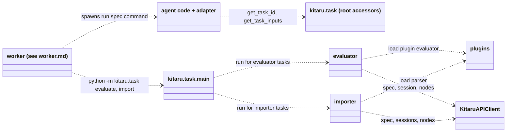

# Task package: in-process execution modules

Spec for `kitaru/task/`, the code that runs inside a task process. The worker (see `worker.md`) spawns these processes: `python -m kitaru.task evaluate` for evaluator tasks, `python -m kitaru.task import` for importer tasks, and the agent's own command for agent tasks, whose code imports the accessors at the package root. The server and the async API client (`KitaruAPIClient`) exist and are taken as given. This document contains everything needed to implement the package.

## Boundary

The worker owns the status protocol. It moves tasks to `running` before the process starts and interprets the exit code afterwards, writing `completed`, `failed`, `timed_out`, or `canceled`. Task-side code never transitions task status and never writes to its own task. Its outward channels are the result file, session and node API writes, the exit code, and stderr, whose tail the worker attaches to failure messages.

Tasks are generic, so they carry no kind-specific columns for outcomes. A task has an opaque `result` payload symmetric to its opaque `inputs`. The task process writes its result as JSON to `KITARU_TASK_RESULT_PATH` before exiting, and the worker ships the file's content in its completion call, so recording the result costs no API request. The worker fails the task when the file exceeds its size cap or does not parse as JSON (see worker.md). An evaluator task's result is its list of `EvaluationResult` objects, an importer task's result is its stats object, and the meaning is interpreted by the kind's owner (the server turns each evaluation result into one evaluation row, stats readers read import results). Agent tasks write no result, their outcome is the linked result session. The adapter creates that link: it reads the task id through the `get_task_id()` accessor and sets it on the session create request, so the link exists as soon as the session is created. The server stores the link on the session row, allows at most one session per agent task (importer tasks link every session they create), and rejects a session create whose task is not `running`. The task id is also all the adapter needs to attribute the session: the server fills `agent_version_id` and `agent_id` in from the task, so the adapter sends neither and has no way to get them wrong (see client_server.md).

Communication inward is the env contract. The worker controls the `KITARU_TASK_*` variables and the API pair, and merges the spec's creator-set env extras (see worker.md), which is how `KITARU_SESSION_NAME` and `KITARU_REPLAY_ID` arrive:

| Variable | Read by | Content |
|---|---|---|
| `KITARU_API_URL` | all | Server base URL |
| `KITARU_API_KEY` | all | API key |
| `KITARU_TASK_ID` | `__main__`, root accessors | Task id |
| `KITARU_TASK_INPUTS` | root accessors | JSON inputs, set only when they fit the worker's size threshold |
| `KITARU_SESSION_NAME` | adapters directly | Session name for the recorded session, set by the session-run creator via task env extras |
| `KITARU_REPLAY_ID` | adapters directly | Replay id, set by the replay pipeline via task env extras, for `GET /v1/replays/{id}` and `POST /v1/replays/{id}/tool-lookup` |
| `KITARU_TASK_PLUGIN_PATH` | `evaluator`, `importer` | Path of the materialized script plugin file, unset for package plugins |
| `KITARU_TASK_PAYLOAD_PATH` | `importer` | Path of the materialized payload file |
| `KITARU_TASK_RESULT_PATH` | `evaluator`, `importer` | Path the result JSON is written to |

## API surface used

| Call | Used by | Purpose |
|---|---|---|
| `client.tasks.get_spec(task_id)` | `evaluator`, `importer`, root accessor fallback | Resolve the task spec |
| `client.sessions.get(session_id)` | `evaluator` | Load the session to evaluate |
| `client.sessions.iter_nodes(session_id, include_payloads=True)` | `evaluator` | Load all its nodes, following cursors to exhaustion |
| `client.sessions.create(SessionCreateRequest)` | `importer` | Create one imported session |
| `client.sessions.ingest_nodes(session_id, SessionNodeBatchRequest)` | `importer` | Ingest its node tree in batches |

## Package layout

Organized by actor, not by layer. The two actors are the evaluator and the importer, each a whole module holding its contract and its flow. The process entry is the standard `__main__.py`, the agent-facing accessors are the package root.

```
src/kitaru/task/
  __init__.py      # get_task_id(), get_task_inputs()
  __main__.py      # process entry: python -m kitaru.task <evaluate|import>
  evaluator.py     # evaluator contract, loading, validation, and the evaluation flow
  importer.py      # importer contract, request builders, and the import flow
  plugins.py       # plugin loading and entrypoint resolution
  task_io.py       # get_required_env(), write_task_result()
```

## Constants

| Constant | Value | Meaning |
|---|---|---|
| `NODE_BATCH_SIZE` | 200 | Nodes per ingest request |
| `MAX_IMPORT_FAILURES` | 20 | Failure samples kept in import stats (defined with the API model) |

## Module specs

### `__init__.py`

The accessors agent code calls inside an agent task process:

```python
def get_task_id() -> str | None: ...   # KITARU_TASK_ID, None outside task mode
def get_task_inputs() -> Any: ...      # KITARU_TASK_INPUTS when set, otherwise the
                                       # details.inputs of GET /v1/tasks/{id}/spec, None outside task mode
```

Both are synchronous by design, since agent code may call them from inside a running event loop, where neither `asyncio.run` nor awaiting the async client is possible. The spec fetch fallback is one bare synchronous `httpx.get` against `/v1/tasks/{task_id}/spec` with the bearer header, not the API client, so no loop or client stack is spun up for a single read that most tasks never make. `get_task_inputs` raises `RuntimeError` when the fallback is needed but `KITARU_API_URL` is unset.

### `__main__.py`

The process entry, and the only scaffolding in the package:

1. Read the kind from `sys.argv` (`evaluate` or `import`), reject anything else.
2. Read `KITARU_TASK_ID` via `get_required_env`, failing on a missing value.
3. Open a `KitaruAPIClient` via `KitaruAPIClient.from_env()` (which requires `KITARU_API_URL` and reads `KITARU_API_KEY`) and `asyncio.run` the selected flow: `evaluator.run(client, task_id)` or `importer.run(client, task_id)`.
4. Exit 0 on success. On any failure, print the error to stderr and exit 1. The worker turns that into a failed task with the stderr tail attached.

### `task_io.py`

Env reading and result writing, used by `__main__.py` and both flows:

```python
def get_required_env(name: str) -> str: ...
def write_task_result(value: Any) -> None: ...
```

`get_required_env` returns the value of a variable and raises `RuntimeError` when it is missing or empty. It is the only way contract variables are read, no module keeps its own copy, and the flows do not rewrap the error: a missing contract variable is a broken process contract, not an evaluation or import problem, and it exits 1 with the message as is. `write_task_result` JSON-encodes the value to the path in `KITARU_TASK_RESULT_PATH`, encoding the result-file contract once for both flows. It accepts a `BaseModel`, a list of `BaseModel`s, or a plain JSON value, dumping models via `model_dump(mode="json")` first, so the evaluation flow's `EvaluationResult` list and the import flow's `ImportStats` go through the same encoder. The worker reads the file back (see worker.md).

### `plugins.py`

Foreign-code loading, the only place in the codebase that imports foreign code (single files from disk and installed modules by ref):

```python
class PluginLoadError(Exception): ...

def load_plugin_module(name: str, path: Path) -> ModuleType: ...
def get_module_attribute(module: ModuleType, attribute: str, label: str) -> Any: ...
def load_plugin_entrypoint(path: Path, entrypoint: str, label: str) -> Any: ...
def load_source_ref(ref: str, label: str) -> Any: ...
```

`load_plugin_module` imports a single file under a fixed module name via `importlib.util.spec_from_file_location`, registers it in `sys.modules`, and raises `PluginLoadError` when the file does not import. `get_module_attribute` resolves the entrypoint attribute and raises `PluginLoadError` when it is missing or not callable, with `label` naming the plugin kind in the message. `load_plugin_entrypoint` combines the two steps and is what the flows call: both wrap the raised `PluginLoadError` into their own error type (`EvaluationError`, `SessionImportError`), so the load-and-wrap block exists once here instead of per flow.

`load_source_ref` resolves a `module:attribute` reference against installed code: it parses the ref via `parse_source_ref` from the top-level `kitaru.source_refs` module (the same helper the server domain's plugin source validation uses, so the format is defined once), imports the module via `importlib.import_module`, and resolves the attribute via `get_module_attribute`. A bad format, a failed import, and a missing or non-callable attribute all raise `PluginLoadError`. The parsing primitive stays pure and shared, everything that executes foreign code lives here. Package plugin entrypoints resolve through it, the worker installed the package requirement into the process environment beforehand.

### `evaluator.py`

Everything evaluation. The contract:

```python
class EvaluationError(Exception): ...

class SessionView(BaseModel):
    session: SessionResponse
    nodes: list[SessionNodeResponse]

EvaluatorReturn = EvaluationResult | list[EvaluationResult]

def call_evaluator(name: str, evaluator: Callable[..., EvaluatorReturn],
                   session: SessionView, params: dict[str, Any]) -> list[EvaluationResult]: ...
```

`EvaluationResult` (api_models, re-exported here): one named evaluation with a numeric score, a string value, or both, plus an optional explanation and an optional `passed` verdict. The data type is derived: float or bool from a lone score, str from a lone value, categorical when both are set. `passed` is independent of the score and the data type. Each result becomes one evaluation row.

An evaluator is called as `evaluate(session: SessionView, **params)` and returns an `EvaluationResult` or a list of them. `call_evaluator` wraps the invocation and normalizes a single result into a one-element list. Validation: exceptions, empty lists, and duplicate names within the returned list all raise `EvaluationError` naming the evaluator. The `name` argument carries the evaluator name from the spec details, used for the messages.

The flow, `async def run(client, task_id)`:

1. Fetch the spec, require evaluator details.
2. Resolve the evaluator callable: a script plugin via `load_plugin_entrypoint(KITARU_TASK_PLUGIN_PATH, details.plugin.entrypoint, ...)`, a package plugin via `load_source_ref(details.plugin.entrypoint, ...)`.
3. Build the `SessionView` from `sessions.get(details.input_session_id)` and `sessions.iter_nodes(..., include_payloads=True)`, consumed to exhaustion, the two fetched concurrently via `asyncio.gather`.
4. `call_evaluator` with the spec details' evaluator name and params.
5. Write the `list[EvaluationResult]` via `write_task_result`.

The evaluation flow makes no API writes at all, it only reads.

### `importer.py`

Everything importing. The contract and the translation layer:

```python
class ParsedNode(BaseModel): ...      # node fields plus children: list[ParsedNode]
class ParsedSession(BaseModel):
    status: SessionStatus
    name: str | None
    inputs: Any
    outputs: Any
    expected: Any
    error: str | None
    started_at: datetime | None
    ended_at: datetime | None
    external_id: str
    metadata: dict[str, Any]
    nodes: list[ParsedNode]

ParsedItem = ParsedSession | ImportFailure   # ImportFailure from api_models
Parser = Callable[[bytes, dict[str, Any]], Iterator[ParsedItem]]

class SessionImportError(Exception): ...

def call_parser(parser: Parser, payload: bytes, params: dict[str, Any]) -> Iterator[ParsedItem]: ...
def session_request(importer: ImportTaskDetails, parsed: ParsedSession) -> SessionCreateRequest: ...
def flatten_nodes(nodes: list[ParsedNode]) -> list[SessionNodeCreateRequest]: ...
```

`call_parser` is a wrapping generator: it advances the parser one `next()` at a time inside a try/except, converting any exception into `SessionImportError`. Wrapping only the parser call would protect nothing, a generator function runs no code until iterated. `session_request` builds the create request with `origin=imported`, the task id, the importer's `provider` and `agent_id`, and the parsed fields, so every imported session links to its importer task. `flatten_nodes` walks the tree depth-first, assigns indexes and parent indexes, and emits flat ingest requests.

The flow, `async def run(client, task_id)`:

1. Fetch the spec, require importer details.
2. Load the parser: a script plugin via `load_plugin_entrypoint(KITARU_TASK_PLUGIN_PATH, details.plugin.entrypoint, ...)`, a package plugin via `load_source_ref(details.plugin.entrypoint, ...)`.
3. Read the payload bytes from `KITARU_TASK_PAYLOAD_PATH`.
4. Stream `call_parser(parser, payload, details.params)` item by item:
   - `ImportFailure`: count as failed, keep as a sample while under `MAX_IMPORT_FAILURES`.
   - Session create conflict (already stored): count as skipped.
   - Session create or node ingest `APIError`: count as failed with the error as sample.
   - `SessionImportError` from the stream (the parser crashed mid-iteration, its generator cannot resume): count as failed with the error as sample, write the stats gathered so far, and re-raise. The process exits 1 and the worker fails the task, the partial stats ride the failed transition.
   - Otherwise ingest the node tree in `NODE_BATCH_SIZE` batches and count as created.
5. Write the `ImportStats(created, skipped, failed, failures)` via `write_task_result`.

Items are consumed one at a time so arbitrarily large payloads never require the whole parse result in memory. A bad item the parser handles itself (yielding an `ImportFailure`) is a counted failure and never aborts the run. A parser crash mid-stream is the parser not handling it, and fails the task: the flow writes the stats gathered so far, then re-raises. Everything imported stays, a re-run dedups on (provider, external_id), and the partial stats are visible on the failed task. Pre-stream errors (spec, plugin load, payload read) and the result write fail the task the same way.

## Plugin contract

What plugin authors write. The callable contracts:

- **Evaluator**: a callable `def evaluate(session: SessionView, **params) -> EvaluationResult | list[EvaluationResult]`, each result becomes one evaluation row. `SessionView` and `EvaluationResult` are imported from `kitaru.task.evaluator`.
- **Importer**: a callable `def parse(payload: bytes, params: dict) -> Iterator[ParsedSession | ImportFailure]`, yielding items lazily, with the types imported from `kitaru.task.importer`.

Either callable ships in one of two source forms, registered through the registry:

- **Script**: a single Python file, the registry stores its blob and the entrypoint attribute. The file may declare dependencies as PEP 723 inline script metadata, which the worker overlays onto the process environment.
- **Package**: an installable distribution pinned to an exact version, the registry stores the requirement and a `module:attribute` entrypoint. The worker installs the requirement into the process environment. Because the callable imports its types from `kitaru.task`, the package declares `kitaru` as a dependency and the requirement alone yields a complete environment.

The task package itself never installs anything.

Plugin processes run without a run spec, so their `secret_env` is empty. They inherit the worker's environment, so credentials a plugin needs (a provider API key for an LLM judge, for example) are worker deployment configuration. Per-plugin secret references are a future improvement.

## Connections



## Decisions

- **Task-side code never writes task status.** The exit code is the status signal and the worker is the only status writer. This keeps one owner per state machine and makes the flows crash-safe: dying mid-way leaves a nonzero exit, not a half-written transition.
- **One generic result payload, delivered by file.** Tasks expose `inputs` and `result` as opaque values, no kind-specific outcome fields. The flows write the result JSON to `KITARU_TASK_RESULT_PATH` once before exiting, the worker ships it in the completion call, and the kind's owner interprets it. This saves one API call per task and makes result and completion atomic, so the server can require a result at the transition.
- **Modules by actor, not by layer.** `evaluator.py` and `importer.py` each hold their contract and their flow, `__main__.py` holds all process scaffolding, the package root holds the agent-facing accessors. No module exists for a layer's sake.
- **One process entry with a kind argument.** `python -m kitaru.task <kind>` instead of one module per kind, so the worker builds one program name and the scaffolding exists once.
- **The flows use the async client with `asyncio.run` from `__main__`.** They own their process, so there is no loop conflict, and they reuse the client's typed errors and retries.
- **Root accessors stay synchronous with a bare fetch fallback.** They are callable from inside a running event loop, and the fallback is a single read on a path most tasks never hit.
- **Streaming imports.** The parser yields, the flow consumes item by item, failures are counted and sampled instead of aborting. Payload size is bounded by the worker's cache budget, not by memory.
- **Package entrypoints reuse the `module:attribute` machinery.** Package plugins resolve through `load_source_ref`, the same format the registry validates at plugin registration, so the flows gain a branch, not a loader, and the format is defined once.
