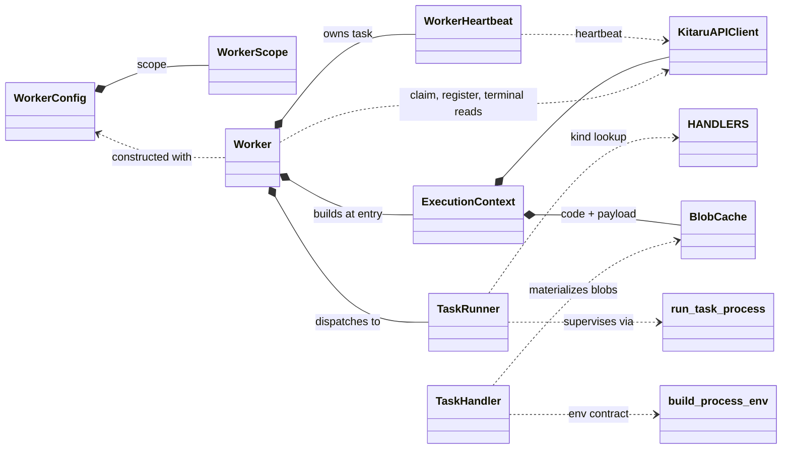

# Worker: client-side execution classes

Spec for the `kitaru/worker/` package. The worker claims tasks from the server, runs them as subprocesses, and reports their status. The server and the async API client (`KitaruAPIClient`) exist and are taken as given. This document contains everything needed to implement the package.

## Goals

- Instantiate a worker with configurable concurrency, an optional lifetime timeout, and all other knobs in one config object.
- Scope what a worker claims through one config concept: task kinds, label selectors, or one job, freely combinable.
- One-off workers that claim one specific job's tasks and drain them, appended tasks included.
- Execute a claimed task with as little refetching as possible.
- One class responsible for executing a single task, with per-kind variation isolated in per-kind strategy objects.
- Batched heartbeating with server-driven task cancellation.
- Content-addressed on-disk caching for plugin code and import payloads.

## API surface used

The worker relies on these client calls and models:

| Call | Purpose |
|---|---|
| `client.workers.create(WorkerCreateRequest(name, scope, runtime, metadata))` | Register the worker, upsert by name, returns the worker id |
| `client.workers.heartbeat(worker_id, WorkerHeartbeatRequest(task_ids))` | Report in-flight tasks, response carries `cancel_task_ids: list[uuid]` |
| `client.tasks.claim(TaskClaimRequest(worker_id, max_tasks))` | Batch claim, returns `TaskClaimResponse(tasks: list[TaskWithSpec])`, the server applies the scope stored on the worker row |
| `client.tasks.update(task_id, TaskUpdateRequest(status, attempt, error?, result?))` | Status transitions with the claim's attempt as fencing token, server rejects illegal or fenced-out ones with a 409, completion carries the task result |
| `client.tasks.get(task_id)` | Error detail |
| `client.jobs.get(job_id)` | Stop condition and terminal read of a pinned job |
| `client.sessions.get(session_id)` | Error detail after a rejected success transition |
| `client.blobs.download(blob_id)` | Materialize plugin code and payloads |

`TaskWithSpec` carries both the `TaskResponse` and the full `TaskSpecResponse`. The spec ships with every claim so execution never refetches it. There is no separate single-task claim endpoint, a job-pinned scope through the batch claim covers that case.

`TaskSpecResponse` fields the worker consumes: `kind`, `timeout_seconds`, `run` (command, working_dir, env), `env` (creator-set extras, merged verbatim into the process environment), `secret_env`, and the per-kind `details`: agent (inputs), evaluator (evaluator_name, params, plugin), importer (plugin, payload with blob_id/sha256, params). The spec plugin is a union discriminated on `type`: script (entrypoint, blob_id, sha256) or package (entrypoint, pinned requirement).

`timeout_seconds` is always set by the server, for every kind, and is the only process timeout the worker knows. Evaluator and importer tasks carry no `run`, so the worker builds their command itself but still takes their timeout from the spec. The worker holds no per-kind timeout constants.

Task kinds: `agent`, `evaluator`, `importer`. Task statuses the worker writes: `running`, `completed`, `failed`, `timed_out`, `canceled`. There is no canceling status: cancellation reaches the worker as a task id in `cancel_task_ids`, and the worker's terminal write is what settles it. The worker reports process success as `completed` for every kind and never touches jobs: the server owns the replay pipeline, appending a completed agent task's evaluator tasks in the same request, so a job-pinned claim scope sees them as soon as the completion returns, and the job settles server-side when its tasks finish. The result session of an agent task is linked by the agent-side adapter, which sets the task id on the session create request (see task.md), so the link exists before the process exits.

## Package layout

```
src/kitaru/worker/
  __init__.py       # exports Worker, WorkerConfig
  config.py         # WorkerConfig
  context.py        # ExecutionContext
  worker.py         # Worker: registration, heartbeat ownership, claim loop, stop logic
  task_runner.py    # TaskRunner
  handlers/
    __init__.py     # HANDLERS registry
    base.py         # TaskHandler protocol, blob materialization helper
    agent.py        # AgentHandler
    evaluation.py   # EvaluationHandler
    imports.py      # ImportHandler
  process.py        # TaskProcess, ProcessResult, TailBuffer, run_task_process,
                    # build_process_env, parse_inline_dependencies, get_python_run_command
  heartbeat.py      # WorkerHeartbeat
  blob_cache.py     # BlobCache
src/kitaru/task/           # code running inside the task process, see task.md
```

## Constants and defaults

| Constant | Value | Meaning |
|---|---|---|
| `DEFAULT_HEARTBEAT_INTERVAL_SECONDS` | 10.0 | Seconds between heartbeats |
| `RUN_POLL_INTERVAL_SECONDS` | 2.0 | Sleep after an empty claim |
| `CLAIM_BACKOFF_MAX_SECONDS` | 60 | Cap for the claim retry backoff |
| `LOG_TAIL_MAX_BYTES` | 8192 | Bytes of stdout/stderr kept per stream |
| `MAX_INPUTS_ENV_BYTES` | 32768 | Threshold for passing inputs via env |
| `MAX_RESULT_BYTES` | 1 MiB | Size cap for the task result file |
| `PAYLOAD_CACHE_MAX_BYTES` | 1 GiB | Payload cache budget, must stay at or above the server's max blob size |

Blob cache roots default to `~/.cache/kitaru/blobs` (code, unbounded) and `~/.cache/kitaru/payloads` (payloads, budgeted). The defaults live in `worker.py` where the two caches are built, `BlobCache` itself has no default root, so the two instances can never silently share a directory.

## Class inventory

### WorkerScope and LabelSelector (`api_models/v1/task.py`)

One value object describing what a worker may claim. Every field narrows the claim, unset fields do not constrain. The fields combine as a conjunction.

`WorkerScope` is a wire model, defined next to `TaskClaimRequest` and shared by the worker config and the worker registration. The worker registers its scope, the server reads it from the worker row at claim time and maps it to the claim filter: `kinds` to `kind IN (...)`, `job_id` to `job_id = :job_id`, and each selector to a label condition on the task's `labels`. An unpinned scope claims any pending task matching its filters.

```python
class LabelSelector(FrozenModel):
    key: str
    values: list[str]          # non-empty
    required: bool = False

class WorkerScope(FrozenModel):
    kinds: list[TaskKind] | None = None
    selectors: list[LabelSelector] | None = None
    job_id: uuid.UUID | None = None
```

A required selector matches tasks carrying the key with a value in `values`. A non-required selector additionally matches every task lacking the key, so it constrains only tasks that declare the label.

| Field | Meaning | Implied stop |
|---|---|---|
| none set | any pending task | stop event or lifetime deadline |
| `kinds` | tasks of these kinds only, e.g. `[importer]` | none, combines |
| `selectors` | label-matched tasks | none, combines |
| `job_id` | this job's tasks, appended ones included | job settled |

Validation: `kinds` and `selectors` must be non-empty when set, selector keys unique, selector values non-empty.

The one label convention the built-in creators write: agent tasks carry `agent_version`. A worker that can only serve certain agent environments sets a non-required `agent_version` selector, which reproduces the old version scoping: evaluator and importer tasks carry no version label and stay claimable, since they bring their own code and need no version environment. Excluding them is what `kinds` is for. Run-scoped workers are a future improvement, nothing stamps a run label today.

The scope is also the worker's completion contract: a job pin drains and returns, everything else runs until stopped.

### WorkerConfig (`config.py`)

Frozen settings object, the only place knobs live. Reads from the environment so a deployment (e.g. Kubernetes) configures the worker without code, while explicit constructor kwargs override env values.

```python
class WorkerConfig(BaseSettings):
    model_config = SettingsConfigDict(
        env_prefix="KITARU_WORKER_", env_nested_delimiter="__", frozen=True
    )

    name: str | None = None              # default: sanitized hostname-pid
    scope: WorkerScope = WorkerScope()
    concurrency: int = 1
    claim_batch_size: int | None = None  # default: free slots per claim
    poll_interval: float = RUN_POLL_INTERVAL_SECONDS
    heartbeat_interval: float = DEFAULT_HEARTBEAT_INTERVAL_SECONDS
    timeout: float | None = None         # wall clock lifetime, None runs until stop
    blob_cache_root: Path | None = None
    payload_cache_root: Path | None = None
    metadata: dict[str, Any] = {}
```

`metadata` is free-form labels stored on the worker row, `KITARU_WORKER_METADATA` takes JSON.

The API connection is not part of the worker config: `KITARU_API_URL` and `KITARU_API_KEY` are read from the process environment and assumed set for any API call. Every field reads as `KITARU_WORKER_<FIELD>`, e.g. `KITARU_WORKER_CONCURRENCY`, `KITARU_WORKER_TIMEOUT`. Scope fields nest with the delimiter: `KITARU_WORKER_SCOPE__KINDS` and `KITARU_WORKER_SCOPE__SELECTORS` take JSON (`'["importer"]'`, a JSON list of selector objects), the only syntax pydantic-settings decodes for nested structured env values, `KITARU_WORKER_SCOPE__JOB_ID` takes a bare value. Comma-separated kind lists are a future improvement.

The default worker name is derived from `socket.gethostname()` and `os.getpid()`, with characters outside `[A-Za-z0-9_-]` replaced by dashes and leading or trailing dashes and underscores stripped. In Kubernetes the hostname is the pod name, so replicas get unique names without configuration.

Responsibility: hold configuration. No behavior.

### ExecutionContext (`context.py`)

Bundle of the shared runtime dependencies, built once per worker entry call.

```python
class ExecutionContext:
    client: KitaruAPIClient
    blob_cache: BlobCache
    payload_cache: BlobCache
```

Responsibility: carry the client and caches to whoever executes tasks, so no method signature threads them separately. The client is constructed via `KitaruAPIClient.from_env()`, which reads `KITARU_API_URL` and `KITARU_API_KEY` from the environment.

### Worker (`worker.py`)

The lifecycle owner. One entry point, driven entirely by the config scope:

```python
class Worker:
    def __init__(self, config: WorkerConfig) -> None: ...
    async def run(self, stop: asyncio.Event | None = None) -> None: ...
```

Responsibility: register the worker, own the heartbeat task, run the claim loop, dispatch claimed tasks to the `TaskRunner` within the concurrency bound, and stop when the scope is drained or the lifetime ends.

`run()` opens a `KitaruAPIClient`, builds the `ExecutionContext`, registers the worker by name (upsert, sending the scope, the detected runtime, and the config metadata), starts the heartbeat task, and enters the claim loop. The client and heartbeat task are torn down when the call returns. Callers that want the terminal entity of a pinned scope fetch it after `run()` returns (`client.jobs.get`).

Registration includes a detected `WorkerRuntime` describing where the worker runs. The detection helper lives in `worker.py` next to the default name helper: platform `kubernetes` when `KUBERNETES_SERVICE_HOST` is set, with the namespace read from `/var/run/secrets/kubernetes.io/serviceaccount/namespace` and the pod name from the hostname, platform `docker` when `/.dockerenv` exists or `/proc/1/cgroup` carries container markers, platform `bare` otherwise. Every platform reports hostname, os, arch, `python_version`, and `kitaru_version`. Re-registration refreshes the values, so a rescheduled pod reports its new location.

One private loop serves every scope, and every claim is the same batch call, filtered by the scope stored at registration:

| Scope | Claim returns | Stop condition |
|---|---|---|
| unpinned | pending tasks matching `kinds` and `selectors` | stop event set, or lifetime deadline |
| `job_id` | the job's tasks, appended ones as they are created | job settled |

With a `job_id` scope there is no phase switch: the `job_id = :job_id` filter returns the initial tasks on the first claim and the appended evaluator tasks as the pipeline creates them. Because appends happen inside the agent task's completion request, the new tasks exist before the agent task reads as completed, so the stop check (one `client.jobs.get`, stop when the job is settled) has no gap to race through. Empty claims are disambiguated by the stop condition read: a settled job ends the loop, tasks held by other workers keep the loop polling until the job settles, a missing job surfaces the 404 from the read.

Stop semantics: the stop condition is checked after every empty claim. The lifetime `timeout` is a deadline computed at entry, checked in the same place, and applies to every scope. When the loop decides to stop it stops claiming, waits for in-flight work to finish, and returns. Nothing hard-kills running processes, the per-task timeouts bound those.

Claim loop with claim-to-capacity dispatch:

- The worker keeps a set of running asyncio tasks bounded by `concurrency`.
- Each iteration claims `min(free_slots, claim_batch_size or free_slots, 100)` tasks and spawns one runner per claimed task. The clamp keeps the request within the claim endpoint's max_tasks bound for workers with more than 100 free slots.
- When any runner finishes, its slot frees and the loop claims again.
- A claim returning fewer tasks than requested means the queue is drained: the loop sleeps `poll_interval` before claiming again, and an empty claim checks the stop condition before the sleep. Only a full claim loops again immediately.
- A failed claim request is logged and retried with exponential backoff, starting at `poll_interval` and doubling up to `CLAIM_BACKOFF_MAX_SECONDS`. The next successful claim resets the backoff. Claim failures never end the loop.

Per dispatched task the worker registers the task id with the heartbeat, calls `TaskRunner.execute(claimed, canceled)` with the cancel event the registration returned, and unregisters in a `finally`. Runner exceptions are logged and never tear down the loop.

### WorkerHeartbeat (`heartbeat.py`)

```python
class WorkerHeartbeat:
    def __init__(self, client: KitaruAPIClient, worker_id: uuid.UUID,
                 interval: float = DEFAULT_HEARTBEAT_INTERVAL_SECONDS) -> None: ...
    def register(self, task_id: uuid.UUID) -> asyncio.Event: ...
    def unregister(self, task_id: uuid.UUID) -> None: ...
    async def run(self) -> None: ...
```

Responsibility: batch the registered in-flight task ids into one heartbeat request per interval, and set the cancel event of every task the server lists in `cancel_task_ids`. `run()` loops until task cancellation, skips the request when nothing is registered, and logs failed heartbeats without raising. The registration dict needs no lock: `run()` snapshots the registered ids before awaiting the request and re-resolves `cancel_task_ids` against the live dict afterward, and `register`/`unregister` never await, so no touch of the dict spans an await point. Only `Worker` calls `register`/`unregister`, the runner just consumes the event. Worker liveness does not depend on the heartbeat: every claim refreshes the worker's last_seen_at server-side, so an idle worker polling an empty queue stays live.

### TaskRunner (`task_runner.py`)

Executes exactly one claimed task from spec to its next status. One concrete class, no subclasses.

```python
class TaskRunner:
    def __init__(self, ctx: ExecutionContext) -> None: ...
    async def execute(self, claimed: TaskWithSpec,
                      canceled: asyncio.Event) -> TaskResponse: ...
```

Responsibility: the status protocol and nothing else. The skeleton:

1. Look up `HANDLERS[spec.kind]`.
2. `PATCH status=running` with the claim's attempt.
3. `handler.prepare(ctx, task_id, spec)` builds the `TaskProcess`. A prepare failure fails the task with `"Failed to prepare the <label> process: <exc>"`.
4. Create a per-task temp directory and set `KITARU_TASK_RESULT_PATH` in the process env, uniformly for every kind. The directory is removed in a `finally`.
5. `run_task_process(process, canceled)` supervises the subprocess.
6. Report the outcome. Outcomes are ranked: a recorded exit code wins over the cancel event and the timeout, and the cancel event wins over the timeout. A kill (`returncode=None`) with the cancel event set reports as canceled, without it as timed out. A process that exits before the kill lands reports its exit code even when a cancel was requested, and the server accepts that completion, so a cancel arriving at the finish line never discards a finished result.
   - Exit 0: read and JSON-parse the result file when it exists, then `PATCH status=completed` with the result attached, uniformly for every kind. A result file larger than `MAX_RESULT_BYTES` fails the task with `"<Label> process wrote a result larger than <max> bytes."`, one that does not parse as JSON fails it with `"<Label> process wrote an invalid JSON result."`. If the server rejects the transition with a 409 (missing or incomplete result session, missing required result), fetch the task and, when a result session is linked, the session, build a precise error (`"Agent process exited successfully without recording a result session."`, `"Result session <id> is <status>, not completed."`, or `"<Label> process exited successfully without writing a result."`), and fail the task.
   - Nonzero exit: fail with `"<Label> process exited with code <rc>."` plus the log tail. When the result file exists, fits the size cap, and parses as JSON, it rides the failed PATCH as the task result (partial import stats, for example), an unreadable file is ignored on this path.
   - Killed with the cancel event set: `PATCH status=canceled`.
   - Killed on timeout: `PATCH status=timed_out` with `"Task timed out after <n> seconds."` plus the tail.

Failing a task is always `PATCH status=failed` with the error message. Every transition carries the attempt from the claim response, canceled included, and the server rejects a mismatch with a 409, meaning the task was requeued and re-claimed since. On the completion 409 path the runner therefore fetches the task first: when its attempt no longer matches the claim, the runner logs and returns without further updates instead of building the result-session error. A 409 on any other transition (failed, timed_out, canceled) is logged and the runner returns, the task belongs to another attempt now. A hard failure writing any transition, the initial running PATCH included, is logged and the attempt abandoned without retries: the un-heartbeated claim ages out through the staleness sweep, which requeues or abandons the task. The sweep is the universal safety net, the runner keeps no retry machinery for status writes. Process labels per kind: `Agent` for agent, `Evaluator` for evaluator, `Importer` for importer. The runner never knows which kinds require a result, it forwards what the file holds and the server validates at the transition.

### TaskHandler and handlers (`handlers/`)

The only per-kind variation is how the process is built. The outcome reporting is uniform, so one point of variation, which rules out `TaskRunner` subclasses outright. A strategy object per process shape instead:

```python
class TaskHandler(Protocol):
    async def prepare(self, ctx: ExecutionContext, task_id: uuid.UUID,
                      spec: TaskSpecResponse) -> TaskProcess: ...

HANDLERS: dict[TaskKind, TaskHandler]
```

The protocol and the blob materialization helper live in `handlers/base.py`, each handler in its own module, and the `HANDLERS` registry in `handlers/__init__.py`.

**`AgentHandler`**:

- Command and working dir come from `spec.run`, timeout from `spec.timeout_seconds`.
- Env: `build_process_env` plus `KITARU_TASK_INPUTS` with the JSON-encoded `details.inputs` when the encoding fits `MAX_INPUTS_ENV_BYTES` (agent code fetches the spec otherwise). Everything else the process needs (replay id, session name) arrives through the spec's creator-set env extras, which `build_process_env` merges for every kind, so the handler has no per-creator branches.

**`EvaluationHandler`**:

- Script plugin: materialize the plugin blob into the code cache, set `KITARU_TASK_PLUGIN_PATH` to the cached path, command `get_python_run_command("kitaru.task", ["evaluate"], parse_inline_dependencies(path))`, no working dir.
- Package plugin: no materialization and no `KITARU_TASK_PLUGIN_PATH`, command `get_python_run_command("kitaru.task", ["evaluate"], [plugin.requirement])`, no working dir.

**`ImportHandler`**:

- Script plugin: materialize the importer code blob into the code cache and the payload blob into the payload cache, concurrently, set `KITARU_TASK_PLUGIN_PATH` and `KITARU_TASK_PAYLOAD_PATH`, dependencies `parse_inline_dependencies(code_path)`.
- Package plugin: materialize only the payload blob, set `KITARU_TASK_PAYLOAD_PATH`, dependencies `[plugin.requirement]`.
- Command `get_python_run_command("kitaru.task", ["import"], dependencies)`, no working dir.

Every handler takes `timeout_seconds` from the spec, never from a constant, so the `TaskProcess` timeout has one source across all three kinds.

Blob materialization: check the cache by sha256, on a miss download via `client.blobs.download(blob_id)` and `cache.put(sha256, content)`, which verifies the hash.

There is no shared command-construction module: each handler builds its command inline from the neutral helpers in `process.py` (`parse_inline_dependencies`, `get_python_run_command`). The `kitaru.task` program and its kind arguments appear only inside their handlers.

Adding a task kind means adding a handler and a registry entry.

### Process supervision (`process.py`, module functions)

```python
class TaskProcess(NamedTuple):
    command: str
    working_dir: str | None
    env: dict[str, str]
    timeout_seconds: int

class ProcessResult(NamedTuple):
    returncode: int | None   # None when killed on timeout or cancel
    tail: str

async def run_task_process(process: TaskProcess, canceled: asyncio.Event) -> ProcessResult: ...
def build_process_env(task_id: uuid.UUID, run_env: dict[str, str],
                      extra_env: dict[str, str], secret_env: dict[str, str]) -> dict[str, str]: ...
def parse_inline_dependencies(path: Path) -> list[str]: ...
def get_python_run_command(module: str, args: list[str], dependencies: list[str]) -> str: ...
```

`run_task_process` semantics:

- Start the command via `sh -c` in its own session (`start_new_session=True`) so the whole process group can be killed.
- Capture stdout and stderr into bounded `TailBuffer`s of `LOG_TAIL_MAX_BYTES` each, draining concurrently.
- Wait for process exit, cancel event, or `timeout_seconds`, whichever comes first. On timeout or cancel, SIGKILL the process group and return `returncode=None`.
- Always reap the process and drain tasks on the way out.
- The returned `tail` is the two stream tails formatted as `"stdout tail:\n..."` and `"stderr tail:\n..."`, joined, empty when nothing was captured.

`build_process_env` layers, in order: the inherited `os.environ`, the run spec env, the spec's creator-set env extras, the secret env. It then removes any inherited contract variables, re-asserts `KITARU_API_URL` and `KITARU_API_KEY` from the worker's own environment so no layer can override them, and sets `KITARU_TASK_ID`. The server already rejects contract variable names in the creator extras, the re-assert here is the second line.

`parse_inline_dependencies` parses PEP 723 inline script metadata (the `# /// script` block) from a file and returns its `dependencies` list, raising when more than one script block exists. Reconstructing the TOML strips `# ` from each block line and a bare `#` from empty ones, per the PEP's reference regex, before `tomllib.loads`. `get_python_run_command` builds the shell command running a python module with arguments: `{sys.executable} -m <module> <args>` without dependencies, `uv run --with <dep>... python -m <module> <args>` with them, quoted with `shlex.join`. Both are kind-neutral, the handlers supply the program name and arguments.

### BlobCache (`blob_cache.py`)

```python
class BlobCache:
    def __init__(self, root: Path, max_bytes: int | None = None) -> None: ...
    def path(self, sha256: str) -> Path: ...
    async def get(self, sha256: str) -> Path | None: ...   # touches mtime on hit
    async def put(self, sha256: str, content: bytes) -> Path: ...
```

Content-addressed file cache keyed by sha256. `put` verifies the digest (raising `BlobCacheError` on mismatch), writes through a temp file and an atomic rename, and evicts least-recently-used entries first (mtime order) until the incoming content fits `max_bytes`. `get` counts as a use. Entries with a `.part` suffix are in-flight writes and never evicted as complete files.

`get` and `put` run their synchronous file bodies in `asyncio.to_thread`, so the digest, the write, and the eviction scan never block the event loop. `path` stays synchronous, it is pure computation. Two concurrent `put` calls can interleave eviction scans, which at worst evicts more than the incoming content needs.

### Task-side package (`kitaru/task/`)

Everything that runs inside the task process is its own package with its own spec, see `task.md`: the evaluation and import flows, plugin loading, the evaluator and parser contracts, and the env accessors for agent code. The worker's only knowledge of it is the `kitaru.task` program it puts into commands and the exit codes it interprets.

## Env contract

Variables the worker controls. All are cleared from the inherited environment before each task process, then set as applicable:

| Variable | Set for | Content |
|---|---|---|
| `KITARU_API_URL` | all | Server base URL, from the worker's environment |
| `KITARU_API_KEY` | all | API key, from the worker's environment |
| `KITARU_TASK_ID` | all | Task id |
| `KITARU_TASK_INPUTS` | agent | JSON inputs when within `MAX_INPUTS_ENV_BYTES` |
| `KITARU_TASK_PLUGIN_PATH` | evaluator and importer with a script plugin | Cached script plugin path |
| `KITARU_TASK_PAYLOAD_PATH` | importer | Cached payload path |
| `KITARU_TASK_RESULT_PATH` | all | Path the task writes its JSON result to, in a worker-owned temp directory |

Creator-set extras from the spec's `env` (for example `KITARU_REPLAY_ID` on replay agent tasks and `KITARU_SESSION_NAME` on session runs) are merged by `build_process_env` for every kind. They are opaque to the worker and can never carry the variables above, the server rejects those names at task creation and the worker re-asserts its own values.

## Connections



## Refetch budget

Requests per executed task:

| Step | Requests |
|---|---|
| Claim (ships task + spec) | amortized over the batch |
| status=running | 1 |
| Blob materialization | 0 on cache hit, 1 per blob on miss |
| Success transition | 1 |
| Failure detail fetch | error path only |

The success transition is attempted directly and the server validates it (an agent task without a completed result session gets a 409, so does an evaluator or importer completion without a result). The task's result rides the completion call, read from the result file, so recording it costs no request of its own. The worker fetches task and session details only to compose the error message. A job pin additionally polls its job for the stop condition, one read per empty claim.

## Decisions

- **Claim scoping is generic label matching.** The worker row stores kinds, selectors, and an optional job pin, and the claim filter matches selectors against task labels. Agent version scoping is a label convention written by the task creators, not a scope field, so the claim path never learns a domain concept and new scoping (run-scoped workers, for example) needs no schema change.
- **Scope is one concept for filter, completion, and wire.** The same `WorkerScope` decides what a claim asks for and when the worker is done. It travels once, in the worker registration, and the server reads it from the worker row at claim time. A job pin drains and returns, everything else runs until stop event or deadline.
- **No standalone claim endpoint.** A job-pinned scope through the batch claim covers the one-off case with one filter, including re-claiming a requeued task. The fail-fast semantics of a dedicated endpoint are reconstructed by the stop condition read, and a task held by another worker is waited on instead of erroring.
- **Non-required selectors do not exclude unlabeled tasks.** Evaluator and importer tasks carry their own code and no version label, so they match any worker unless `kinds` says otherwise. Exclusion is an explicit choice, not a side effect of declaring version capabilities.
- **Uniform success transition.** Process success is reported as `completed` for every kind. The server appends a completed agent task's evaluator tasks within the completion request and settles the job when its tasks finish. The worker never writes a job status.
- **A recorded exit outranks cancel and timeout, cancel outranks timeout.** A process that exits before the kill lands is reported by its exit code, killing it late does not undo finished work. Between the kill reasons the cancel event wins, it is the server-driven signal and the timeout is the local bound.
- **Strategy over subclasses for kinds.** The only variation is process construction, supervision and the status protocol are identical. Subclasses become the right call only if kinds ever diverge in the execute skeleton itself.
- **Graceful stop only.** Timeout and stop event drain in-flight tasks rather than killing them. A hard-stop variant can be added later by setting the cancel events of all in-flight tasks, the plumbing supports it.
- **The claim's attempt fences every executor status write, with no exception.** A requeued and re-claimed task carries a higher attempt, so a stale worker's late transition is rejected with a 409 instead of overwriting the new claim. Canceled is fenced like the rest, because the user-facing cancel is `POST /v1/jobs/{id}/cancel`, which sets request flags rather than writing task statuses. A stale worker confirming a cancel can no longer terminate somebody else's attempt. The heartbeat stamps only tasks the caller still owns, lost ones come back in `cancel_task_ids`.
- **One worker registration per entry call.** Registration upserts by name, so restarts reuse the worker row. The config `name` default is hostname-pid.
- **Package plugins install through uv, not the blob cache.** A package plugin ships as a pinned requirement passed to `uv run --with`, so uv's package cache replaces blob materialization and the first run pays the install inside the task timeout. Trust rests on the exact pin instead of a content hash, transitive dependencies stay unpinned, and the package index is worker environment configuration.
