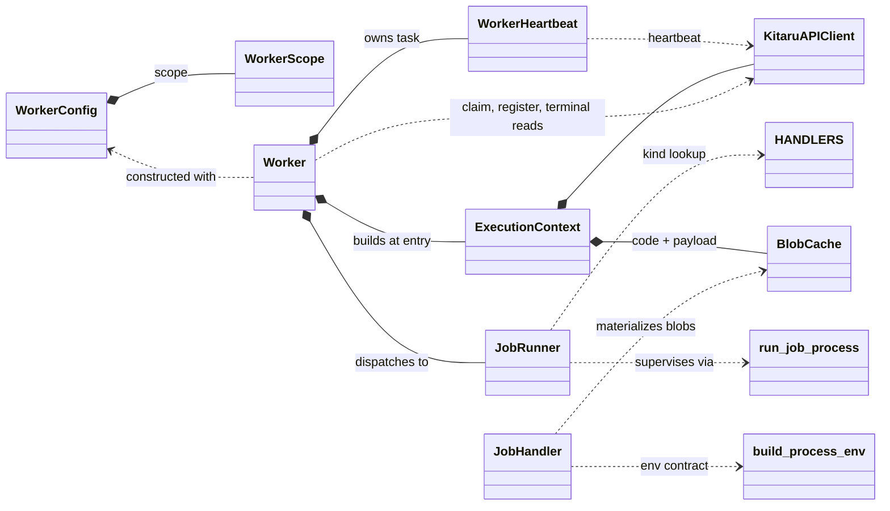

# Worker: client-side execution classes

Spec for the `kitaru/worker/` package. The worker claims jobs from the server, runs them as subprocesses, and reports their status. The server and the async API client (`KitaruAPIClient`) exist and are taken as given. This document contains everything needed to implement the package.

## Goals

- Instantiate a worker with configurable concurrency, an optional lifetime timeout, and all other knobs in one config object.
- Scope what a worker claims through one config concept: agent versions, job kinds, one experiment run, or one job, freely combinable where meaningful.
- One-off workers that claim one specific job id and drain it together with its fan-out children.
- Execute a claimed job with as little refetching as possible.
- One class responsible for executing a single job, with per-kind variation isolated in per-kind strategy objects.
- Batched heartbeating with server-driven job cancellation.
- Content-addressed on-disk caching for plugin code and import payloads.

## API surface used

The worker relies on these client calls and models:

| Call | Purpose |
|---|---|
| `client.workers.create(WorkerCreateRequest(name, scope, runtime, metadata))` | Register the worker, upsert by name, returns the worker id |
| `client.workers.heartbeat(worker_id, WorkerHeartbeatRequest(job_ids))` | Report in-flight jobs, response carries `cancel_job_ids: list[uuid]` |
| `client.jobs.claim(JobClaimRequest(worker_id, max_jobs))` | Batch claim, returns `JobClaimResponse(jobs: list[JobWithSpec])`, the server applies the scope stored on the worker row |
| `client.jobs.update(job_id, JobUpdateRequest(status, attempt, error?, result?))` | Status transitions with the claim's attempt as fencing token, server rejects illegal or fenced-out ones with a 409, completion carries the job result |
| `client.jobs.get(job_id)` | Terminal reads and error detail |
| `client.jobs.list(parent_job_id=...)` | Children of a pinned job for the stop condition |
| `client.sessions.get(session_id)` | Error detail after a rejected success transition |
| `client.experiment_runs.get(run_id)` | Stop condition and terminal read |
| `client.blobs.download(blob_id)` | Materialize plugin code and payloads |

`JobWithSpec` carries both the `JobResponse` and the full `JobSpecResponse`. The spec ships with every claim so execution never refetches it. There is no separate single-job claim endpoint, a job-pinned scope through the batch claim covers that case.

`JobSpecResponse` fields the worker consumes: `kind`, `run` (command, working_dir, env, timeout_seconds), `secret_env`, and the per-kind `details`: replay (replay_id, inputs), session_run (inputs, name), score (config, plugin), import (plugin, payload with blob_id/sha256, params). The spec plugin is a union discriminated on `type`: script (entrypoint, blob_id, sha256) or package (entrypoint, pinned requirement).

Job kinds: `replay`, `session_run`, `score`, `import`. Job statuses the worker writes: `running`, `completed`, `failed`, `timed_out`, `canceled`. The worker reports process success as `completed` for every kind. The server owns the replay pipeline: completing a replay job fans out its score jobs in the same request, so a job-pinned claim scope sees the children as soon as the parent's completion returns, and the replay verdict settles server-side when the children finish. The result session of a replay or session run is linked by the agent-side adapter, which sets the job id on the session create request (see job.md), so the link exists before the process exits.

## Package layout

```
src/kitaru/worker/
  __init__.py       # exports Worker, WorkerConfig
  config.py         # WorkerConfig
  context.py        # ExecutionContext
  worker.py         # Worker: registration, heartbeat ownership, claim loop, stop logic
  job_runner.py     # JobRunner
  handlers/
    __init__.py     # HANDLERS registry
    base.py         # JobHandler protocol, blob materialization helper
    agent.py        # AgentHandler (replay and session run)
    score.py        # ScoreHandler
    imports.py      # ImportHandler
  process.py        # JobProcess, ProcessResult, TailBuffer, run_job_process,
                    # build_process_env, parse_inline_dependencies, get_python_run_command
  heartbeat.py      # WorkerHeartbeat
  blob_cache.py     # BlobCache
src/kitaru/job/            # code running inside the job process, see job.md
```

## Constants and defaults

| Constant | Value | Meaning |
|---|---|---|
| `DEFAULT_HEARTBEAT_INTERVAL_SECONDS` | 10.0 | Seconds between heartbeats |
| `RUN_POLL_INTERVAL_SECONDS` | 2.0 | Sleep after an empty claim |
| `CLAIM_BACKOFF_MAX_SECONDS` | 60 | Cap for the claim retry backoff |
| `LOG_TAIL_MAX_BYTES` | 8192 | Bytes of stdout/stderr kept per stream |
| `MAX_INPUTS_ENV_BYTES` | 32768 | Threshold for passing inputs via env |
| `MAX_RESULT_BYTES` | 1 MiB | Size cap for the job result file |
| `SCORE_TIMEOUT_SECONDS` | 300 | Score process timeout when the spec carries no run |
| `IMPORT_TIMEOUT_SECONDS` | 600 | Import process timeout |
| `PAYLOAD_CACHE_MAX_BYTES` | 1 GiB | Payload cache budget |

Blob cache roots default to `~/.cache/kitaru/blobs` (code, unbounded) and `~/.cache/kitaru/payloads` (payloads, budgeted). The defaults live in `worker.py` where the two caches are built, `BlobCache` itself has no default root, so the two instances can never silently share a directory.

## Class inventory

### WorkerScope (`api_models/v1/job.py`)

One value object describing what a worker may claim. Every field narrows the claim, unset fields do not constrain. The fields combine as a conjunction.

`WorkerScope` is a wire model, defined next to `JobClaimRequest` and shared by the worker config and the worker registration. The worker registers its scope, the server reads it from the worker row at claim time and maps it to the claim filter field for field: `agent_version_ids` to `agent_version_id IN (...)`, `kinds` to `kind IN (...)`, `experiment_run_id` to `experiment_run_id = :run_id` (fan-out children carry the run id of their parent's run), `job_id` to `id = :job_id OR parent_job_id = :job_id`. An unpinned scope claims any pending job matching its filters.

```python
class WorkerScope(FrozenModel):
    agent_version_ids: list[uuid.UUID] | None = None
    kinds: list[JobKind] | None = None
    experiment_run_id: uuid.UUID | None = None
    job_id: uuid.UUID | None = None
```

| Field | Meaning | Implied stop |
|---|---|---|
| none set | any pending job | stop event or lifetime deadline |
| `agent_version_ids` | jobs bound to one of these agent versions | none, combines |
| `kinds` | jobs of these kinds only, e.g. `[import]` | none, combines |
| `experiment_run_id` | jobs of this run plus their fan-out children | run terminal |
| `job_id` | this job plus its fan-out children | job and its children terminal |

Validation: `experiment_run_id` and `job_id` are mutually exclusive. `kinds` and `agent_version_ids` must be non-empty when set.

Semantics of `agent_version_ids`: scoping is per agent version, since versions differ in code and requirements and "this host can run it" is a property of the version, not the agent. The constraint applies to jobs that reference an agent version (replays, session runs, source-scorer jobs). Jobs without an agent version (registry score jobs, imports) pass the version filter, because they carry their own code and need no version environment. Excluding them is what `kinds` is for, so a version-pinned worker that should run nothing else sets both.

The scope is also the worker's completion contract: a scope pinned to a job or run drains and returns, an unpinned scope runs until stopped.

### WorkerConfig (`config.py`)

Frozen settings object, the only place knobs live. Reads from the environment so a deployment (e.g. Kubernetes) configures the worker without code, while explicit constructor kwargs override env values.

```python
class WorkerConfig(BaseSettings):
    model_config = SettingsConfigDict(
        env_prefix="KITARU_WORKER_", env_nested_delimiter="__", frozen=True
    )

    name: str | None = None              # default: sanitized hostname-pid
    scope: WorkerScope = WorkerScope()
    concurrency: int = 1
    claim_batch_size: int | None = None  # default: free slots per claim
    poll_interval: float = RUN_POLL_INTERVAL_SECONDS
    heartbeat_interval: float = DEFAULT_HEARTBEAT_INTERVAL_SECONDS
    timeout: float | None = None         # wall clock lifetime, None runs until stop
    blob_cache_root: Path | None = None
    payload_cache_root: Path | None = None
    metadata: dict[str, Any] = {}
```

`metadata` is free-form labels stored on the worker row, `KITARU_WORKER_METADATA` takes JSON.

The API connection is not part of the worker config: `KITARU_API_URL` and `KITARU_API_KEY` are read from the process environment and assumed set for any API call. Every field reads as `KITARU_WORKER_<FIELD>`, e.g. `KITARU_WORKER_CONCURRENCY`, `KITARU_WORKER_TIMEOUT`. Scope fields nest with the delimiter: `KITARU_WORKER_SCOPE__AGENT_VERSION_IDS` and `KITARU_WORKER_SCOPE__KINDS` take JSON lists (`'["import"]'`), the only list syntax pydantic-settings decodes for nested env values, `KITARU_WORKER_SCOPE__EXPERIMENT_RUN_ID` and `KITARU_WORKER_SCOPE__JOB_ID` take bare values. Comma-separated lists are a future improvement.

The default worker name is derived from `socket.gethostname()` and `os.getpid()`, with characters outside `[A-Za-z0-9_-]` replaced by dashes and leading or trailing dashes and underscores stripped. In Kubernetes the hostname is the pod name, so replicas get unique names without configuration.

Responsibility: hold configuration. No behavior.

### ExecutionContext (`context.py`)

Bundle of the shared runtime dependencies, built once per worker entry call.

```python
class ExecutionContext:
    client: KitaruAPIClient
    blob_cache: BlobCache
    payload_cache: BlobCache
```

Responsibility: carry the client and caches to whoever executes jobs, so no method signature threads them separately. The client is constructed via `KitaruAPIClient.from_env()`, which reads `KITARU_API_URL` and `KITARU_API_KEY` from the environment.

### Worker (`worker.py`)

The lifecycle owner. One entry point, driven entirely by the config scope:

```python
class Worker:
    def __init__(self, config: WorkerConfig) -> None: ...
    async def run(self, stop: asyncio.Event | None = None) -> None: ...
```

Responsibility: register the worker, own the heartbeat task, run the claim loop, dispatch claimed jobs to the `JobRunner` within the concurrency bound, and stop when the scope is drained or the lifetime ends.

`run()` opens a `KitaruAPIClient`, builds the `ExecutionContext`, registers the worker by name (upsert, sending the scope, the detected runtime, and the config metadata), starts the heartbeat task, and enters the claim loop. The client and heartbeat task are torn down when the call returns. Callers that want the terminal entity of a pinned scope fetch it after `run()` returns (`client.jobs.get`, `client.experiment_runs.get`).

Registration includes a detected `WorkerRuntime` describing where the worker runs. The detection helper lives in `worker.py` next to the default name helper: platform `kubernetes` when `KUBERNETES_SERVICE_HOST` is set, with the namespace read from `/var/run/secrets/kubernetes.io/serviceaccount/namespace` and the pod name from the hostname, platform `docker` when `/.dockerenv` exists or `/proc/1/cgroup` carries container markers, platform `bare` otherwise. Every platform reports hostname, os, arch, `python_version`, and `kitaru_version`. Re-registration refreshes the values, so a rescheduled pod reports its new location.

One private loop serves every scope, and every claim is the same batch call, filtered by the scope stored at registration:

| Scope | Claim returns | Stop condition |
|---|---|---|
| unpinned | pending jobs matching `agent_version_ids` and `kinds` | stop event set, or lifetime deadline |
| `job_id` | the job itself while pending, later its fan-out children | job and its children terminal |
| `experiment_run_id` | the run's jobs and their fan-out children | run terminal |

With a `job_id` scope there is no phase switch: the `id = :job_id OR parent_job_id = :job_id` filter returns the job on the first claim and the score children as the fan-out creates them. Because the fan-out happens inside the completion request, the children exist before the parent reads as completed, so the stop check (job terminal and no non-terminal children, read via the `parent_job_id` jobs filter) has no gap to race through. Empty claims are disambiguated by the stop condition read: a drained scope ends the loop, a job held by another worker keeps the loop polling until it goes terminal, a missing job surfaces the 404 from the read.

Stop semantics: the stop condition is checked after every empty claim. The lifetime `timeout` is a deadline computed at entry, checked in the same place, and applies to every scope. When the loop decides to stop it stops claiming, waits for in-flight tasks to finish, and returns. Nothing hard-kills running jobs, the per-job timeouts bound those.

Claim loop with claim-to-capacity dispatch:

- The worker keeps a set of running tasks bounded by `concurrency`.
- Each iteration claims `min(free_slots, claim_batch_size or free_slots, 100)` jobs and spawns one task per claimed job. The clamp keeps the request within the claim endpoint's max_jobs bound for workers with more than 100 free slots.
- When any task finishes, its slot frees and the loop claims again.
- A claim returning fewer jobs than requested means the queue is drained: the loop sleeps `poll_interval` before claiming again, and an empty claim checks the stop condition before the sleep. Only a full claim loops again immediately.
- A failed claim request is logged and retried with exponential backoff, starting at `poll_interval` and doubling up to `CLAIM_BACKOFF_MAX_SECONDS`. The next successful claim resets the backoff. Claim failures never end the loop.

Per dispatched job the worker registers the job id with the heartbeat, calls `JobRunner.execute(claimed, canceled)` with the cancel event the registration returned, and unregisters in a `finally`. Task exceptions are logged and never tear down the loop.

### WorkerHeartbeat (`heartbeat.py`)

```python
class WorkerHeartbeat:
    def __init__(self, client: KitaruAPIClient, worker_id: uuid.UUID,
                 interval: float = DEFAULT_HEARTBEAT_INTERVAL_SECONDS) -> None: ...
    def register(self, job_id: uuid.UUID) -> asyncio.Event: ...
    def unregister(self, job_id: uuid.UUID) -> None: ...
    async def run(self) -> None: ...
```

Responsibility: batch the registered in-flight job ids into one heartbeat request per interval, and set the cancel event of every job the server lists in `cancel_job_ids`. `run()` loops until task cancellation, skips the request when nothing is registered, and logs failed heartbeats without raising. The registration dict needs no lock: `run()` snapshots the registered ids before awaiting the request and re-resolves `cancel_job_ids` against the live dict afterward, and `register`/`unregister` never await, so no touch of the dict spans an await point. Only `Worker` calls `register`/`unregister`, the runner just consumes the event. Worker liveness does not depend on the heartbeat: every claim refreshes the worker's last_seen_at server-side, so an idle worker polling an empty queue stays live.

### JobRunner (`job_runner.py`)

Executes exactly one claimed job from spec to its next status. One concrete class, no subclasses.

```python
class JobRunner:
    def __init__(self, ctx: ExecutionContext) -> None: ...
    async def execute(self, claimed: JobWithSpec,
                      canceled: asyncio.Event) -> JobResponse: ...
```

Responsibility: the status protocol and nothing else. The skeleton:

1. Look up `HANDLERS[spec.kind]`.
2. `PATCH status=running` with the claim's attempt.
3. `handler.prepare(ctx, job_id, spec)` builds the `JobProcess`. A prepare failure fails the job with `"Failed to prepare the <label> process: <exc>"`.
4. Create a per-job temp directory and set `KITARU_JOB_RESULT_PATH` in the process env, uniformly for every kind. The directory is removed in a `finally`.
5. `run_job_process(process, canceled)` supervises the subprocess.
6. Report the outcome. Outcomes are ranked: a recorded exit code wins over the cancel event and the timeout, and the cancel event wins over the timeout. A kill (`returncode=None`) with the cancel event set reports as canceled, without it as timed out.
   - Exit 0: read and JSON-parse the result file when it exists, then `PATCH status=completed` with the result attached, uniformly for every kind. A result file larger than `MAX_RESULT_BYTES` fails the job with `"<Label> process wrote a result larger than <max> bytes."`, one that does not parse as JSON fails it with `"<Label> process wrote an invalid JSON result."`. If the server rejects the transition with a 409 (missing or incomplete result session, missing required result), fetch the job and, when a result session is linked, the session, build a precise error (`"Agent process exited successfully without recording a result session."`, `"Result session <id> is <status>, not completed."`, or `"<Label> process exited successfully without writing a result."`), and fail the job.
   - Nonzero exit: fail with `"<Label> process exited with code <rc>."` plus the log tail. When the result file exists, fits the size cap, and parses as JSON, it rides the failed PATCH as the job result (partial import stats, for example), an unreadable file is ignored on this path.
   - Killed with the cancel event set: `PATCH status=canceled`.
   - Killed on timeout: `PATCH status=timed_out` with `"Job timed out after <n> seconds."` plus the tail.

Failing a job is always `PATCH status=failed` with the error message. Every transition carries the attempt from the claim response, and the server rejects a mismatch with a 409 on all but canceled, meaning the job was requeued and re-claimed since. On the completion 409 path the runner therefore fetches the job first: when its attempt no longer matches the claim, the runner logs and returns without further updates instead of building the result-session error. A 409 on any other transition (failed, timed_out, canceled) is logged and the runner returns, the job belongs to another attempt now. A hard failure writing any transition, the initial running PATCH included, is logged and the attempt abandoned without retries: the un-heartbeated claim ages out through the staleness sweep, which requeues or abandons the job. The sweep is the universal safety net, the runner keeps no retry machinery for status writes. Process labels per kind: `Agent` for replay and session run, `Scorer` for score, `Importer` for import. The runner never knows which kinds require a result, it forwards what the file holds and the server validates at the transition.

### JobHandler and handlers (`handlers/`)

The only per-kind variation is how the process is built. The outcome reporting is uniform, so one point of variation, which rules out `JobRunner` subclasses outright. A strategy object per process shape instead:

```python
class JobHandler(Protocol):
    async def prepare(self, ctx: ExecutionContext, job_id: uuid.UUID,
                      spec: JobSpecResponse) -> JobProcess: ...

HANDLERS: dict[JobKind, JobHandler]
```

The protocol and the blob materialization helper live in `handlers/base.py`, each handler in its own module, and the `HANDLERS` registry in `handlers/__init__.py`.

**`AgentHandler`** (registered for both `replay` and `session_run`, which build identical processes):

- Command, working dir, and timeout come from `spec.run`.
- Env: `build_process_env` plus `KITARU_JOB_SESSION_NAME` when `details.name` is set, plus `KITARU_JOB_INPUTS` with the JSON-encoded `details.inputs` when the encoding fits `MAX_INPUTS_ENV_BYTES` (agent code fetches the spec otherwise), plus `KITARU_JOB_REPLAY_ID` from `details.replay_id` for replay jobs.

**`ScoreHandler`**:

- Source scorer (`details.plugin is None`): run `python -m kitaru.job score` in the agent's run environment, command `get_python_run_command("kitaru.job", ["score"], [])`, working dir and timeout from `spec.run`.
- Registry scorer with a script plugin: materialize the plugin blob into the code cache, set `KITARU_JOB_PLUGIN_PATH` to the cached path, command `get_python_run_command("kitaru.job", ["score"], parse_inline_dependencies(path))`, no working dir, timeout `SCORE_TIMEOUT_SECONDS`.
- Registry scorer with a package plugin: no materialization and no `KITARU_JOB_PLUGIN_PATH`, command `get_python_run_command("kitaru.job", ["score"], [plugin.requirement])`, no working dir, timeout as above.

**`ImportHandler`**:

- Script plugin: materialize the importer code blob into the code cache and the payload blob into the payload cache, concurrently, set `KITARU_JOB_PLUGIN_PATH` and `KITARU_JOB_PAYLOAD_PATH`, dependencies `parse_inline_dependencies(code_path)`.
- Package plugin: materialize only the payload blob, set `KITARU_JOB_PAYLOAD_PATH`, dependencies `[plugin.requirement]`.
- Command `get_python_run_command("kitaru.job", ["import"], dependencies)`, no working dir, timeout `IMPORT_TIMEOUT_SECONDS`.

Blob materialization: check the cache by sha256, on a miss download via `client.blobs.download(blob_id)` and `cache.put(sha256, content)`, which verifies the hash.

There is no shared command-construction module: each handler builds its command inline from the neutral helpers in `process.py` (`parse_inline_dependencies`, `get_python_run_command`). The `kitaru.job` program and its kind arguments appear only inside their handlers.

Adding a job kind means adding a handler and a registry entry.

### Process supervision (`process.py`, module functions)

```python
class JobProcess(NamedTuple):
    command: str
    working_dir: str | None
    env: dict[str, str]
    timeout_seconds: int

class ProcessResult(NamedTuple):
    returncode: int | None   # None when killed on timeout or cancel
    tail: str

async def run_job_process(process: JobProcess, canceled: asyncio.Event) -> ProcessResult: ...
def build_process_env(job_id: uuid.UUID, run_env: dict[str, str],
                      secret_env: dict[str, str]) -> dict[str, str]: ...
def parse_inline_dependencies(path: Path) -> list[str]: ...
def get_python_run_command(module: str, args: list[str], dependencies: list[str]) -> str: ...
```

`run_job_process` semantics:

- Start the command via `sh -c` in its own session (`start_new_session=True`) so the whole process group can be killed.
- Capture stdout and stderr into bounded `TailBuffer`s of `LOG_TAIL_MAX_BYTES` each, draining concurrently.
- Wait for process exit, cancel event, or `timeout_seconds`, whichever comes first. On timeout or cancel, SIGKILL the process group and return `returncode=None`.
- Always reap the process and drain tasks on the way out.
- The returned `tail` is the two stream tails formatted as `"stdout tail:\n..."` and `"stderr tail:\n..."`, joined, empty when nothing was captured.

`build_process_env` layers, in order: the inherited `os.environ`, the run spec env, the secret env. It then removes any inherited contract variables, re-asserts `KITARU_API_URL` and `KITARU_API_KEY` from the worker's own environment so a run spec or secret env cannot override them, and sets `KITARU_JOB_ID`.

`parse_inline_dependencies` parses PEP 723 inline script metadata (the `# /// script` block) from a file and returns its `dependencies` list, raising when more than one script block exists. Reconstructing the TOML strips `# ` from each block line and a bare `#` from empty ones, per the PEP's reference regex, before `tomllib.loads`. `get_python_run_command` builds the shell command running a python module with arguments: `{sys.executable} -m <module> <args>` without dependencies, `uv run --with <dep>... python -m <module> <args>` with them, quoted with `shlex.join`. Both are kind-neutral, the handlers supply the program name and arguments.

### BlobCache (`blob_cache.py`)

```python
class BlobCache:
    def __init__(self, root: Path, max_bytes: int | None = None) -> None: ...
    def path(self, sha256: str) -> Path: ...
    async def get(self, sha256: str) -> Path | None: ...   # touches mtime on hit
    async def put(self, sha256: str, content: bytes) -> Path: ...
```

Content-addressed file cache keyed by sha256. `put` verifies the digest (raising `BlobCacheError` on mismatch), writes through a temp file and an atomic rename, and evicts least-recently-used entries first (mtime order) until the incoming content fits `max_bytes`. `get` counts as a use. Entries with a `.part` suffix are in-flight writes and never evicted as complete files.

`get` and `put` run their synchronous file bodies in `asyncio.to_thread`, so the digest, the write, and the eviction scan never block the event loop. `path` stays synchronous, it is pure computation. Two concurrent `put` calls can interleave eviction scans, which at worst evicts more than the incoming content needs.

### Job-side package (`kitaru/job/`)

Everything that runs inside the job process is its own package with its own spec, see `job.md`: the score and import flows, plugin loading, the scorer and parser contracts, and the env accessors for agent code. The worker's only knowledge of it is the `kitaru.job` program it puts into commands and the exit codes it interprets.

## Env contract

Variables the worker controls. All are cleared from the inherited environment before each job process, then set as applicable:

| Variable | Set for | Content |
|---|---|---|
| `KITARU_API_URL` | all | Server base URL, from the worker's environment |
| `KITARU_API_KEY` | all | API key, from the worker's environment |
| `KITARU_JOB_ID` | all | Job id |
| `KITARU_JOB_INPUTS` | replay, session run | JSON inputs when within `MAX_INPUTS_ENV_BYTES` |
| `KITARU_JOB_SESSION_NAME` | session run | Session name when the spec has one |
| `KITARU_JOB_REPLAY_ID` | replay | Replay id from the spec details |
| `KITARU_JOB_PLUGIN_PATH` | score, import with a script plugin | Cached script plugin path |
| `KITARU_JOB_PAYLOAD_PATH` | import | Cached payload path |
| `KITARU_JOB_RESULT_PATH` | all | Path the job writes its JSON result to, in a worker-owned temp directory |

## Connections



## Refetch budget

Requests per executed job:

| Step | Requests |
|---|---|
| Claim (ships job + spec) | amortized over the batch |
| status=running | 1 |
| Blob materialization | 0 on cache hit, 1 per blob on miss |
| Success transition | 1 |
| Failure detail fetch | error path only |

The success transition is attempted directly and the server validates it (a replay or session run without a completed result session gets a 409, so does a score or import completion without a result). The job's result rides the completion call, read from the result file, so recording it costs no request of its own. The worker fetches job and session details only to compose the error message. Pinned scopes additionally poll their target for the stop condition, a job pin also lists the children of its job.

## Decisions

- **Claim scoping is per agent version, not per agent.** Versions differ in code and requirements, so whether a host can run a job is a property of the version. The server-side counterparts change accordingly: the worker row stores the scope, and the claim filter works off `agent_version_id IN (...)` and `kind IN (...)` directly.
- **Scope is one concept for filter, completion, and wire.** The same `WorkerScope` decides what a claim asks for and when the worker is done. It travels once, in the worker registration, and the server reads it from the worker row at claim time. Bounded scopes (job, run) drain and return, unbounded scopes run until stop event or deadline.
- **No standalone claim endpoint.** A job-pinned scope through the batch claim covers the one-off case with one filter, including re-claiming a requeued parent. The fail-fast semantics of a dedicated endpoint are reconstructed by the stop condition read, and a job held by another worker is waited on instead of erroring.
- **Version filter does not exclude version-less jobs.** Registry score jobs and imports carry their own code, so they match any worker unless `kinds` says otherwise. Exclusion is an explicit choice, not a side effect of pinning versions.
- **Uniform success transition.** Process success is reported as `completed` for every kind. The server fans out a completed replay's score jobs within the completion request and settles the replay verdict when they finish. The worker never writes `scoring`.
- **A recorded exit outranks cancel and timeout, cancel outranks timeout.** A process that exits before the kill lands is reported by its exit code, killing it late does not undo finished work. Between the kill reasons the cancel event wins, it is the server-driven signal and the timeout is the local bound.
- **Strategy over subclasses for kinds.** The only variation is process construction, supervision and the status protocol are identical. Subclasses become the right call only if kinds ever diverge in the execute skeleton itself.
- **Graceful stop only.** Timeout and stop event drain in-flight jobs rather than killing them. A hard-stop variant can be added later by setting the cancel events of all in-flight jobs, the plumbing supports it.
- **The claim's attempt fences every executor status write.** A requeued and re-claimed job carries a higher attempt, so a stale worker's late transition is rejected with a 409 instead of overwriting the new claim. Canceled is the exception, it doubles as the user-facing cancel and stays unfenced for now. The heartbeat stamps only jobs the caller still owns, lost ones come back in `cancel_job_ids`.
- **One worker registration per entry call.** Registration upserts by name, so restarts reuse the worker row. The config `name` default is hostname-pid.
- **Package plugins install through uv, not the blob cache.** A package plugin ships as a pinned requirement passed to `uv run --with`, so uv's package cache replaces blob materialization and the first run pays the install inside the job timeout. Trust rests on the exact pin instead of a content hash, transitive dependencies stay unpinned, and the package index is worker environment configuration.
